# Urban economics {#ch:Urban}

## Introduction {#sec:IntroUrban}

In this chapter, we introduce basic notions of the urban economics. *The urban economics* is a theory about the location choice made by firms and households. It answers the following questions:

* Why do the cities emerge?
* Why do cities differ in terms of size?
* What determines the internal structure of the cities?

The urban theory focuses on the cities, which are an important object of research, given their population and contribution to the world economic growth.

Section \@ref(sec:City) defines the notion of city. In section \@ref(sec:CityOrigins), the origins of cities are explored.  Section \@ref(sec:Urbanization) illustrates the process of growth of the urban population known as urbanization. In Section \@ref(sec:CitiesBig), some explanations are offered, why cities tend to grow and become big. Section \@ref(sec:CitiesDifferent) uses the theory of central places in order to explain why city sizes are so different: from little towns to huge megacities. In section \@ref(sec:InternalStructure), the internal structure of cities and location choices made by firms and households. Section \@ref(sec:Gradient), shows the dependence between location (distance from the city center) and population and employment density. <!---->

## What is a city? {#sec:City}

The question of what makes a settlement an urban area is not an easy one. Different criteria can be employed in order to define a city. The most typical are the size of population, the population density, and the structure of economic activities carried out in the settlement.

*Population size*. In Russia, a settlement can be declared city, if it has population of 12,000 and more and 85\% of its population are not occupied in agriculture.^[This definition is provided by the Decree of Sep. 12, 1957 *On attributing settlements to the category of cities, worker and resort townships*. Interestingly, its predecessor --- the Decree of September 15, 1924 *General provisions on urban and rural settlements* imposed similar but somewhat lower restrictions: 1000 persons and at least 75\% of population occupied in the non-agricultural production.]Currently, urban settlement status is determined by the legislation of federal subjects.

In many countries, a settlement must have some minimum population in order to be treated as a city. Table \@ref(tab:threshold) reports the minimum required population for several countries.

Table: (\#tab:threshold)Definition of city: country-specific population thresholds

Country                               Citizen
-----------------------------------  --------
Denmark and Sweden                        250
France and Israel                        1000
Mexico and USA                           2000
Azerbaijan and Georgia                   2500
Kyrgyzstan, Moldova, Ukraine, etc.       5000
Russia                                  10000
Japan                                   12000

The minimum population varies a lot: from as few as 250 persons in Denmark and Sweden to as many as 30,000 in Japan. In practice, despite the existence of the official minimum threshold, the population of the cities can be well below it. Figure \@ref(fig:boxplotUrbanAreas) and Table \@ref(tab:sizeUrbanAreas) report the descriptive statistics of the distribution of the population of Russian cities and towns (*goroda*) as well as urban villages (*posyolki gorodskogo tipa*) in 2017.

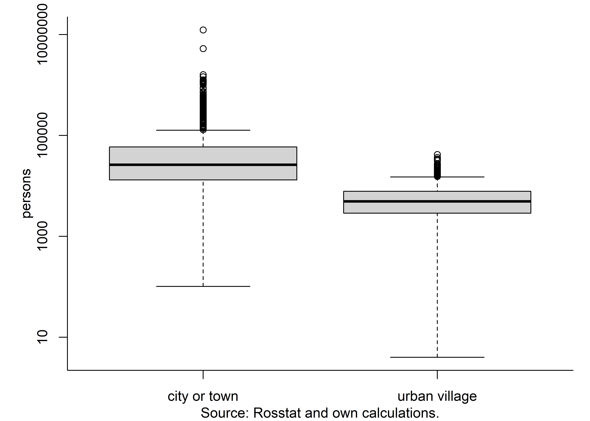

(\#fig:boxplotUrbanAreas)The size of Russia's urban areas, 2017

In general, the population in cities and towns is much larger than that of the urban villages. It also mostly exceeds 12,000. However, the lower tail of distribution lies below 1000 persons.

According to Table \@ref(tab:sizeUrbanAreas), there are 1112 cities or towns and 1183 urban villages in Russia.

Table: (\#tab:sizeUrbanAreas)Size of Russia's urban areas, 2017

Statistic               City or town                 Urban village                   
----------------------  ---------------------------  --------------------------------
Number of areas         1112                         1183                            
Minimum, persons        102 (Innopolis, Tatarstan)   4 (Kozhym, Komi Republic)       
1st quartile, persons   13,130                       2876                            
Median, persons         26,300                       4934                            
Mean, persons           91,770                       6061                            
3rd quartile, persons   59,020                       7846                            
Maximum, persons        12,380,000 (Moscow)          41,980 (Nakhabino, Moscow reg.) 

The median population of cities or towns is 26,300, which is more than twice as large as the minimum threshold. However, almost one-fourth of all cities and towns are close to or below that lower boundary. The smallest and probably the youngest town Innopolis has slightly more than 100 inhabitants, while the smallest urban village Kozhym has only four residents.

*Population density*. Given the ambiguity of the population size as criterion for defining a city or a town, other indicators are suggested. For example, the Organisation for Economic Co-operation and Development (OECD) suggested using the population density in order to identify the so-called **functional urban areas** (FUA), which are its proxies for cities [@OECD_2013]. The OECD uses a three-step algorithm in order to delineate the FUAs. In the first step, the urbanized areas, or "urban high-density clusters'', are defined over the national territory, ignoring administrative borders. For this purpose, the national territory is divided by a continuous grid with a cell size of 1 km$^2$. The urban core then is identified as a high-density cluster of contiguous grid cells of 1 km$^2$ with a density of at least 1,500 inhabitants per km$^2$ (1000 in Canada and USA). In the second step, the non-contiguous cores belonging to the same functional urban area are connected. This is done in order to account for the polycentric cities. Their belonging to the same FUA is determined based on the commuting intensity between cores. If many people are commuting between the neighbor cores, then all these cores are thought to belong to the same FUA. In the third step, the urban hinterlands are identified. These are defined as all  municipalities  with  at  least  15\%  of  their  employed  residents working in a certain urban core.

Figure \@ref(fig:MapFUAGermany) shows an example of the FUAs as determined by the OECD for the case of Germany. Green color denotes the urban cores of the FUAs, while the red areas stand for their hinterlands.

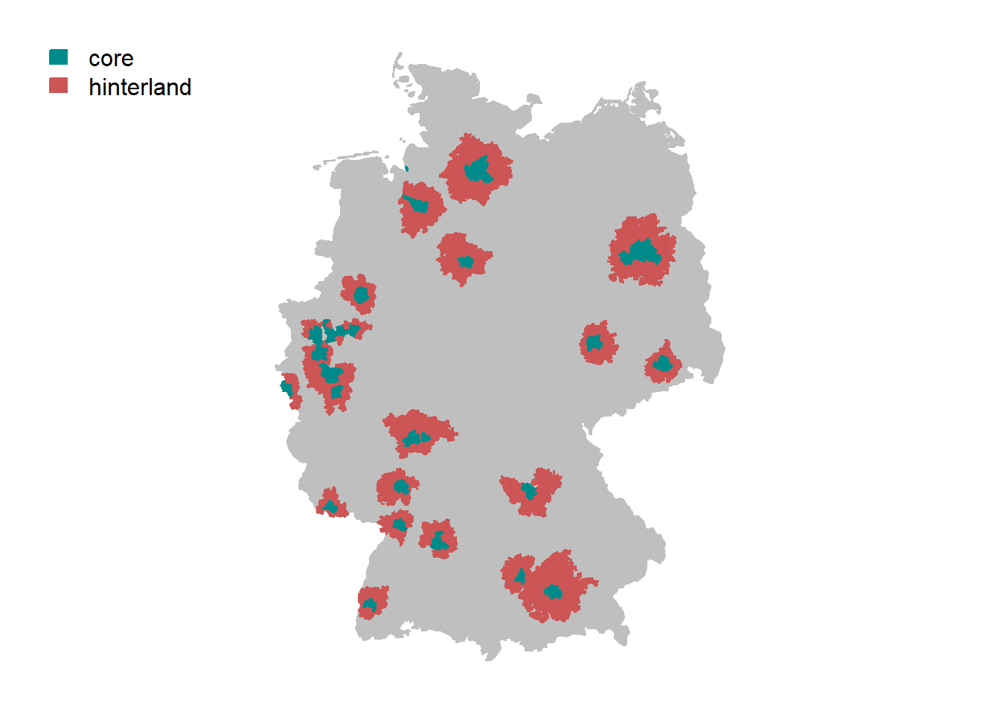

(\#fig:MapFUAGermany)Functional urban areas of OECD in Germany

It can be seen that the FUAs go beyond the administrative boundaries of the officially defined cities. For example, the largest FUA in the east of Germany unifies Berlin, Potsdam, and their immediate surroundings. Its hinterland stretches for dozens of kilometers around the core. People living in these areas commute every day to the core, where the jobs are concentrated and return to their towns and villages, where the housing rents and prices are lower.

## Why do cities emerge? {#sec:CityOrigins}
What are the reasons calling the cities into existence? The first known cities were founded in 8th millenium BC, that is, 10,000 years ago (Jericho in present-day Israel with a population of about 2000), in 7th millenium BC (Çatalhöyük in present-day Turkey, with a population of 5000), and in the second half of the 4th millenium BC (Uruk in Southern Mesopotamia, nowadays Irak, with a population of approximately 50,000) [@OSullivan_2008]. Symptomatically, these cities emerged during the Agricultural revolution and in the so-called Fertile Crescent in the Middle Asia, where early transition from hunting and gathering to the agriculture took place.

One of the indispensable prerequisites for the development of cities is a surplus of agricultural production. The urban residents specialize in industrial production, trade, and other non-agricultural activities. Therefore, agricultural workers must produce enough not only to satisfy their own needs, but also to feed the inhabitants of cities. Moreover, the cities must offer economic benefits in order to offset for their evident costs: high land prices, congestion, and pollution.

Here, we will consider a purely market-based model of a city creation and growth, leaving aside all non-economic reasons. In a purely agricultural economy, no cities are expected to emerge. The model of such an economy is based on the following assumptions. First, there only two *production factors*: land and labor. Second, all people have *identical productivity*. It means that every person produces in one hour the same output as any other person. Third, there are *no scale economies*: the agricultural production has *constant returns*. In other words, if the inputs of labor and capital double, the production also doubles. Fourth, there are no other means of transportation as the one's legs. Hence, the *travel time* is identical for everybody, since all (healthy) people are walking with a speed of 4 km/h.

What gives rise to the emergence of cities? The cities can only appear, if some or all of the assumptions of the agricultural economy model are violated. First, thanks to the *comparative advantages* the trade can emerge. The economy must not be autarkic anymore --- everybody can concentrate on the production of goods and services in which he has comparative advantages and exchange them for other goods and services produced by those who possess the corresponding comparative advantages. Second, the existence of *scale economies* contributes decisively to the formation of cities. The scale economies in transportation (e.g., invention of a wheel) allow an increase in the spatial extension of trade, while those in production (e.g., an invention of water mills) lead to the concentration of production. Thus, production is concentrated in some sites, which are for some reason beneficial for the production (proximity to a river or a sea haven, intersection of roads, availability of minerals, etc.), and can serve a large area, where agricultural products and raw materials are produced to be exchanged at the production site for the urban products. Third, if the physical proximity of producers facilitates innovation and learning (e.g., the universities, which attract many students), then individual producers will cluster together and, thus, generate a city. Fourth, a collective consumption of some public good that requires a physical proximity of consumers can also lead to a creation of cities. For example, religious practice can stimulate the development of cities as soon as the small village shrines, where earthen gods are worshiped, are replaced by large temples, where a specialized caste of priesters worship celestial gods [@Mumford_1961].

## Urbanization {#sec:Urbanization}

*Urbanization* is the process of an accelerated population growth in the urban areas. *Urbanization rate* denotes the share of population living in the urban areas.

Figure \@ref(fig:UrbanizationUN) depicts the urbanization process by countries between 1950 and 2010. The darker the color the higher the share of urban population in the country. It can be seen that at the beginning of the period the most urbanized countries were in Australia, Europe, North America, and in part in South America. Over the time, more and more countries become urbanized.

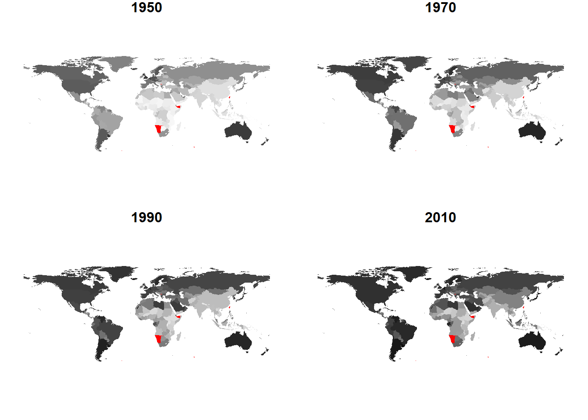

(\#fig:UrbanizationUN)Urbanization in the world, 1950--2010

Source: United Nations World Development Indicators.

Figure \@ref(fig:RuralUrban) shows the growth of the world rural and urban between 1960 and 2017. Over the whole period, the urban population grew at a much higher rate than the rural one. By 2007, both populations became equal. Since then, more than a half of the world population lives in urban areas.

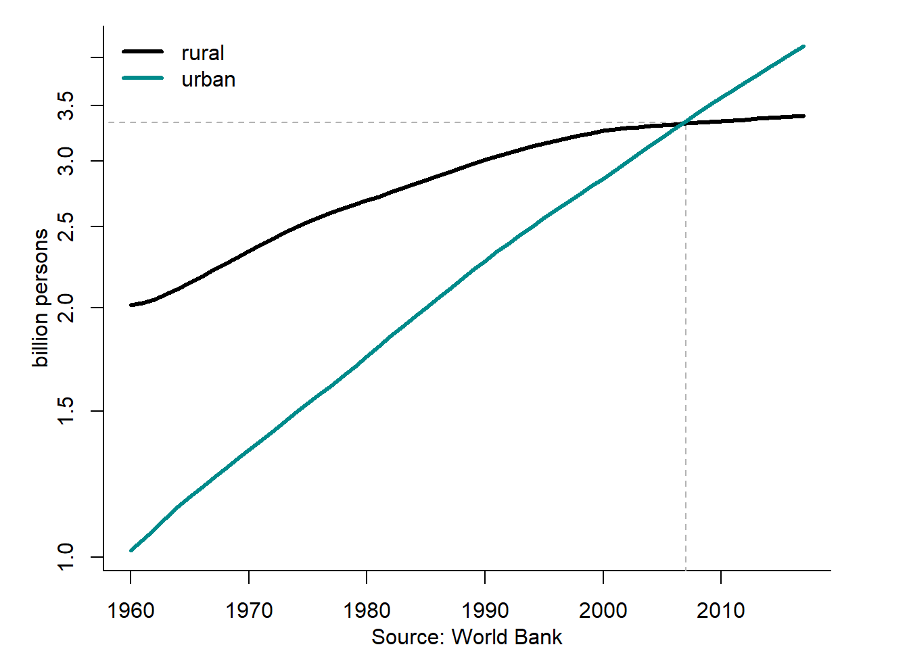

(\#fig:RuralUrban)Rural vs. urban population in the world, 1960--2017

Figure \@ref(fig:UrbanizationRussia) illustrates the urbanization process in Russia between 1897 and 2010. In the late 19th century, the share of urban population was about 15\%. By 1939, it increased up to 35\%. Only after World War II, the urban population in Russia exceeded the rural one. By the end of the Soviet period, the urbanization rate attained over 70\%. Since then, it remains at the same level.

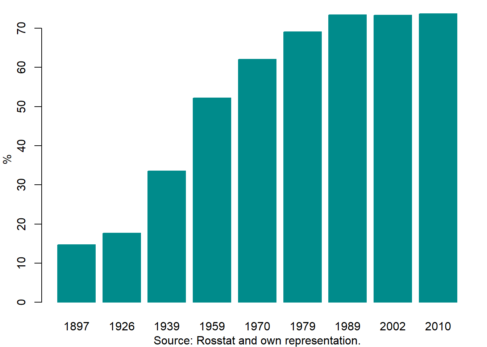

(\#fig:UrbanizationRussia)Urbanization in Russia, 1897--2010

The population of individual cities, especially of the large ones, substantially increased. Figure \@ref(fig:PopulationPetrograd) depicts the population change in St. Petersburg ---the former capital of the Russian Empire and the second largest city of the Russian Federation--- between 1764 and 2015.

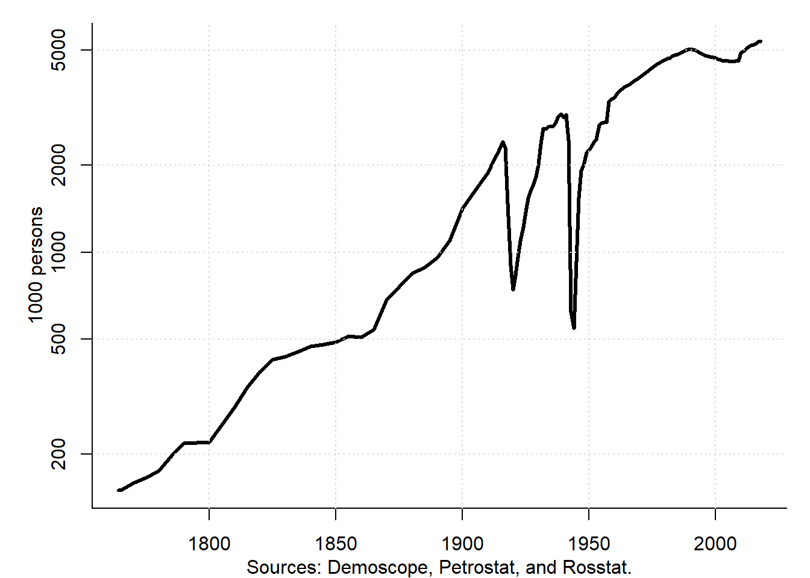

(\#fig:PopulationPetrograd)Population of St. Petersburg, 1764--2018

The population of St. Petersburg increased from about two million at the eve of World War I to more than five million 100 years later. Due to the city's turbulent history, this evolution was not smooth. During the Russian Civil War, World War II, and in the early 1990s, the population drastically decreased. While the first two decreases were associated with large-scale war events, the last depopulation episode took place during peaceful times and can be explained by a very tough transition from the centrally planned economy to the market one.

The population growth can be decomposed into two components: growth of the population and growth of the administrative city boundaries. As seen in Figure \@ref(fig:MapPetrograd), the territory of St. Petersburg experienced a manifold increase between 1917 and 2017. The largest expansion took place immediately after the Russian Civil War, when the nearest outskirts, mostly industrial areas, of the city were included into its administrative boundaries.

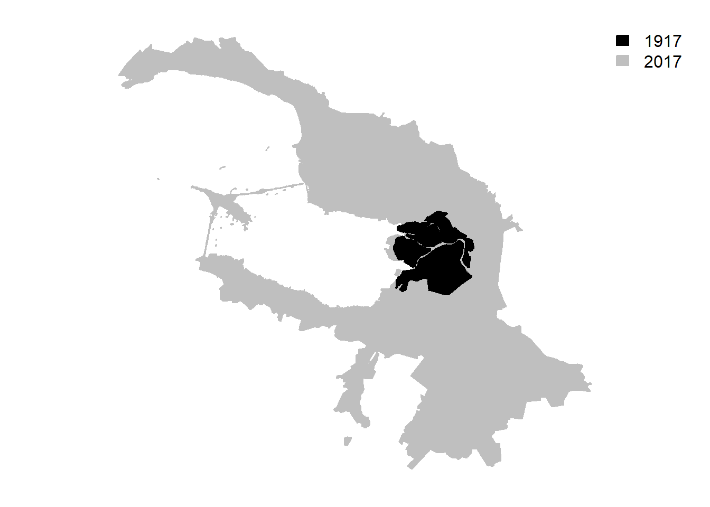

(\#fig:MapPetrograd)Territorial expansion of St. Petersburg, 1917--2017

Source: own representation

## Why cities are big? {#sec:CitiesBig}
What are the factors encouraging the growth of cities? Do larger cities have more advantages than smaller ones? Indeed, there are several factors that make large cities economically more attractive and successful than their smaller counterparts.

The first factor is the *economies of intra-industry agglomeration*. They occur, when the firms belonging to the same industry locate next to each other. This allows them to purchase the intermediate inputs from a common supplier at a lower cost. In addition, it leads to an increased efficiency of labor market, because the cost of job search in such a case is lower. This is achieved thanks to the transmission of information on vacancies through informal channels and the fact that potential employers are nearby. Moreover, the intra-industry agglomeration creates communication economies, that is, a quick information exchange and technology diffusion.

The second factor is the *urbanization economies*, which stands for concentration in the same place of the firms belonging to the different industries. These firms can still use common suppliers (such as banks, insurance companies, hotels, transport, and publishers) and public services (such as roads, public transit, education, and health care). Provided that these common suppliers have scale economies, the concentration of various firms requiring their products creates a market, which is wide enough in order to take advantage of these economies of scale. Hence, the firms located in the same place can purchase the inputs from the common suppliers and obtain public services at a lower cost.

The third factor is the *trade agglomeration*, which refers to the spatial concentration of trade establishments. It rendered possible thanks to the *external effects of retail trade* meaning that one shop's sales are affected by those of other shops. There are two types of external effects: for complementary goods and for incomplete substitutes. Consider the case of complementary goods, e.g., cloth and shoes. If there is already a shop selling cloth in the neighborhood, then it makes sense for a seller of shoes to open his shop nearby. The customers looking for clothes are likely to need shoes passing to them. Therefore, the shoes shop will be able to capture attention of some of the cloth shop customers. The case of incomplete substitutes is less evident. Indeed, why, say, two building materials or furniture stores can benefit from locating next to each other? It seems that they will compete for the each other's customers and ruin trade. And yet in many cases we observe that such stores are situated close to each other. The reason is that their products are substitutes, but are not exactly identical. Therefore, if somebody needs, say, a hammer he is more likely to travel to the place, where several building materials stores are located, than to the place, where he can find only one such store. In such a way, the customer can save time. Indeed, if he cannot find the hammer he needs in one store, he just has to walk a few meters in order to find a similar store, where he can find what he needs. 

## Why city sizes are different: The theory of central places {#sec:CitiesDifferent}

If we look at the cities and towns, we will immediately see that they vary a lot in in terms of size. As seen in Table \@ref(tab:sizeUrbanAreas), in Russia city sizes vary from just 102 persons to over 12 million. Half of Russian cities have a population below 26,300. In 2010, out of 1100 Russian cities, 12 had population exceeding 1 million and accounted for 28.9\% of the total urban population, 25 cities had population between 0.5 and 1 million (16.2\% of the total urban population). 

Table: (\#tab:Cities)Number and population of Russian cities, 2010

Category by population 1000    Number of cities  Population 1000    Share of population percent
----------------------------  -----------------  ----------------  ----------------------------
<50                                         781  16,445                                    16.9
50-100                                      155  11,083                                    11.1
100-250                                      91  13,817                                    14.5
250-500                                      36  14,574                                    12.4
500-1000                                     25  12,403                                    16.2
1000+                                        12  27,416                                    28.9
Total                                      1100  97,527                                   100.0
Source: @Rosstat_2012.

Why city sizes are so different? Why do not they converge to some "optimal size", identical for all cities? The theory of *central places* offers an explanation for this phenomenon. It is a land-use theory that subdivides settlements into classes, according to their importance as central places in the surrounding areas. It was developed in the 1930s by German geographers Walter Christaller (1893--1969) and August Lösch (1906--1945): see @Christaller_1933 in German, @Christaller_1966 in English translation, and @Loesch_1944.

For simplicity, the theory assumes that the surface is uniform and that the population is evenly distributed across it. No natural or human made obstacles exist that would hinder the movements from one part of the surface to another. Therefore, initially the economic agents are indifferent, where to locate their establishments.

Each establishment (or industry) has its optimal activity area. This depends on the price of the good or service, travel cost, and productivity. For example, assume that we have three establishments: a bakery, a physician's practice, and a book store. The bakery can serve an area with a radius of 1 km. People need to buy their bread every day plus the hot bread can become cold, if carried for more than 1 km. Thus, the next baker will open his establishment 2 km away from the existing bakery. Thus, the whole surface will be covered by the bakeries, which are located at 2 km from each other, see small circles in Figure \@ref(fig:CentralPlaces). Note that the areas served by each bakery have a form of a bee cell. This turns out to be an optimal delineation of the markets. The circles would not do because they would result in either unserved regions or in intersections, where both bakers would compete. 

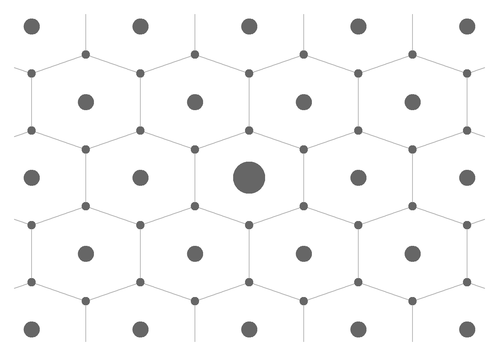

(\#fig:CentralPlaces)Central places

Assume that the doctor has a bigger area he can serve with profit. Let the radius of this area be 2 km. Fortunately, most people do not need to visit a physician every day, so they can afford traveling a couple times a year up to 2 km to their physician's cabinet. Suppose also that the doctor will choose a place for his practice next to a bakery. Maybe he likes cakes or the baker is often ill and visits the doctor. In any case, the place, where both bakery and physician's practice are located, have a larger population. So, they are denoted in Figure \@ref(fig:CentralPlaces) by the middle-sized circles. Given a wide area served by each doctor, the next physician will open his practice 4 km away from hour doctor. Most likely the location of this new cabinet will coincide with that of some of the bakeries.

Finally, assume that the book store serves an area with a radius of 4 km. The books are not some stuff we need to buy on a daily and even on a weekly basis. Hence, the travel distance of up to 4 km will not scare away buyers. The book store will be located in a place, where already a bakery and a physician's practice exist. The resulting place will have an even larger population. That is why it will be denoted by a big circle in Figure \@ref(fig:CentralPlaces).

Thus, the central places theory predicts an emergence of a *hierarchy of cities*: superior order, intermediate order, and inferior order. The bigger cities will have a higher variety of goods and services produced and sold there and, therefore, a larger population. The superior-order places will have all types of goods and services (a bakery, a doctor's cabinet, and a book store). The  intermediate-order places will have less goods and services than the superior-order ones and more than the inferior-order ones, which will have only a bakery. Each place imports goods from the higher-order places and exports to the lower-order ones. The places having the same order do not interact because they have an identical supply structure.

The theory of central places is not simply an abstract concept that only theoretical economists or geographers use. It is utilized in some countries for the purposes of planning the allocation of resources. For example, Figure \@ref(fig:CentralPlacesDE) shows a map of central places in Germany constructed by the BBSR (Bundesinstitut für Bau-, Stadt- und Raumforschung [@DeutscherBundestag_2017]).

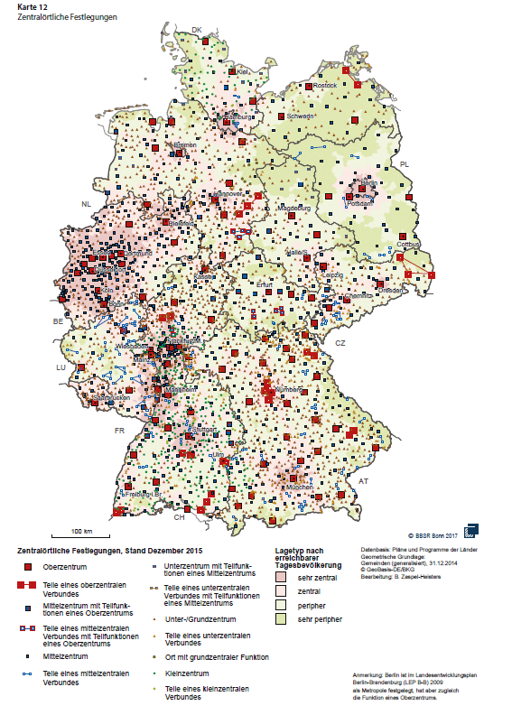

(\#fig:CentralPlacesDE)Central places in Germany

Source: BBSR

This map was developed by a German research institute BBSR, which is a part of the German federal government. The red squares denote the superior-order central places, while the blue circles stand for the intermediate-order central places. The spatial pattern observed in the map does not remind the bee cells as predicted by the theory. Such a deviation of the practice from the theory can be explained by the effects of geographical, historical, and political factors.

## The internal structure of cities {#sec:InternalStructure}

### The land use model of von Thünen
		
The origins of the modern model of a monocentric city are in the pioneering work of Johann Heinrich von Thünen (1783--1850), who in 1842 suggested a model of land use. The original work @vonThuenen_1826 can be read in Google Books, while English translation is available as @vonThuenen_1966.

His purpose was to identify where to locate different agricultural activities. The attraction point is the nearest city, where the market for agricultural products is situated. Different agricultural produces have different production and transportation costs. Therefore, the questions von Thünen intended to address were: How far from the city, say, potatoes and corn be cultivated or cows raised? Although, originally, von Thünen's theory was used for agriculture. However, it can be easily extended to the urban economy.

In the von Thünen's model, the land rent is the maximum possible amount that an agricultural producer can pay for the use of land.
			
\begin{equation}
		R = (P-C)Q - \tau Q d
		(\#eq:VonThuenen)
\end{equation}
	
where $R$ is the land rent (euros/km$^2$); $P$ is the market price of the crop (euros/t); $C$ is the production cost of the crop (euros/t); $Q$ is the yield (t/km$^2$);
$\tau$ is the transportation cost (euros/t/km); $d$ is the distance from the market (city).

Figure \@ref(fig:VonThuenen) compares two land rent functions for two agricultural produces: A and B.

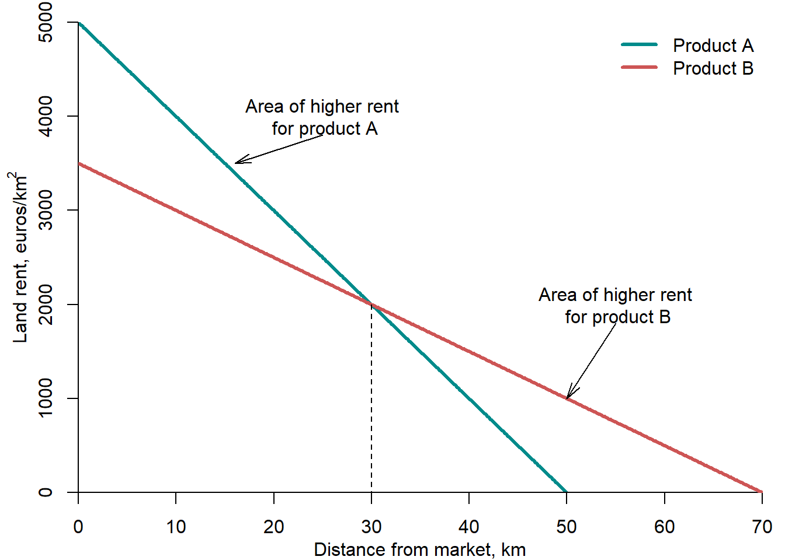

(\#fig:VonThuenen)Land use: von Thuenen's land rent

As the main factor that makes difference in space is the distance to the city (market), different agricultural activities will occupy segments at different distances from the city. Thus, they will form rings around the city, as shown in Figure \@ref(fig:MapVonThuenen).

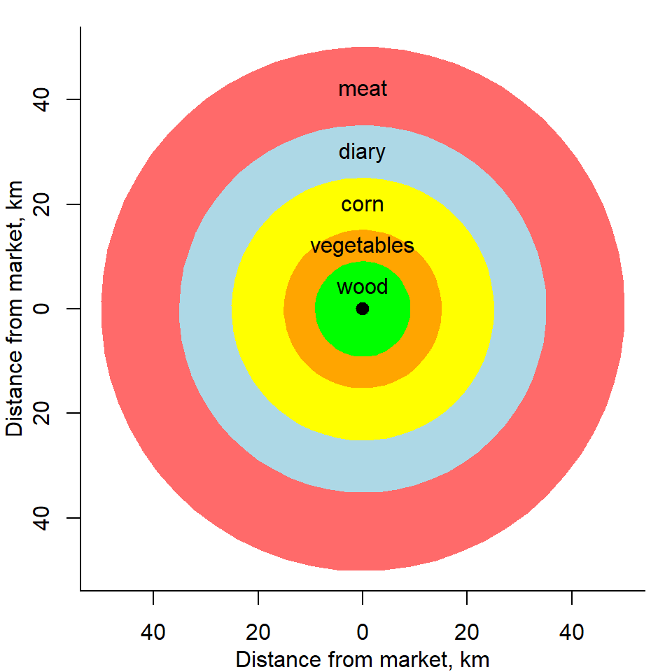

(\#fig:MapVonThuenen)Land use: von Thuenen's product rings

### Alonso-Mills-Muth model
The modern theory of monocentric city structure suggested by William Alonso (1933-1999), Edwin Mills (born in 1928), and Richard Muth (born in 1927) [@Alonso_1964;@Mills_1972;@Muth_1975]. Its aim is to explain the land use in a monocentric city, that is, a city having only one center. Below, we consider this theory from the viewpoints of production and consumption. The following discussion is to a large extent based on @Mills_1972.

Let us consider first the land use in a monocentric city from the production side perspective. The model is based on the following assumptions:

* all goods are produced using the land and capital;
* the production function has constant returns to scale and permits substitution between the land and capital;
* the input and output markets are perfectly competitive implying that all firms are pricetakers;
* the supply of capital is perfectly elastic to the urban area, i.e., it is equally available throughout the whole city;
* the rental rate on capital, $i$, is the same throughout the whole urban area;
* the land rent, $R(d)$ is determined by the model and depends on distance from city center.

The production function of a firm can be formulated as follows:
			
\begin{equation}
x = f\Big(K(d), L(d)\Big) 
		(\#eq:ProductionFunctionAMM)
\end{equation}
where $x$ is the non-housing output (e.g., production of consumer goods); $d$ is the distance from production site to city center; $K(d)$ is the use of capital (say, equipment or buildings); and $L(d)$ is the use of land (i.e., the territory occupied by the factory).

Its only difference from the production function in the standard microeconomic theory is the distance, $d$. In such a way from the spaceless world the firm is transfered into the world, where distance matters and creates additional obstacles for the market participants. 

Based on the production function in equation \@ref(eq:ProductionFunctionAMM) the profit of the firm can be calculated:

\begin{equation}
\pi = px - i K(d) - R(d) L(d) - \tau x d  	

\end{equation}
where $p$ is the unit price of output (euros); $i$ is the interest rate on capital; $R(d)$ is the land rent per $m^2$; and $\tau$ is the cost of transporting 1 product unit for 1 km.

The first-order conditions of the profit maximization problem are as follows:
		
\begin{equation}
			\frac{\partial\pi}{\partial K(d)} = \frac{\partial x}{\partial K(d)}(p - \tau d) - i = 0
\end{equation}
\begin{equation*}
			\frac{\partial\pi}{\partial L(d)} = \frac{\partial x}{\partial L(d)}(p- \tau d) - R(d) = 0
\end{equation*}

The resulting rent function is:% ($\pi=0$):
				
\begin{equation}
		R(d) = \frac{\partial x}{\partial L(d)}(p - \tau d)
\end{equation}

According to the rent function, two predictions can be made. First, the land rent decreases with distance from city center: the closer to the center the higher the land rent, as shown in Figure \@ref(fig:BidRentFunction). Second, due to the factor substitution the land rent grows faster than linear at small values of $d$. Indeed, when the land becomes more expensive, the firms began using it more intensively by constructing higher buildings and by offsetting in such a way lower land use by a large use of the capital.

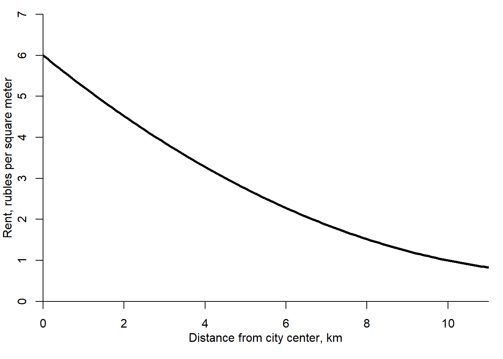

(\#fig:BidRentFunction)Land use in a monocentric city: rent function

Now, let us approach the land use in a monocentric city from the consumption side. Here, we concentrate on the model of household location choice. This model is based on the following assumptions:
			
Household has utility function describing its tastes for housing services, $h$, and non-housing goods and services, $x$. The location choice, or the distance from center, $d$, affects both the utility as subjective costs of commuting (time foregone for other activities, fatigue, strain, and boredom) and the budget constraint as commuting costs. Households maximize their utility with respect to consumption of housing, goods, and commuting subject to budget constraint.

The following mathematical model of household location choice can be formulated:	
		
\begin{equation}\begin{array}{l}
		\mbox{Utility: }U = g(x, h, d)\\
		\mbox{Budget constraint: }px+r(d)h + \tau d = w
			\end{array}
\end{equation}
where $U$ is the household utility; $p$ is the price of non-housing goods and services; $r(d)$ is the housing rent; $\tau$ is the commuting cost; $d$ is the distance from city center; and $w$ is the household's income.

Figure \@ref(fig:HouseholdLocation) shows the household indifference curve illustrating his choice between the non-housing and housing consumption.

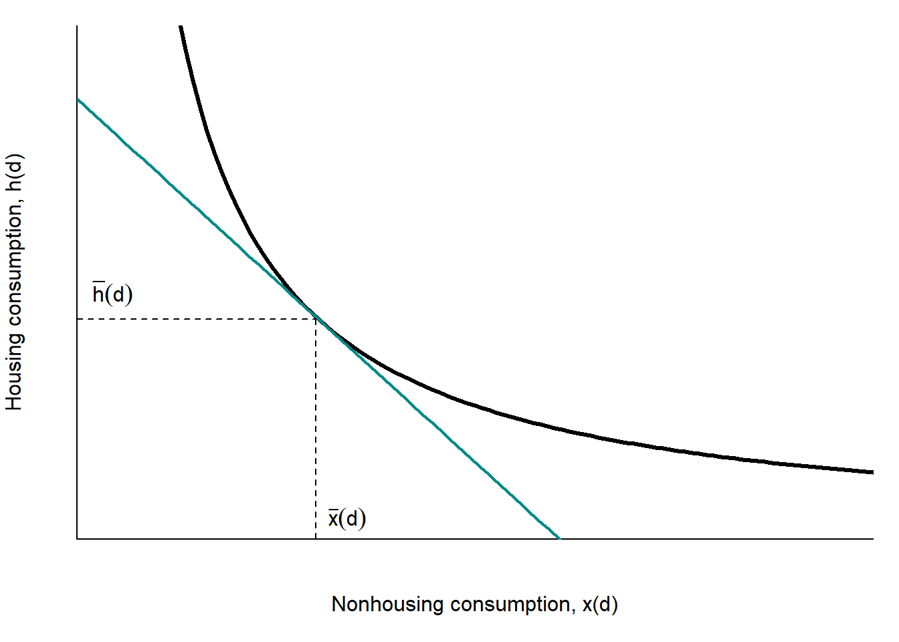

(\#fig:HouseholdLocation)Household location choice

In equilibrium, the rate of substituion of the housing consumption for the non-housing consumption is equal to the ratio of the non-housing price to the price of housing:	

\begin{equation}
		\frac{\Delta h}{\Delta x} = -\frac{p}{r} \Rightarrow p\Delta x(d) + \Delta r(d)h(d) = 0
\end{equation}
The budget constraint of the household:	

\begin{equation}
		px(d)+r(d)h(d) + \tau d = w
\end{equation}

The effect of a small change in $d$:	

\begin{equation}
		p\Delta x(d)+\Delta r(d) h(d) + \Delta r(d)\Delta h(d) + r(d)\Delta h(d) + \tau \Delta d = 0
\end{equation}	
		
\begin{equation}
		\Delta r(d)\Delta h(d) \approx 0
\end{equation}	

\begin{equation}
		r(d)\Delta h(d) + \tau \Delta d = 0
\end{equation}

The resulting housing rent/price function:

\begin{equation}
		\frac{\Delta r(d)}{\Delta d} = -\frac{\tau}{h(d)}
\end{equation}

The housing rent function has negative slope. This implies that the housing is more expensive close to city center than in suburbs. Moreover, the rent function is steep wherever $h$ is small: if suburban households consume more housing than those living in center, then the function is steeper close to city center, as shown in Figure \@ref(fig:HouseholdLocation2HH).

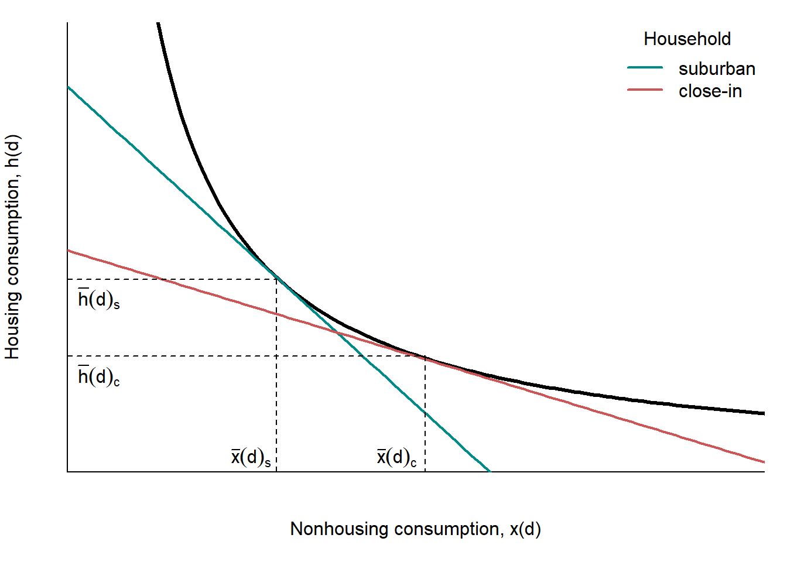

(\#fig:HouseholdLocation2HH)Household location choice: city center vs. suburbs

The housing rent function has important implications in terms of the population density within cities. First, the suburbanites (the persons living in the suburbs of a city) consume more housing than residents living close to the city center. Second, since the land is cheaper relative to other housing inputs in suburbs than close to city center, suburban housing uses lower capital-to-land ratios. This means that, all other things being equal, we can expect that the residential buildings will be larger in the central parts of the city and smaller in the suburbs. This is a typical structure of a North American city: while in the center the residents are living in the multi-storey apartment buildings, in the suburbs they occupy spacious single-family houses. Third, in the suburbs, the population density is predicted to be lower than near to the city center. This is closely related to the second implication: higher population density in the central districts is directly related to the higher intensity of land use there. Indeed, a plot of land occupied by an apartment building will provide more housing units than a land plot with exactly the same area but occupied by the single-family houses. More housing units means more inhabitants, even accounting for the fact that the families living in the single-family houses tend to be larger. Fourth, the model predicts a certain spatial income distribution of the households:

Let the disutility of 1 km of commuting be proportionate to wage, equally for high- and low-income workers. If income elasticity of demand for housing exceeds 1, then high-income workers will live farther from the city center; see Figure \@ref(fig:HouseholdLocationRichPoor). By contrast, if income elasticity is lower than 1, then high-income workers will, nevertheless, live farther out, provided that demand for housing is not too inelastic with respect to its price.

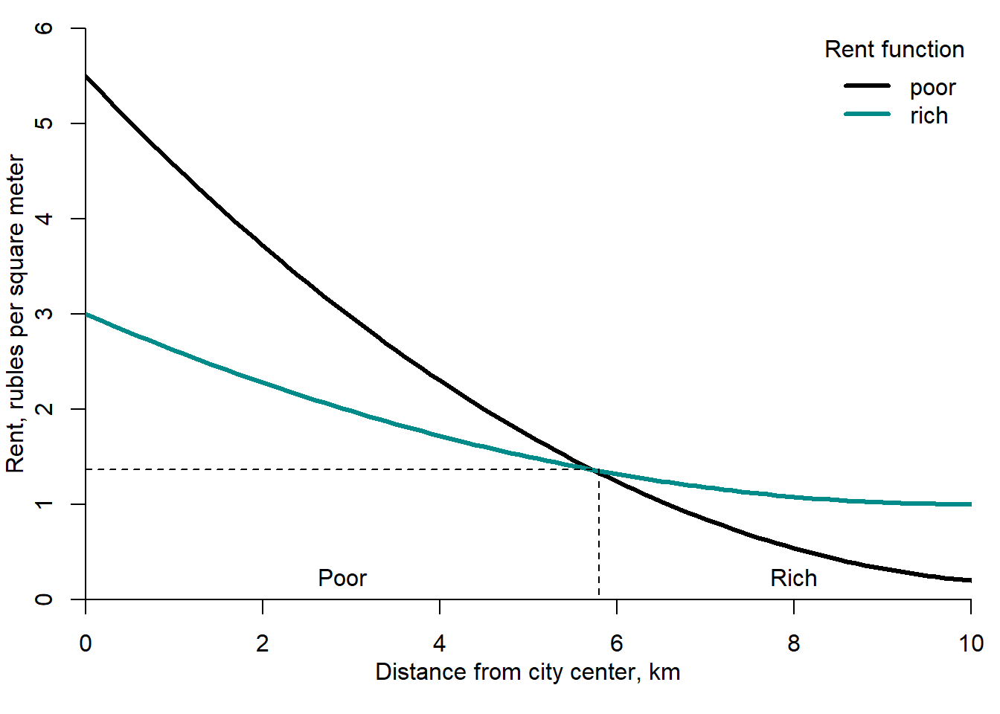

(\#fig:HouseholdLocationRichPoor)Land use in a monocentric city: rich vs. poor

The income-specific household location choice can also have alternative explanations. According to the transport mode choice explanation, the poor cannot afford automobiles and must rely upon public transit. Unlike the suburbs, the central districts of the cities have a dense enough public transit network. Therefore, the poor must live in central cities in order to have mobility.

Another explanation is related to the age of dwellings. The rich prefer newer housing because it has higher quality corresponding to the latest standards, while poor can tolerate the old housing, which is equipped with basic utilities. In some cases, even nowadays, one can find old buildings near to the city center without bath or central heating. The newer houses are more likely to be found in suburbs, while the older ones tend to locate in the central districts. 

In the USA, poor typically live close to central business district (CBD), while rich in suburbs. In European countries, often an opposite case is observed. For example, in Paris, rich live in the CBD. @Brueckner_et_al_1999 use the cases of Paris and Detroit in order to explain this difference in the spatial distribution of the rich and poor. Their explanation relies upon the urban amenities (historical monuments, fine architecture, etc.) and natural amenities (ocean or river front). These amenities positively affect the housing prices and rents for dwellings located nearby. Moreover, the rich value living near them more than the poor. In Paris, urban amenities are concentrated in the city center, while Detroit has no such amenities at all. This can be generalized for many old cities in Europe having a long and glorious history and the cities in the US having virtually no history.

Now, we can put together different sides of the same picture, namely production and consumption sides. Together, they deliver a stylized picture of the spatial distribution of different city activities (sectors), see Figure \@ref(fig:MonocentricCityLandUse).

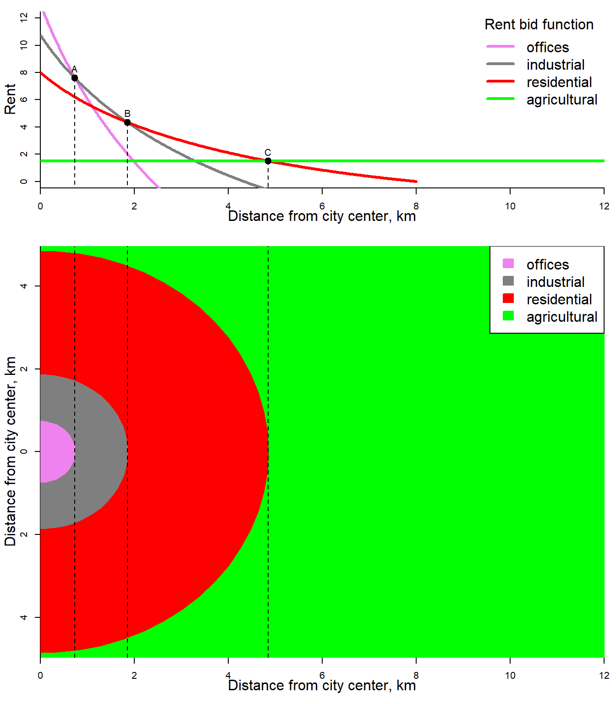

(\#fig:MonocentricCityLandUse)Land use in a monocentric city: multiple sectors

As seen, the model predictes the following spatial location of industries. The sectors are ranked by distance from city center in order in which they are ranked by steepness of their rent-bid function. In other words, the industry with the steepest rent-bid function is closest to CBD.

The manufacturing firms locate close to centrally located port or rail facilities to export their output and import inputs, because they require large amounts of raw and processed materials. The service sector firms (e.g., office activities) require demand of the entire urban area to exhaust their scale economies. Office activities entail much less rapidly diminishing returns with increases in capital-to-land ratio than manufacturing. The labor is their most important input. Moreover, the workers are much less expensive to transport vertically using elevators than materials.
		
An example of real land use pattern can be seen in Figure \@ref(fig:MapLandUseSPb), which shows the zoning of St. Petersburg in 2003.

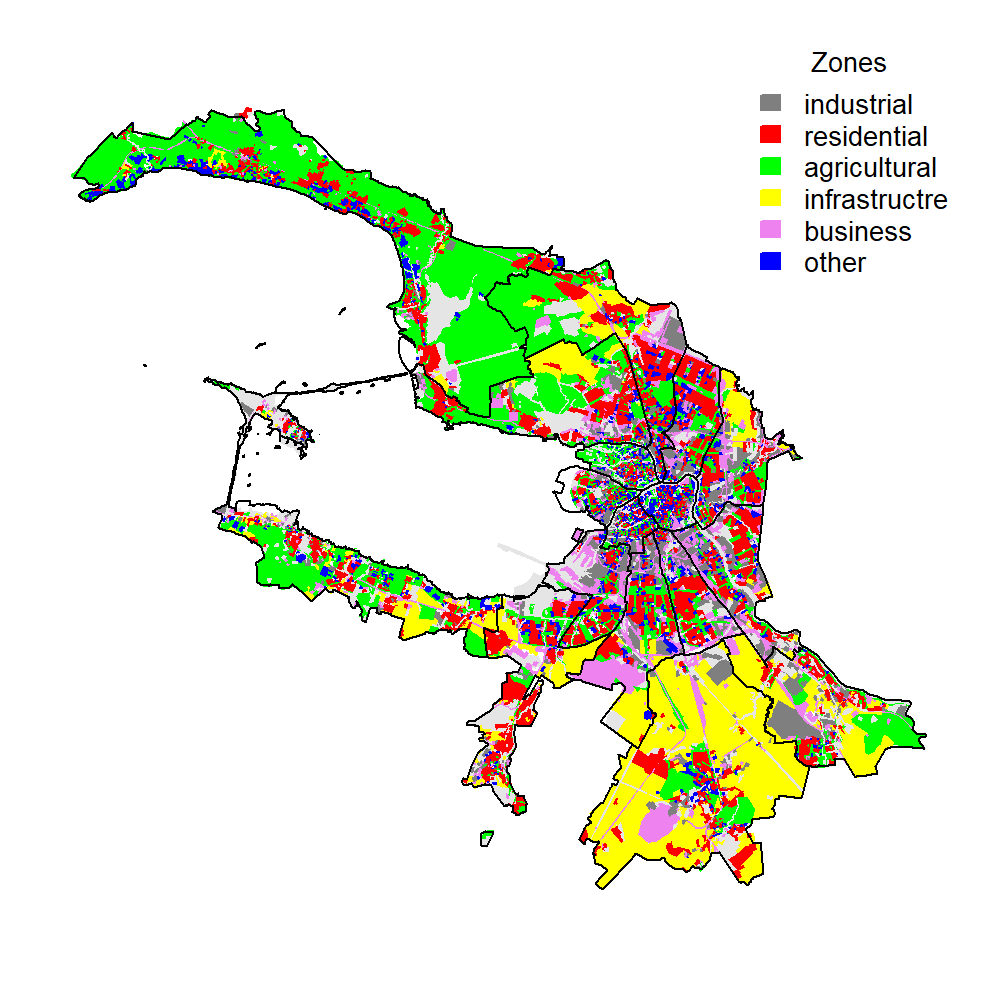

(\#fig:MapLandUseSPb)Land use in St. Petersburg

The industrial zones form the so-called "gray ring" around St. Petersburg's city center. This is typical for many former Soviet cities. The residential areas are located farther outward, surrounded by the recreational and agricultural zones. In fact, the map reflects the vision of the city planning authorities. However, at least for 2003 it accurately reflected the spatial distribution of different sectors, which quite closely mimics the stylized picture predicted by the land use theory that we discuss here.
		
In urban economics, as distance from city center increases, the land prices decrease; the population and employment density go down; the social composition of population changes; and the share of rented dwellings decreases ceding place to the owner-occupied dwellings [@Blanco_2014, p. 46--50]. Figure \@ref(fig:TenantsLondonWards) illustrates this for London using the spatial distribution of the share of private sector tenants by wards.^[Ward is a local authority area, which is typically used for electoral purposes.]

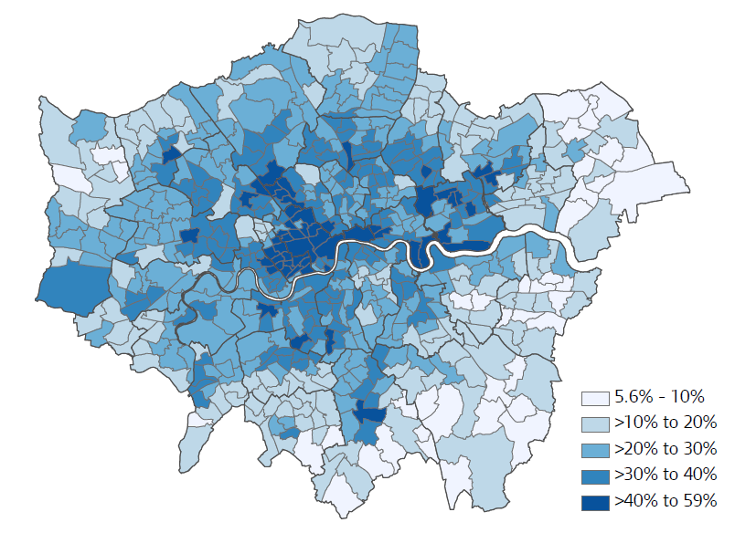

(\#fig:TenantsLondonWards)Private tenants as proportion of all households in London by ward, 2011

Source: @Mayor_London_2015, p. 13.

As seen, the highest proportions (above 40\%) are attained in the central wards, while toward the periphery of the city the share of tenants declines. An inverse picture is obtained, when the proportion of homeowners is depicted. A similar spatial pattern can be observed also for Rome [@Immobili_Italia_2019, p. 28].

## Density gradient {#sec:Gradient}

The city land use theory predicts the population and employment density decreasing as the distance from the city center increases. This negative dependence between the density and the distance from the city center can be described using the notion of **density gradient**. Formally, the density gradient can be expressed as follows:

\begin{equation}\label{eq:CBD_expon}
p(d) = p(0) e^{-\gamma d\varepsilon}
\end{equation}
where $p(d)$ is the population or employment density at $d$ km from CBD, persons/km$^2$; $d$ is the distance from city center, km; $p(0)$ is the population or employment density in the CBD, persons/km$^2$; $\gamma$ is the density gradient; and $\varepsilon$ is the random error. The random error is introduced in order to reflect a real situation. In the real world, the population density cannot be explained by the distance from the center alone. Moreover, the density can be measured with mistakes. Thus, the random error reflects both various factors contributing to the determination of the population density, but omitted in our model, and the measurement mistakes.

Figure \@ref(fig:StylizedDensityGradients) compares different gradients. The larger the absolute value of $\gamma$ the steeper the slope of the population density function and the quicker the density declines as the distance from the city center increases.

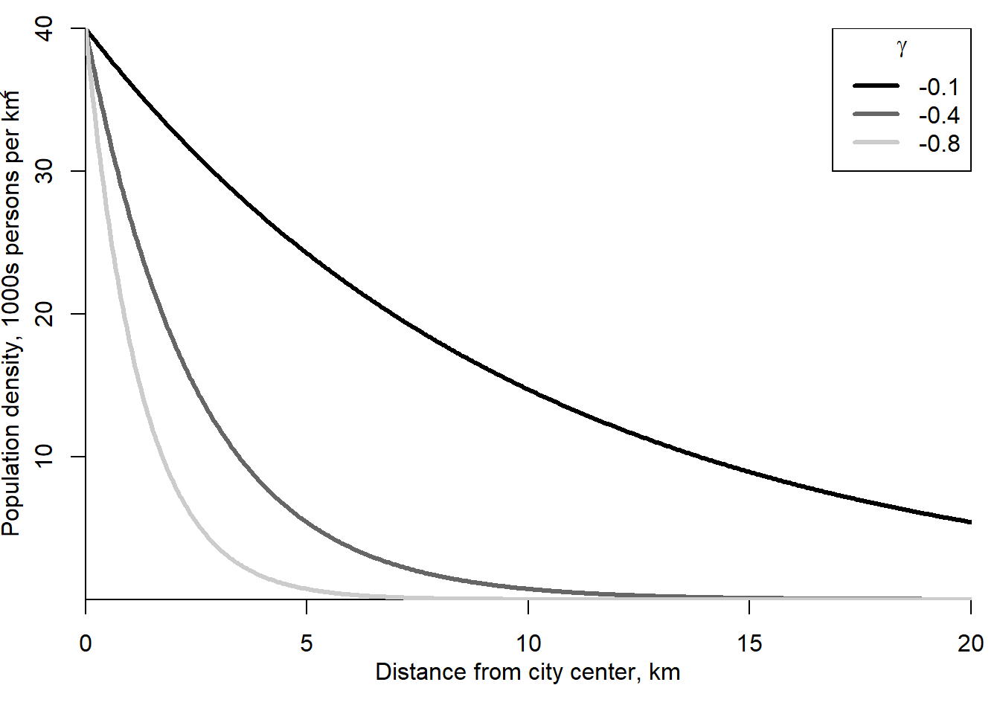

(\#fig:StylizedDensityGradients)Alternative stylized population density gradients

The population and employment density gradients are affected by various factors. First, the density gradients become flatter with the income: as the income per city resident increases, the residents can enjoy a higher housing consumption. Therefore, they will occupy more space, which will lead to a lower population density. Second, $\gamma$ shrinks with a growing population of the city, since it leads to a denser population in the less-developed areas and to an expansion at the urban fringe (city expands its boundaries). In many cases, the population growth in the city is accompanied by the decline of the population density in the central areas of the city.

Third, the density gradient flattens as a result of improvements in transport performance. Falling transportation costs and higher speed allow more people to settle down farther from the city center and still enjoy a relatively easy access to the jobs and urban amenities located in the CBD. As examples of such developments one can mention the advent of the electric trams and of the personal cars that permitted an extreme expansion of the city boundaries. To a large extent, the modern levels of urbanization owe to the technological progress that greatly improved human mobility.

Figure \@ref(fig:MapPopulationDensitySPb) illustrates the spatial distribution of the population density in St. Petersburg in 2015.

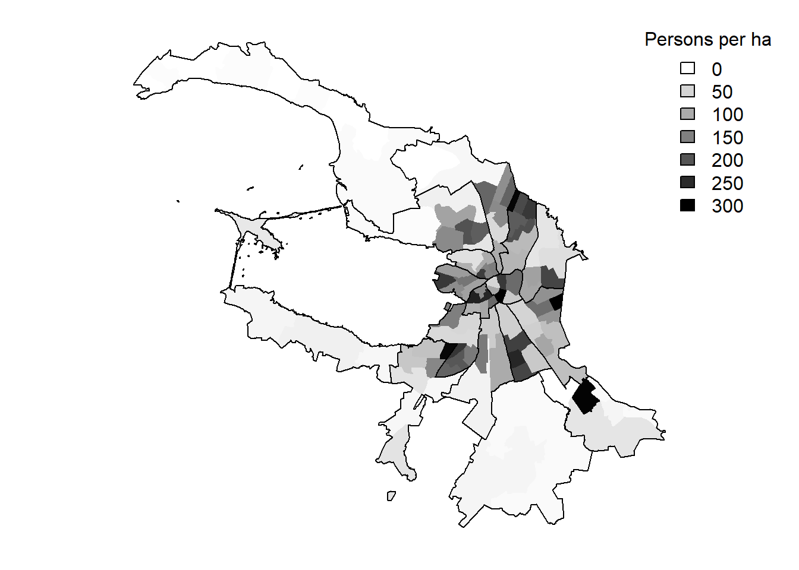

(\#fig:MapPopulationDensitySPb)Population density in St. Petersburg, 2015

Sources: Petrostat and own representation.

Contrary to the predictions of the theory of the land use in monocentric city, the central parts of St. Petersburg are not those with the highest population densities. The population density is very high in the so-called "dormitory districts", where residential high-rise building dominate the landscape. It can also be explained by governmental regulations. For example, the height restrictions prohibit erecting buildings exceeding a certain threshold in the city center. In addition, the delayed deindustrialization permitted a conservation of the "gray industrial ring" of St. Petersburg around its center, thus, preventing its conversion into higher-density residential areas.

The information contained in Figure \@ref(fig:MapPopulationDensitySPb) can be made even more visible in Figure \@ref(fig:DistanceDensitySPb), which shows the relation between the distance from the centroid of St. Petersburg and population and employment density.

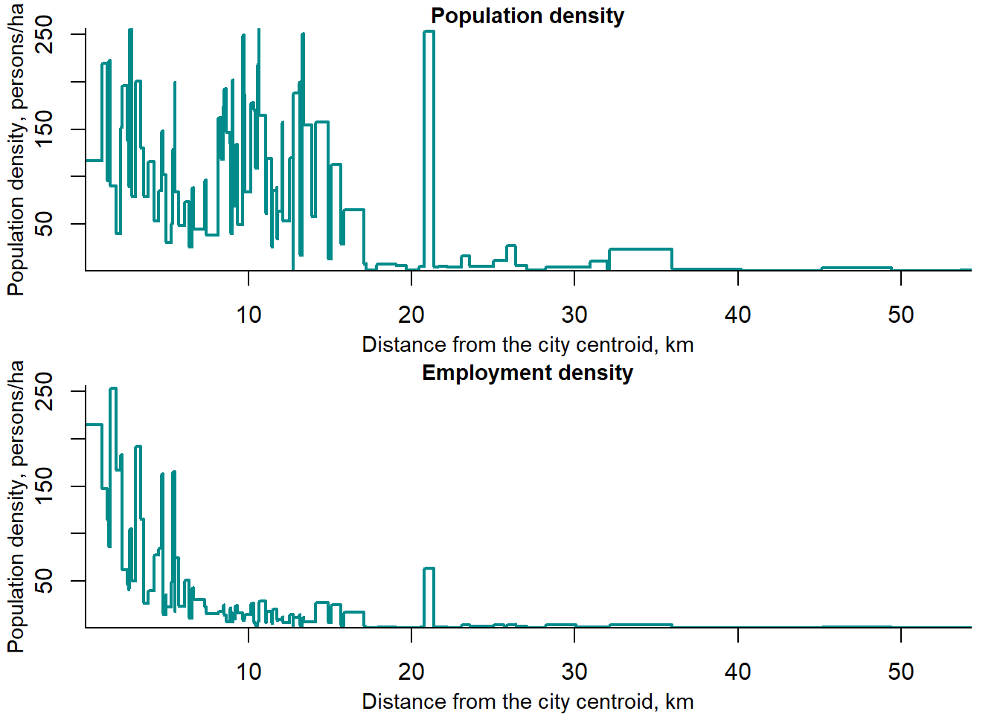

(\#fig:DistanceDensitySPb)Distribution of population and employment density by distance from the centroid in St. Petersburg, 2015

Sources: Petrostat and own representation.

Within approximately 15 km from the city centroid, the population density remains almost unchanged, one exception being the industrial "gray ring'' at around 8--9 km from the centroid of the city. A large outlier at about 23 km is an industrial town within the agglomeration of of St. Petersburg (Metallostroy). The employment density follows a pattern, which is very similar to that predicted by the theory. Once again, Metallostroy stands out as an outlier.

For comparison, consider the spatial distribution of population density in Berlin by 447 LOR (*lebensweltlich orientierte Räume*) areas, see Figure \@ref(fig:MapPopulationDensityBerlin). 

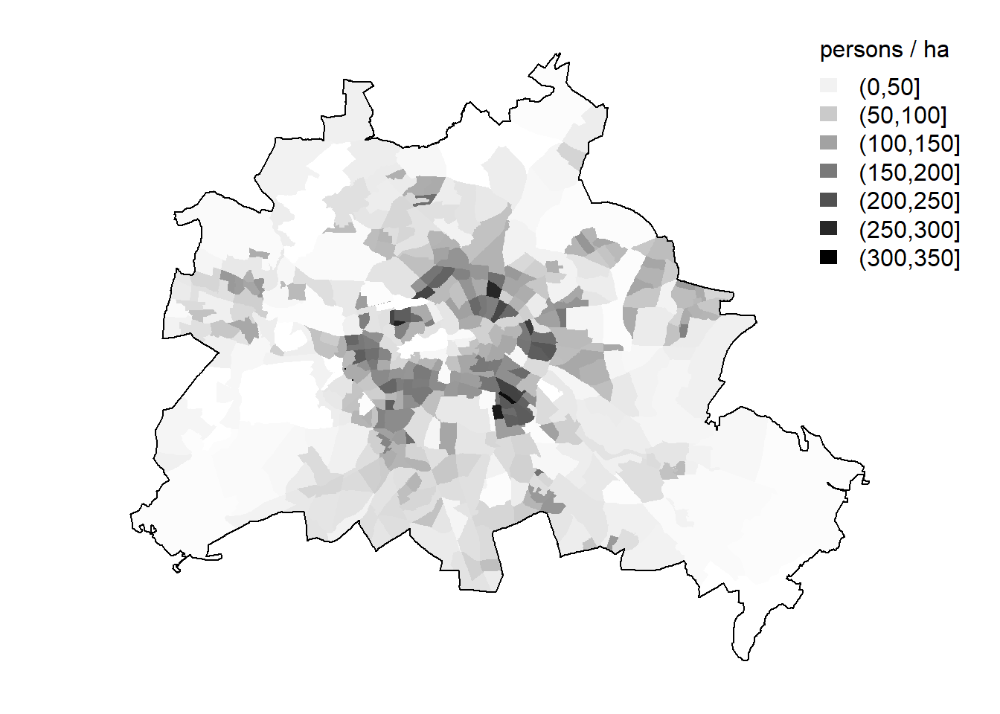

(\#fig:MapPopulationDensityBerlin)Population density in Berlin, 2015

Sources: Senatsverwaltung für Stadtentwicklung und Wohnen and own representation.

Berlin has a comparable population with that of St. Petersburg: 3.5 vs. 5 million, respectively. However, the population density patterns in both cities are very different. Berlin fits much better into the distribution predicted by the theory. Berlin experienced a large-scale deindustrialization after World War II, since many factories were relocated to West Germany.

Figure \@ref(fig:DistanceDensityBerlin) depicts the population density as a function of distance from the centroid of Berlin.

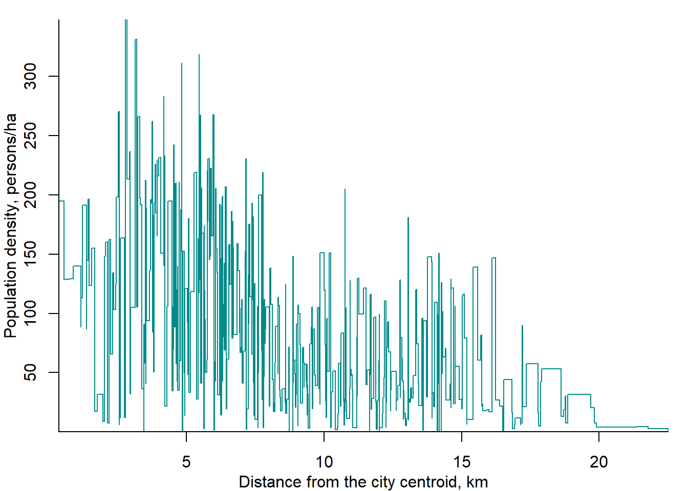

(\#fig:DistanceDensityBerlin)Distribution of population density by distance from the centroid in Berlin, 2015

Sources: Senatsverwaltung für Stadtentwicklung und Wohnen and own representation.

In Berlin, unlike in St. Petersburg, the population density diminishes in a more consistent way as the distance from the geographical center of the city increases. A relatively low population density within 3 km from the center is due to the fact that the central part of Berlin is occupied by large park Tiergarten.

How does the population gradient look like worldwide. @Bertaud_Malpezzi_2014 investigate the empirics of population gradient for many cities and obtained a number of interesting results. The negative exponential density gradient implied by the urban model fits data well. However, in some cities, large deviations are observed. Seoul is an example of the market economy, but extremely strict land use regulations shape  spatial distribution of its population density. The layout of Brasilia and Moscow is a result of central planning. Brasilia was built in 1960 from the scratch as the new capital of Brazil and was planned using the rationalist ideas of Charles-Edouard Le Corbusier (1887--1965), while Moscow was largely re-designed in the 1930s.^[As a matter of fact, in the early 1930s, in his "Response to Moscow'' Le Corbusier sketched a plan of reconstructing the Soviet capital as a radiant city (*ville radieuse*). Fortunately, this plan was never implemented.]
Capetown is a city developed under apartheid, which was divided into two cities: one for the whites and another for the colored people.

## Exercises {.unnumbered #sec:ExUrban}

1. What is a city?
2. What are statistical issues of identifying cities?
3. Which solutions are offered to cope with these issues?
4. What is the difference between the intra-industry and urbanization economies? Provide examples of both.
5. What does the Christaller-Lösch theory explain?
6. What and how does the theory of von Thünen explain?
7. What does Alonso-Muth-Mills model explain?
8. What are the predictions of Alonso-Muth-Mills model about firms?
9. What are the predictions of Alonso-Muth-Mills model about households?
10. What are the general predictions of urban economics about the land use in cities?

## Key terms {.unnumbered #sec:KTUrban}	

----------------------  -----------------------------  -----------------------
urban economics         city                           urban area             
functional urban area   urban population               urbanization           
population size         population density             comparative advantages 
scale economies         intra-industry agglomeration   urbanization economies 
trade agglomeration     external effects of trade      central places         
hierarchy of cities     land use                       von Thünen             
land rent               Alonso-Mills-Muth              monocentric city       
production function     household problem              location choice        
rent-bid function       central business district      city center            
density gradient        population density             employment density     
----------------------  -----------------------------  -----------------------
