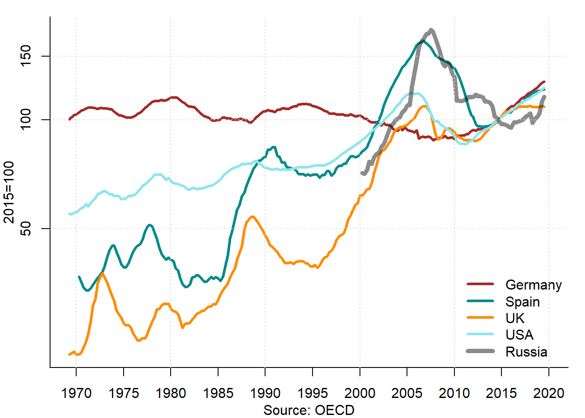

# Housing market {#ch:Market}

## Introduction {#sec:IntroMarket}

This chapter is devoted to the market of such a specific good as housing. The housing market possesses the standard elements of any market: supply, demand, and the price that equalizes them. Since the housing is a durable good, the housing market can be divided into the primary (newly built housing) and secondary (used housing) markets. In addition, due to its relative expensiveness ---the purchasing price can be many times higher than the annual income of the household--- not everybody can afford buying a dwelling. This leads to a distinction between the owner- and tenant-occupied housing. At the same time, the housing is not an ordinary good. It is characterized by large complexity and heterogeneity. The immobile nature of housing creates  strong dependence of its value on the place, where it is situated. All in all, the specificity of housing makes it an exciting object of investigation.

This chapter is organized as follows. Section \@ref(sec:HousingImportance) serves as motivation for this chapter, for it demonstrates the importance of housing from the socio-economic standpoint.In section \@ref(sec:Market) we will focus on the specific features of housing as a good: heterogeneity, immobility, durability, and expensiveness.  Sections \@ref(sec:Demand) \ref{sec:Demand} and \@ref(sec:Supply) consider the housing demand and supply, respectively. In section \@ref(sec:Prices), the housing prices and their long-term dynamics are discussed. Section \@ref(sec:Equilibrium) presents a stock-flow model of the housing market unifying all its aspects: the demand; the supply; and the housing price or rent that equate supply and demand. Section \@ref(sec:Availability) is devoted to the availability of housing in various countries and compares them to Russia. In section \@ref(sec:Vacancy), such measure of excess supply as housing vacancy is examined. Section \@ref(sec:Affordability) deals with the affordability of housing, that is, the ability of households to buy or rent a home.<!---->

	
## The importance of housing {#sec:HousingImportance}
The housing represents a large share of wealth of private households. Households spend a large part of their current expenses on housing. People, especially in countries with severe climate, stay most time in buildings. In addition, housing often serves as a symbol of status.

In Russia, the housing has a particular importance. The main issue is the very insufficient availability of affordable and high-quality housing in Russia. The availability of housing (as measured by the living space per head) in Russia is two times smaller than in Western Europe and almost three times smaller than in the USA (see section \@ref(sec:Availability)). This problem is aggravated by the fact that the housing affordability (as measured by the ratio of incomes of an average household to the income it must have to purchase a standard dwelling using a mortgage loan provided at standard conditions) in Russia is, for example, four times lower than in the USA [@Gusev_2008].
			
This is confirmed by the results of the opinion surveys, which show that the most important problems of Russian citizens at the national level are: high housing prices, high utilities prices, and a near impossibility to buy housing.^[See the press release of the Russian Public Opinion Research Center of October 7, 2016: https://wciom.ru/index.php?id=236&uid=115901.] 

## Housing market {#sec:Market}

The housing as a good has several specific features that distinguish it from other goods. First, *housing is very heterogeneous* --- it differs a lot in terms of size, layout, equipment, state, and location. Second, the *housing is immobile* --- it is impossible (without huge expenses) to move it in space. There some exceptions, like boat houses (e.g., in Amsterdam, Berlin, and Paris) and mobile homes (widely spread in the USA). Third, the *housing is durable* --- normally, it can be used for decades. The exceptions include temporary housing and huts of nomad people (e.g., iglu or yurt). Fourth, the *housing is very expensive* --- it accounts for a large share of consumption and wealth of private households. Fifth, the *costs of moving are very high*: large financial and socio-psychological costs are associated with changing the residence, especially if people move between for a long distance.

		
### Heterogeneity of housing

The housing is a highly heterogeneous good --- it varies a lot across different dimensions. The housing value can be represented as a combination of contributions of its features. Typically, two major types of housing characteristics are distinguished: *structural* and *locational*. The structural characteristics refer to the physical condition of the dwelling itself and the building wherein it is located. They include the size (e.g., total and living area, the number of rooms, the number of floors in the building as well as the floor in which the dwelling is located, the area of the land plot), the layout (e.g., several small rooms vs. one large room, connected or isolated rooms, joined or separate WC and bathroom, availability of balcony or loggia, etc.), the equipment (e.g., built-in kitchen, central or individual heating, air conditioning), the state (e.g., newly built vs. completely worn-out, luxury vs. poor), construction materials, and the energy consumption and type of energy.

The locational characteristics describe all features of the housing related to its geographical location. They include the accessibility (e.g., the distance or the travel time to the central business district, the proximity to roads or public transit stops and stations), the socio-economic situation in the neighborhood (the income and cultural level, the unemployment and the crime rate in the neighborhood or city district in which the dwelling is located), the natural environment (the quality of air, the availability of the green spaces, the proximity of the sources of environmental pollution, the incidence of various diseases), and the state of neighbor houses (how well the nearby houses and adjacent land plots are kept).

One related feature of the housing market is the information asymmetry between the seller and buyer of the housing. In case of such a complex and heterogeneous good, it is virtually impossible for the buyer to figure out all its relevant characteristics before he buys and starts to use it. Even then, some hidden deficiencies can be discovered only years after. These include, for example, the fungus of the walls (structural characteristics) or the fact that nearby railway station is going to be shut down in a few years (locational characteristics). 

### Immobility of housing

In most cases, the housing is immobile, meaning that it is prohibitively difficult and expensive to move it from one place to another. Therefore, the real estate agents often joke that the three main factors affecting house prices are: location, location, and location. However, this joke contains a big grain of truth. Indeed, in many cases the value of the dwelling can be up to a half dependent on its location.

The heterogeneity of housing implies a high degree of segmentation of housing markets. The housing submarkets are delineated by such characteristics as size, location, and quality. The local markets can be quite isolated from each other, especially if they are divided by the natural (rivers, mountains, etc.) or human made (railroads, highways, etc.) barriers. Such local isolation produces spatial heterogeneity of housing (local submarkets differ from each other, especially in terms of the price) and spatial dependence (the dwellings located next to each other are more related in terms of their values than dwellings located far apart). Section \ref{sec:Spatial} elaborates more on these issues and how they can be tackled with in order to accurately assess the value of the real estate.

### Durability of housing

The housing is a very durable good. It can serve for various decades or even centuries. However, over time, the housing wears and tears. Therefore, from time to time a refurbishment is needed.

The number of existing dwellings or their area is called **housing stock**. The housing stock grows mainly through the new construction. Some part of housing is removed from the market. First, dwellings are converted to non-residential uses (e.g., offices, doctor's practices). Second, the owners simply do not use it and leave vacant (empty) as a so-called "concrete purse''. This is done especially during the housing market booms, when the prices for housing increase, and the market participants expect to sell it at a later stage with a profit. In such a case, renting out of the housing is regarded as something burdensome. Third, when housing is worn out and not well maintained, it decays and becomes uninhabitable. Fourth, the housing is demolished, because it is too worn out or it is considered as an obstacle for the new developments (construction of new streets or larger buildings).
		
One interesting phenomenon related to the durability of housing is the so-called **filtering down**. It means a transition of housing from the more expensive into a cheaper segment due to wear and obsolescence. Typically, the housing market is very segmented by different dimensions. One of the dimensions is the quality of housing. The higher-quality dwellings are more expensive and, therefore, are used by the better off persons, while lower-quality dwellings are inhabited by the poor people. Often, the investors are more interested in constructing high-quality dwellings that offer higher profits than the dwellings for poor. This can create problems with availability of affordable housing, since people with lower incomes are more populous. However, the good news is that the high-quality dwellings constructed years before through the wear and tear descend into the lower-quality segment. The rich people leave these dwellings and more into the newly built ones, whereas poor people can move in these "filtered down'' dwellings. This process ---at least to some extent--- mitigates the housing affordability issue.
		
		

### Housing is expensive

Another important feature of the housing is its high price. Despite all the standardization of the building materials and streamlining of the construction process, the modern housing is very expensive. 

The housing price by far and large exceeds the current income of the household. It can well be 3--4 times larger than the annual income. Therefore, the housing is mainly bought with borrowed money. This can be dangerous, if the dwelling is bought at a peak of a housing boom, which is followed by an abrupt price fall.^[See more on the so-called speculative asset price bubbles in Chapter \@ref(ch:Bubbles).] In such a case, many house buyers with low or uncertain incomes can default and lose their property. In some countries, e.g., in Germany, the liability of mortgage debtors does not end with the sale of the house, instead the whole their wealth must be used to pay out their debts. If many people cannot fulfill their debt obligations, then the banks, which lent them money, get into troubles. Due to a strong interdependence of the banks this can lead to a systemic crisis of the whole banking system, which, in turn, can trigger a full-fledged economic downturn. This is a scenario that took place in 2008--2009 first in the USA and then in many other countries.
	
The fact that the housing is very expensive generates a divide between people: some of them, who have another money to buy a dwelling, become homeowners, while the others must live in a rented housing. The choice between the own and the rental housing is known as a tenure choice. In more detail it will be considered in Chapter \@ref(ch:Tenure).

Finally, the housing makes up the largest part of the private wealth. This means that the assets of the private households are mainly invested in their housing and, thus, are not really diversified. For example, in Germany, it accounts for more than a half of the wealth of private households. It share is well above the proportion of other assets, including cash and securities. In China, the proportion of the housing in the total wealth is even higher, corresponding to approximately 70\%^[The New York Times: China's real estate mirage: https://list.juwai.com/de/news/2017/06/why-are-chinese-so-obsessed-with-buying-property.]
In Sweden, during the post-WWII period, the housing accounted for 50--75\% of the wealth of private households [@Berg_1988]. Figure \@ref(fig:NationalWealthStructureRussia) depicts the structure of the fixed capital of Russia in 2015.

(\#fig:NationalWealthStructureRussia)Structure of Russia's fixed capital, end of 2015

As seen, the value of residential buildings accounts for more than 40\% and is about 138.8 trillion rubles.

Figure \@ref(fig:WealthFrance) traces the evolution of the structure of the private wealth of France between 1700 and 2010. The value of four main assets (agricultural land, housing, other domestic capital, and net foreign assets) is expressed as percentage of the national income.

(\#fig:WealthFrance)National wealth of France, 1700--2010

Source: @Piketty_Zucman_2014.

While until the mid-19th century, the agricultural land in France used to be the largest asset, by the end of the 20th century the housing turned into the largest wealth component. 

## Demand for housing {#sec:Demand}
   
As in any other market, the effective demand for housing depends on the number of individuals requiring it and on their purchasing power. In case of the housing market, the individuals requiring dwellings are households. According, for example, to the definition of Rosstat, "a household is a group of persons living in the same residential premises or part of them, who jointly provide themselves with food and all necessary stuff for their life, and completely or in part join and spend their money. These persons can can be unified by the kinship relations and relationships resulting from marriage, or do not be relatives, or be either one or another''.^[See definition in Russian here: http://www.gks.ru/free_doc/new_site/population/demo/micro-perepis/finish/Method-MPN-2015.pdf.]

Therefore, the demand for housing depends basically on the demographic factors and disposable income. However, the housing is a dual good: it can be used both for consumption (as a place to live) and for investment (as a store of value and possibility to make money). Hence, the demand for housing has the following determinants: demography (population, number of households, migration); disposable income; the opportunity cost (interest rate); and the price. 

### Demography

The population growth leads to a rising need for housing. However, when population is constant or even declining, the demand for housing can still increase due to the growing number of households, because their size reduces. During 20th and 21st centuries, in European countries, including Russia, household sizes have been declining. Consider, for example, the population and households development in two countries with shrinking population: Germany and Russia in 2002--2010. In Germany, the population decreased by 1,0\%, whereas number of households increased by 4,1\%. In Russia, between 2002 and 2010, the average household size dropped from 2.7 to 2.6 persons, which led an increase of the number of private households from 52.7 to 54.6 million, that is, by 3.5\%.^[According to the results of the All-Russian population censuses of 2002 and 2009.] At the same, the number of the private household members declined from 142.8 to 141.0 million, i.e., by 1.3\%. During the same period, in the Russian urban areas, the number of the private households increased by 5.1\%, with their population remaining almost unchanged, while the average household size decreased from 2.7 to 2.5.

In many countries, the natural population growth is negative. It means that the number of deaths exceeds the number of births. In this case, the population growth can be achieved only through immigration. Figure \@ref(fig:NetMigrationRussia) shows the net migration (immigration minus emigration) in Russia between 1991 and 2018.

(\#fig:NetMigrationRussia)Net migration in Russia, 1991--2018

As seen, the net migration in Russia has been positive, sometimes ---in the early 1990s--- exceeding 800,000 persons. This inflow of foreign population in part offset the decline of population in the Russian Federation.

Similarly, the migration has played an important role in the population growth of Germany in 1950--2019, as Figure \@ref(fig:NetMigrationGermany) shows.

(\#fig:NetMigrationGermany)Net migration in Germany, 1950--2019

The net migration to Germany underwent strong fluctuations in the post-WWII period. Two largest and the most recent surges in the net migration are related to the immigration from the former Soviet Union in the early 1990s and the refugee crisis of 2015.

### Income
The rise of the purchasing power is related to the increase of the real disposable income. Even if the number of private households remains unchanged, the increase in their welfare leads to the growing demand for housing. This means that the demand for more spacious and comfortable housing increases or people start demanding additional dwellings. For example, in Spain the so-called secondary dwellings (\textit{viviendas secundarias}) are widespread, which are typically purchased in the recreational areas as a supplement to the principal dwelling located in the area of the permanent residence of the owner.

## Housing supply {#sec:Supply}
The supply of housing depends in the first place on its rate of return. Usually, the rate of return of housing is measured by the ratio of the net revenue from letting it out (rental revenue minus related expenses) to the amount of capital invested in purchasing it. The investors compare the expected rate of return of housing to the alternative forms of investment, which have the same or smaller risk. When the risk-weighted rate of return of investment in the housing market is equal to the risk-weighted rate of return of other assets, the investors are indifferent where to invest their capital. Typically, the rate of interest on bank deposits is considered as an alternative rate of return. If the interest rate increases, then, other things being equal, the willingness of investors to invest their capital in the housing market will diminish. Similar things happen when the expected rate of return on housing declines. This can be a result of a reduction of the housing price, cost increases, and rise of risk. The housing price decrease can be caused by the reduction of demand or by the saturation of the market. The costs can change as a result of the use of the new technologies (e.g., cheaper pre-engineered buildings), increasing energy saving standards (for example, the houses must have double or triple plastic windows and a special weatherization of walls), improvement of comfort (for instance, the availability of elevators or special equipment for elderly and disabled people), or shortage of the building materials and labor force (as result of construction growth or of its use for other, e.g., military purposes). The government can affect the building costs, for it is the government that introduces the norms of housing consumption, equipment, and energy saving, as well as changes the rate of return of the housing market.

During the peacetime, the housing stock changes rather slowly. For example, in Russia, the stock of housing is large: in 2017, there were 65.9 million dwellings or 3.7 billion square meters. In comparison to the housing stock, the net increase of housing is small: between 2001 and 2017, the average annual increase of the Russian housing stock had been 1\% in terms of the number of dwellings and by 1.6\% in terms of the area.

Figure \@ref(fig:HousingConstructionSelectedCountries) depicts the housing construction dynamics in several countries. The housing construction is measured by the number of completed dwellings (flats in the apartment buildings and single-family houses).

(\#fig:HousingConstructionSelectedCountries)Completed dwellings, 1950--2019

As seen, the residential construction has underwent strong fluctuations. On the one hand, they are related to the large-scale post-war reconstruction programs, especially in Germany and Russia. On the other hand, they result from cyclicity of the housing market. A big construction boom, which preceded the Great Recession 2008--2009 is very pronounced. This in particular true in case of Spain, where in the first half of the 2000s, 3--4 times more housing had been built than in Germany, despite the fact the population of Germany is double of that of Spain. This conditioned a very destructive contraction that followed. In Russia, the residential construction declined during the "lost decade'' of the 1990s, when as a result of the breakdown of the Soviet Union and badly designed policy of transition toward market economy, the nation incurred enormous material losses.

Figure \@ref(fig:HousingConstructionWorldwide) displays the average annual residential construction intensity between 1900 and 2017. In fact, it covers an unbalanced panel of 62 countries.

(\#fig:HousingConstructionWorldwide)Completed dwellings per 1000 persons worldwide, 1900--2017

Sources: national statistical offices and own calculations.

It compares the housing construction worldwide, in the former Socialist countries, and in Russia. As seen, the residential construction rapidly fell during both world wars and then strongly increased. The highest construction intensity had been observed between 1950 and 1990. During this period, Socialist countries demonstrated particularly high intensity of residential construction. Between 1990 and 2000, a large drop in the construction can be observed, which especially hard hit the former Socialist countries that engaged during that period on the way of transition. Another substantial decrease in the construction intensity took place in the wake of the Great Recession of 2008--2009. Interestingly, since 2010, Russia demonstrates a higher than the worldwide average intensity of residential construction, which, however, falls short of the level attained in the last years of the USSR, let alone the record levels attained in the late 1950s.

## Housing prices {#sec:Prices}
The housing price allows establishing an equilibrium between the supply of and demand for housing. It performs a signalling function by informing the builders, landlords, and consumers about housing shortage or excess supply.

Figure \@ref(fig:HousePricesSelectedOECDCountries) shows the dynamics of the house prices in several OECD countries plus Russia between 1970 and 2020.

(\#fig:HousePricesSelectedOECDCountries)Housing prices in selected countries, 1970--2020

All these housing price indices are set to 100\% in 2015. A logarithmic scale is used in order to better see the relative increases of the prices. Germany demonstrates the lowest growth rates of housing prices over most part of the period. Russia experienced in the 1990s a very swift increase in the housing prices, which is related to the liberalization of its economy, privatization of the housing stock, and the hyperinflation. After 70 years of the centrally planned economy, where housing market was confined to a very narrow niche, virtually all residential properties became an object of buying and selling. Spain and the UK also had rapid house price increases, while the USA occupied an intermediate position. Around 2008, the upward trend was broken and in all countries, except for Germany, the prices fell down. After several years of stagnation, they started to recover.

Figure \@ref(fig:HousePricesSelectedOECDCountries) displays the nominal prices. Therefore, in part their increases can be explained by the overall inflation rates in each country. For instance, in Russia, the housing price increase in the 1990s is to a large extent due to its tremendous hyperinflation. Figure \@ref(fig:RealHousePricesSelectedOECDCountries) accounts for this by presenting the real housing prices, that is, the nominal prices divided by the consumer price index and, thus, corrected for inflation.

(\#fig:RealHousePricesSelectedOECDCountries)Real housing prices in selected countries, 1970--2020

The adjustment for inflation rates makes the house price cycles more visible. They take various lengths, varying from five to ten years and sometimes synchronized between countries. The adjustment of housing prices for the overall price level growth makes also pronounced a house price decline in Germany that lasted from the mid-1990s through 2010 and the current crisis of the Russian housing market, where real prices have fallen since 2014.

The house price data presented above cover almost 50 years, in case of Russia --- about 20 years. A very long-term evolution of real house prices in 14 advanced countries can be traced thanks to a database compiled by @Knoll_et_al_2017; see Figure \@ref(fig:HousePricesLongRun). It allows to see how strongly did the housing prices increase. 

(\#fig:HousePricesLongRun)Evolution of real house prices in 14 countries, 1870--2016, 1990=100

Source: @Knoll_et_al_2017, http://www.macrohistory.net/data/.

Between 1870 and 1950s, the real house prices stagnated. It is only since the 1950s, that they began to rapidly increase. The price of land plays a central role for the long-term evolution of house prices. Construction costs rose in the interwar period, increased substantially in 1950--1970, and then leveled off.

## Housing market equilibrium {#sec:Equilibrium}

The establishment of the housing market equilibrium can be illustrated using Figure \@ref(fig:HousingMarketEquilibrium), which depicts the standard stock and flow model. The left panel shows the housing stock, while the right panel displays the net change (flow) of the housing stock. Along the horizontal axis, the area of housing in square meters is plotted, whereas the vertical axis shows the rent per square meter. In the short run, the housing supply is determined by the available housing stock and is, therefore, completely inelastic. For this reason, the supply curves in the left panel are depicted as vertical straight lines.

(\#fig:HousingMarketEquilibrium)The stock-flow model

In the right panel, the supply curve $S_{\Delta H}$ has a positive slope and denotes a net inflow of the housing into the market, $\Delta H$. When the housing rent, $r$, is high, then the net inflow is positive. However, if the rent is low, then the net flow can be negative. This is related to the fact that the housing can not only appear on the market, but also disappear from it as a result of demolition, merger of several dwellings into one, etc. The net inflow of housing, $\Delta H$, represents a difference between the newly built and eliminated housing. When the rent $r$ is high, much new housing is built and little old housing is demolished. However, when the housing rent is low, the rental revenues of the landlords decrease, which makes the construction of new housing less attractive and can induce the housing owners to neglect maintenance and even demolish the existing housing. In this case, the net inflow of housing becomes negative. When the housing rent equals $r_e$, in the point, where curve $S_{\Delta H}$ intersects the vertical axis, the area of the newly built dwellings is equal to that of the eliminated dwellings; thus, the net inflow is zero leaving the housing stock unchanged.

Initially, the housing stock equals $H_0$. The demand for housing is represented by the curve $D$ having negative slope. In the point of intersection of both lines, the housing rent is $r_0$. At such rental price, the investors (developers) are ready to build $\Delta H_1$ square meters of housing. Therefore, in the next period, the supply curve will shift rightward, into the position $H_1=H_0+\Delta H_1$ and the rent decreased to $r_1$. However, event in that case, the developers are still willing to erect additional housing, albeit less than in the previous period --- $\Delta H_2$. Thus, the new residential construction will continue until the housing stock will increase up to $H_e$ and the rental price will fall to $r_e$. This will be an equilibrium level. The housing market will remain in the equilibrium until it will be distorted by some supply or demand shock.

What kind of shocks can force the housing market out of its equilibrium? For example, an earthquake can destroy a part of the housing stock and, thus, cause a negative supply shock. In such a case, the long-run supply curve in the left panel will immediately shift leftward. This will lead to a rent increase, which will induce a new housing construction and, hence, gradual expansion of the housing stock. Migration can also affect the equilibrium. In case of negative net migration (emigration), the demand for housing decreases and the demand curve shifts leftward leading to a reduction of rent. By contrast, positive net migration (immigration) will lead to a rightward shift of demand curve causing rents to rise, which, in turn, will stimulate the developers to expand the new housing construction and slow down the removal of the existing housing units.

What happens if the housing price changes? Suppose that the price increases. This increases the attractiveness of supplying more housing and can lead to the new construction; a slowdown of wearing through current repairs; and housing modernization implying a change of layout and a quality improvement of the existing housing. If the price decreases, then there is less or no new construction; the (rental) dwellings are converted to other (non-residential) uses; and more buildings are demolished.  

## Housing market cycle {#sec:PorkCycle}

As most other markets, the housing market follows a cyclical pattern: After an expansion, comes a decline, which eventually ends with an advent of a new upswing. Typically, during expansions, the housing prices and supply increase, while during downswings, the prices decline and supply stagnates or even goes down; see Figure \@ref(fig:PorkCycle). This development is often described as a *pork cycle* --- the concept borrowed from the agrarian economics and observed by the German researcher Arthur Hanau, who investigated pig markets [@Hanau_1928_prognose].

(\#fig:PorkCycle)The pork cycle

\begin{figure}[htbp]
	\captionsetup{font=large}
	\caption{The pork cycle\label{fig:Pork_cycle}}
	\centering{}\includegraphics[scale=0.7]{D:/KKholodilin/VShE/Draft/Housecon/Fig_Pork_cycle.pdf}
\end{figure}

The cyclicity is a result of a long production process in the housing sector. It takes sometimes several years before a new house can be built or an existing house reconstructed. Usually, a plot of land must be found and bought or leased, a building permit must be obtained, a project of the house must be drafted, and construction must be carried out. 

The upper panel of Figure \@ref(fig:PorkCycle) shows the interplay of the housing supply (green line) and demand (black line) over time, while the lower panel shows the price dynamics. Assume that initially the housing market is in equilibrium denoted by the point $A$. Then, a positive demand shock occurs. For example, the demand for housing starts growing due to the immigration. More people arrive, who need places to live. Since it takes several years for the supply to react, the housing shortage emerges. In a free market, a growing gap between demand and supply triggers a price increase. This, in turn, sends a signal to the investors that more housing is needed. After several years, the residential construction and, hence, the housing supply increase. The housing shortage decreases and finally disappears in point $B$. However, the construction does not stop there, because the decisions of building new dwellings were made years before, as the gap was still there. Therefore, the supply overshoots and keeps growing, even if demand remains constant or declines. Instead of housing shortage, an excess of housing appears. This makes the price of housing fall. Eventually, housing supply stops growing. After a while, the equilibrium is restored in point $C$.

The price increases make the housing less affordable; see section \@ref(sec:Affordability). Given that the housing expenditure makes up a large portion of the household expenses, it can provoke protests, especially of the tenants. The housing price and rent increases that can last for years make the general public and some politicians require the governmental intervention in order to solve the "market failure"; see chapter \@ref(ch:Policy). Price increases related to the housing shortage can also serve as a starting point for a build-up of a speculative price bubble; see chapter \@ref(ch:Bubbles).

## Housing vacancy {#sec:Vacancy}
Normally, the housing stock is not fully used. There are almost always dwellings that stay vacant. This is similar to the labor market, where some people are unemployed, or to the capital stock, where the production capacities are not fully utilized. Similarly to the labor market, the residential vacancy can be decomposed in two parts: *frictional*, *structural*, *voluntary*, and *cyclical* vacancy. 

The frictional residential vacancy exists because it takes time to find a new tenant for a dwelling, which became empty after a previous tenant left it, or to find a new buyer for an owner-occupied dwelling. This is related to the liquidity and transparency of the market as well as to the transaction costs. For example, the internet portals with advertisements of dwellings for rent must have greatly increased the transparency and probably also reduced the *time on the market*, that is, the period during which the search for a new occupant takes place and, thus, the dwelling is available for potential users. But even so, the internet ads can stay online for several months implying that during this period the dwelling can be vacant. We can only guess how much time did it take to find a new occupant in the pre-internet era, when advertisements where placed on the windows of the property or on the lightposts.

The structural vacancy occurs due to differences in the composition of demand and supply. For instance, there can be many single-person households and very few small dwellings. Thus, there is no enough demand for large dwellings leading to their vacancy. Dwellings can be also structurally vacant because they do not meet the contemporary standards of comfort (e.g., have no central heating in countries, where central heating is a standard, or possess no toilet), are dilapidated, or are located in a very unpopular place (e.g., in a depressive region), so that nobody wants to live there.

The voluntary vacancy is observed, when personal circumstances of the owners prevent them from renting or selling their dwellings. For example, the owner inherited the dwelling and did not yet decide what to do with it. The owner is ill and cannot take care of the dwelling by putting it on the market. The owner does not have any interest in undertaking efforts to place the dwelling on the market. Or he wants to speculate and, therefore, lets the dwelling empty awaiting for prices to increase. The dwelling can be also vacant because it is being renovated. In some cases, the owner can be dead or far away, so that no one knows how to contact him about the dwelling.  

Finally, the cyclical vacancy is related to the economic cycle at the housing market (discussed in section \@ref(sec:PorkCycle)), which can, in turn, be affected or affect the overall business cycle. The improvement of economic conditions leads to an increased demand for housing, which leads to falling vacancies. By contrast, the worsening economic conditions force people to reduce their demand for housing: for example, several households (e.g., adult children with spouses and their parents) moving together in the same dwelling. As a result, the vacancy rates increase.

**The housing vacancy** is the part of housing stock, which is unused:

\begin{equation}
	V = S - D
\end{equation}
where $V$ is number of vacant dwellings; $S$ is the effective housing supply; and $D$ is the housing demand.

The vacancy rate is defined as:
 \begin{equation}
	v = \frac{V}{S}
\end{equation}

Typically, it is expressed in percent. Often it is computed not only for the whole market, but also for its segments, such as rental housing.

According to the *natural vacancy rate hypothesis*, the housing rents are driven by deviations of the vacancy rate from its equilibrium ("natural'') levels [@Rosen_Smith_1983]. The estimates of natural vacancy rate provide useful information for investors, lenders, etc. The comparison of natural rate, $v^*$, to the actual vacancy rate, $v$, provides indication of future rent movements. The natural vacancy rate affects the return on the property investment. In the long-run equilibrium, a falling natural vacancy rate leads to an increase of the amount of rent generated by a rental property and, thus, of the return on rental property investment.

The demand for housing can be defined as:
\begin{equation}
	D^H = d(R, U, Y, P, Z)
\end{equation}
where $R$ is nominal rent; $U$ is user cost of homeownership; $Y$ is the real income; $P$ is the housing price; and $Z$ is a vector of demographic variables (e.g., the number and size of households, the age composition of population).

The equation for the vacancy rate can be expressed as:
\begin{equation}
	v = \frac{V}{S} = 1 - \frac{1}{S}d(R, U, Y, P, Z)
\end{equation}
The rent adjustment:

\begin{equation}
	r = f(e, v-v^*)
\end{equation}
where $r$ is rate of change of nominal rent; $e$ is rate of change of operating expenses; and $v^*$ is natural vacancy rate.

The natural vacancy rate varies strongly from country to country, as seen in Table \@ref(tab:NatVacancyRate); see, for example, @Rink_Wolff_2015_wohnungsleerstand for Germany and @Wilhelmsson_et_al_2011_rent_control for Sweden. In the USA, for example, according to the NYS Emergency Tenant Protection Act (1974), a housing emergency can be declared in a municipality, if the vacancy rate there surpasses the 5\% threshold. These country-specific differences must be taken into account, when forecasting rent.

Table: (\#tab:NatVacancyRate)Natural vacancy rate in selected countries

Country        Natural vacancy rate percent
------------  -----------------------------
Germany                                   3
Sweden                                    1
Switzerland                               1
USA                                       5

In Germany, a vacancy rate exceeding 3\% is regarded as a sign of a "relaxed'' housing market, where every person looking for a dwelling can without problem find it. In the USA, such a vacancy rate would point to a stressed housing market, characterized by an excessive housing demand. By the German and US standards, Switzerland appears to function at the almost full "employment'' of housing for the last 80 years, as seen in Figure \@ref(fig:VacancyRateSwitzerland).

(\#fig:VacancyRateSwitzerland)Vacancy rates in Switzerland, 1937--2019

Due to changes in the statistical definitions, several measures of vacancy rate are used. As the period between 1950 and 1990 shows, the biggest cities have the largest housing shortage.

For the USA, two vacancy rates are available: for rental and for owner-occupied dwellings; see Figure \@ref(fig:VacancyRateUSA), which shows quarterly data covering the period 1956--2017.

(\#fig:VacancyRateUSA)Vacancy rates in the USA, 1956--2020

The vacancy rate for the rental dwellings substantially (by almost six percentage points) exceeds that for the owner-occupied dwellings. This can reflect the higher mobility of the tenants. Both vacancy rates have a slight upward trend and display cyclical fluctuations, which coincide with those of the real housing prices. For example, the Great Recession 2008--2009 resulted in large jump of the vacancy rate for owner-occupied dwellings. Many home buyers faced the impossibility of paying their mortgage loans and left their houses to the banks. Large-scale defaults inundated the housing market, so that many dwellings stayed empty, for the banks could not find persons willing to buy these properties. Surprisingly, in 2020, the COVID-19 crisis led to a dramatic decline in vacancy rates.

## Housing availability {#sec:Availability}

An important indicator of the housing market development is the availability of housing. It shows how much living space is available per person or household.

Different countries have very different levels of housing availability. Figure \@ref(fig:StructureHousingRooms) shows the distribution of housing stock in four countries (Germany, Russia, Spain, and the USA) by the number of rooms.

(\#fig:StructureHousingRooms)Structure of housing stock by number of rooms, 2006--2011

Sources: national statistical offices and own calculations.

Russia differs a lot from other countries. While in Russia, most dwellings has 2 rooms or less, in other three countries, the vast majority of dwellings have 4 rooms or more.

Figure \@ref(fig:SizeFlatsLargeEuropeanCities) depicts the dwelling sizes in 49 large European cities or capitals. Since no statistical data on the city level could be found, we use the data taken from the Internet advertisements of dwellings for sale. Surely, the structure of the advertized housing must not necessarily be identical to that of the existing total housing stock. Still, it can provide some useful insights in cross-city and cross-country differences.

(\#fig:SizeFlatsLargeEuropeanCities)Size of dwellings in European cities, 2012

Sources: Internet advertisements on sales of dwellings in various countries.

As seen, the quality of advertised flats can vary substantially both across cities and time. Usually, it is correlated with the welfare level, culture, and availability of the free space in each city. For example, flats in Central and Eastern Europe (CEE) are typically smaller (50-60 m$^2$ and 2 rooms), whereas in Western Europe they are much larger (70-90 m$^2$ and 3 rooms), see Figure \@ref(fig:SizeFlatsLargeEuropeanCities), where the CEE cities are denoted by red color. One notable exception is Paris, where a typical flat is about 60 m$^2$ large and has 2 rooms. One can even find the ads of flats as small as 9 m$^2$, which are offered for exorbitant prices in Paris. It is difficult to imagine something like this in Berlin. The flats in cities of non-continental and Nordic countries are also relatively small. The largest flats (about 110 m$^2$ and more than 3 rooms) can be found in Lisbon and Istanbul.

Table \@ref(tab:Availability) reports several indicators characterizing the housing availability in selected countries.

Table: (\#tab:Availability)Housing availability in selected countries

Country    Average dwelling size   Surface per person total housing stock square meters   Surface per person newly completed dwellings square meters   Years needed for Russia to catch up
--------  ----------------------  -----------------------------------------------------  -----------------------------------------------------------  ------------------------------------
Germany                     91.1                                                   42.7                                                         0.25                                    86
Russia                      53.2                                                   23.0                                                         0.48                                      
Spain                       92.4                                                   35.7                                                         0.24                                    53
UK                          92.3                                                   49.3                                                                                                   
USA                        139.4                                                   65.0                                                         0.45                                  1401

Sources: National statistical offices and own calculations.

In 2010--2014, in Russia, the average dwelling was almost two times smaller than in European countries and almost	three times smaller than in the USA. The gap between Russia and other countries in terms of surface per person is even larger. However, in case of the newly built dwellings, the surface per capita in Russia is much larger than in Germany and Spain and is comparable to that in the USA. This implies that, if the difference will remain, then, as follows from equation \@ref(eq:CatchUp), in 53 years the surface per capita will attain the same level as in Spain, in 86 years that of Germany, and in 1401 years that in the USA.

The number of years Russia would need to catch up developed countries in terms of surface per capita can be computed as follows:
\begin{equation}
CT_t = \frac{HS^i_t - HS_t^{RU}}{\Delta HS_t^{RU}-\Delta HS_t^i}
(\#eq:CatchUp)
\end{equation}
where $HS^i_t$ is the floor area per person in country $i$ in year $t$; $HS^{RU}_t$ is the floor area per person in Russia in year $t$; $\Delta HS^i_t$ is the net per-capita change of floor area in country $i$ in year $t$; and $\Delta HS^{RU}_t$ is the net per-capita change of floor area in Russia in year $t$.

Figure \@ref(fig:NewHousingSizeRussiaGermany) compares the average surface (in m$^2$) of the newly built housing in Germany and Russia in 1956--2017.

(\#fig:NewHousingSizeRussiaGermany)Average surface of new dwellings in Russia and Germany, 1956--2019

It can be seen that, during the last 60 years, the housing availability has improved, as reflected in the average per-capita surface. This process is characteristic for both Germany and Russia, although the housing availability in Germany was and still is much better than in Russia. The absolute gap is almost unchanged at about 30 m$^2$. After the Great Recession of 2008--2009, both countries has experienced a reduction of the size of the newly built dwellings. This can be explained by two factors: 1) shrinking household sizes (a small family needs a small dwelling); 2) low income levels (many Russians can only afford buying a "microapartment'' of 20--30 m$^2$, albeit it will not allow them to satisfy their housing requirements to a full extent).

Figure \@ref(fig:NewExistingHousingSizeRussia) displays the average surface per capita of the newly built and existing housing in Russia between 1956 and 2017.

(\#fig:NewExistingHousingSizeRussia)Average surface of new dwellings in Russia and Germany, 1956--2019

It shows that between 1991 and 2017 the average surface per capita of the existing housing stock increased from about 50 to 56 m$^2$. This is a result of the growing sizes of new dwellings. Moreover, the difference between the surface of the newly built and existing housing widened from about 10 to about 13 m$^2$.

## Housing affordability {#sec:Affordability}
Housing is a very expensive good. Both purchasing and renting the housing costs a lot of money. The concept of **housing affordability** reflects the ability of market participants (above all the private households) to obtain access as owner or as tenant to the housing.

### Purchasing of housing

The affordability of housing from the point of view of a home buyer, is usually measured by the price-to-income ratio. It corresponds to the number of years of (usually, median) income it would take to buy a home. Thus, the higher the ratio, the less affordable the housing.

Figure \@ref(fig:P2YRatioUSA) shows the housing price-to-income ratio for the USA between 1987 and 2017. It is based on the median prices of existing single-family home and median household income.

(\#fig:P2YRatioUSA)Price-to-income ratio in the USA, 1987--2018

Sources: Federal Reserve Bank of St. Louis, National Association of Realtors, and own calculations.

On average, the price-to-rent ratio is about 3.4 years. In 2006, it achieved its maximum of 4.6 years.

Figure \@ref(fig:P2YRatioRussia) depicts the evolution of the price-to-income ratio in Russia between 1998 and 2017. The price is that for the dwellings with the surface of 50 m$^2$ sold at the primary and secondary markets. Instead of the median income, which is typically used in computing this ratio, we use the average household income, for there are no data on the median income. Given that the average income tends to be higher than the median income, the index is underestimated. Here, we assume that two household members are working and earning the same income. In addition, it is assumed that both new and second-hand dwellings have the same size, which is not true in reality as Figure \@ref(fig:NewExistingHousingSizeRussia) shows.

(\#fig:P2YRatioRussia)Price-to-income ratio in Russia, 1998--2019

The housing price-to-income ratio in Russia used to be substantially higher than that, say, in the USA. The good news is that the trend is declining, which means an improving affordability of housing: While in 1998, it took 10 years of income to buy a home, in 2017, it decreased to "just'' 3.5 years, which is comparable with the levels observed in developed countries. To a large extent, this improvement is due to the increasing nominal income. It should also be taken into account that the dwellings in developed countries are much larger than in Russia. Thus, if we took the dwellings of identical sizes, we would have obtained a much lower affordability for Russia.

Figure \@ref(fig:P2YRatiosSelectedOECDCountries) compares the indices of price-to-income ratios in several countries.

(\#fig:P2YRatiosSelectedOECDCountries)Price-to-income ratio in selected countries, 1970--2020

The indices are set to 100 in 2010. Thus, they do not allow to see the "absolute affordability'', only its dynamics. In most selected countries, the ratios steadily fluctuate in accordance with housing price bubbles. In Russia, the index increased until 2008--2009, when the affordability of housing was the lowest, and since then has been decreasing, which points out to the improving affordability. In Germany, the index was declining until the same inflection point as Russia ---the Great Recession--- and is climbing up.

The price-to-income ratio is a simple to compute measure, which does not require too much information. Its weakness consists in ignoring the mortgage interest rate: The higher the rate the longer the payment period. An alternative measure of affordability of owner-occupied housing is the **housing affordability index** (HAI), which takes care of it. It is the ratio of the qualifying income (the part of income that can be spent on paying out a mortgage debt without endangering other expenses of the household) to the mortgage payment (interest and principal repayment). Formally,

\begin{equation}\label{eq:HAI}
HAI = 100\frac{q Y}{P}
\end{equation}
where $q$ is the qualifying ratio for monthly mortgage loan expense to gross monthly income (for example, 25\%, because typically a household can afford spending one-fourth of its income on paying out the loan); $Y$ is the gross monthly income; and $P$ is the monthly payment related to the mortgage loan and including interest and principal. $P$ is computed using the annuity formula as follows:

\begin{equation}\label{eq:Annuity}
P = M\frac{(1+i)^T i}{(1+i)^T-1}
\end{equation}
where $M$ is the amount of the mortgage loan, defined as the value of property, $V$, minus down payment, $D$ ($M=V-D$); $i$ is the mortgage interest rate; and $T$ is the maturity period of the mortgage loan (e.g., 10 or 20 years) during which the loan is completely paid out.

In 2005, according to @Gusev_2008, the HAI in Russia was 28.9\% for the primary housing market and 33.4\% for the secondary market, while for the USA the HAI was 111.8\%. What does it mean? First, in Russia, a household having an average income could not afford taking a standard mortgage loan%
\footnote{The following assumptions are made: $q=0.25$, $T=15$ years, the annual interest rate $i=15$\%, and the down payment makes up 20\% of the total value of the dwelling.} in order to purchase a home with a total surface of 54 m$^2$: Its income was sufficient to cover only up to one-third of the payments associated with the loan. Second, a US household earning a median income was able without any problem to serve a standard (for the USA) mortgage loan and, thus, to buy a standard home, which is likely to be much more spacious than its Russian counterpart. Third, the housing affordability in 2005 in the USA was four times higher than in Russia. Using the same assumptions^[The only difference is the lower annual interest rate: $i=11.5$\%. Of course, both the housing prices and income are larger in 2017 than in 2005.] as @Gusev_2008, we arrive at the following estimates of HAI for Russia in 2017: 54.7\% for the primary and 59.5\% for the secondary housing market. In 2017, the US HAI increased to about 159\%.^[According to the estimations of the National Association of Realtors; https://www.nar.realtor/research-and-statistics/housing-statistics/housing-affordability-index.]
Thus, the affordability improved in both countries, in Russia somewhat more. Therefore, within 12 years the gap reduced from 4 to 3 times, which is still a lot. Moreover, at least a half of the Russian households still have not enough income to afford buying an average size dwelling even with a borrowed money.

Figure \@ref(fig:MapHAI) displays the spatial distribution of the housing affordability index by regions of the Russian Federation in 2017. It is computed for the same dwelling surface (54 m$^2$), down payment ratio (20\%), and qualifying ratio (25\%), whereas mortgage interest rates, housing prices, and money incomes are region specific.

(\#fig:MapHAI)Housing affordability index by regions of Russia, 2017

Sources: Central Bank of Russia, Rosstat, and own calculations.

The HAI in Russia varies between 25 and 101\%. It is the highest in Nenets autonomous okrug --- a northern region, where income levels are high, while the mortgage interest rate is the lowest. In most regions, the HAI lies between 45 and 65\%.

Figure \@ref(fig:MapHAIEurope) shows the housing affordability index in European cities. The index is computed using the Numbeo cost-of-living data.^[The Numbeo database is maintained by its users who supply data on the costs of different consumption items; see https://www.numbeo.com/cost-of-living/. The data were downloaded in January 2020.] The HAI is calculated for an apartment having a total surface of 70 $m^2$ and located outside of city center. In addition, the Numbeo database contains data on an average monthly net salary (after tax) and a mortgage interest rate, which are taken advantage of in our calculations. The loan maturity is 20 years, the down payment ratio is 20\%, and servicing share is 25\%.

(\#fig:MapHAIEurope)Housing affordability index in European cities, 2020

Sources: Numbeo and own calculations.

A clear divide between Eastern and Western Europe can be seen: while in the East, the affordability of housing is very low, it is much higher in the West. The most affordable housing is to be found in Finland, Germany, The Netherlands, and Switzerland. To a large extent this can be explained by higher incomes and much lower interest rates in the West.

### Renting of housing
The housing expenditure is one of the largest, if not the largest, components of the consumption of private households. During the 20st century in many countries, the housing expenses have taken over the first place in the ranking of consumption expenditure, which was previously occupied by the food expenses.

Figure \@ref(fig:ShareHousingExpenditure) shows the structure of the household consumption expenditure by the main items in 2010.

(\#fig:ShareHousingExpenditure)Main consumption expenditures of households 2010

Sources: Bureau of Labor Statistics; Eurostat; Rosstat; and own presentation.

In the Western countries, the share of housing expenditure, which along with the housing rent includes utilities payments (water, electricity, heating, etc.), represents the largest component of the private household budget. In Russia, it occupies the third position, while the food and clothing expenditures are on the first and the second positions, respectively. While in the Western countries, the share of housing expenses varies between 20 and 35\% (the share of housing rent, also denoted as **rent burden**, is lower), in Russia it is below 10\%. Note that the inverse of the price-to-rent ratio is the gross rental yield, that is, the rate of return on housing.

Figure \@ref(fig:HousingRentalShareRussia) displays the evolution of the share of housing expenditure in Russia between 1970 and 2015.

(\#fig:HousingRentalShareRussia)Share of housing expenditure in Russia, 1970--2019

During the late Soviet period, most Russian citizens lived in the cities in the rental dwellings. At that time, the main landlord was the state and the rents were controlled at an artificially low levels. This explains a very low and stagnating rent burden between 1970 and 1990. In the early 1990s, most part of the housing stock was in the municipal ownership and the rents for the municipal dwellings were fixed in order to prevent the social turmoil. By contrast, other consumer prices were liberalized and rose enormously during the hyperinflation period. This explains the plummeting rent burden in the first half of the 1990s. Since then, the rental share significantly increases, although it still does not attain the levels observed in the Western countries.

Using the so-called Schwabe's law (*Schwabesches Gesetz*) the economists describe a negative relation between the income and the rent burden often observed in the empirical studies: the poorer the person (household) the larger the share of housing expenditure in his total expenditure. This empirical regularity was observed by the German statistician Hermann Schwabe (1830--1874); see @Schwabe_1868.

Despite being discovered in the late 19th century, the Schwabe's law appears to be still valid in the 2010s, as Table \@ref(tab:RentalBurdenQuintiles) shows.

Table: (\#tab:RentalBurdenQuintiles)Rental burden in selected countries by per-capita total current income quintiles, %

Country            Year     Q1     Q2     Q3     Q4     Q5
----------------  -----  -----  -----  -----  -----  -----
Australia          2014   26.7   28.4   27.4   25.0   18.7
Belgium            2016   30.3   27.9   26.7   24.6   20.0
Germany            2016   30.5   27.9   26.5   24.3   19.9
Ireland            2016   21.9   21.3   20.3   17.8   17.8
Italy              2016   23.9   22.3   21.8   21.1   19.5
The Netherlands    2013   27.5   25.7   24.6   25.6   24.7
Spain              2016   36.4   32.2   30.2   27.5   23.7
Switzerland        2016   19.3   17.4   16.8   15.6   12.0
United Kingdom     2016   19.3   19.6   17.9   17.8   18.6

Source: Luxembourg Income Study and own calculations.

In most countries, the households in the first quintile of income distribution, that is, 20\% of households with the lowest incomes spend on average relatively more on rent than their counterparts in the higher quintiles. For instance, in Germany, the average rental burden of the households with the lowest incomes is more than 30\%, whereas the households in the top quintile spend on rent just about 20\% of their total current income.

This stylized fact similar to the so-called Engel law, according to which the share of food expenditure diminishes as the income increases. Figure \@ref(fig:EngelCurve) depicts an Engel curve for housing.

(\#fig:EngelCurve)Engel curve for housing

The thick lines are the indifference curves defined for housing, $h$, and some non-housing good, $x$. The thin straight lines denote the budget lines: $y=p_x x + p_h h$, where $y$ is the household's income; $p_x$ is the price of an aggregate consumer good; and $p_h$ is the rental price of housing. For simplicity, let us normalize the rental price of housing to $p_h=1$. The tangency points of the indifference curves and budget lines denote the combinations of $h$ and $x$ the household can afford at the respective budget constraints (income levels). The thick green line that goes through the tangency points is the Engel curve. It demonstrates that at the higher income levels, the household can buy more of both $h$ and $x$. However, the share of rental expenditure in the total expenditure, $\frac{h}{h+p_x x}$, diminishes as the income increases.

Why should the rent burden decline with the increasing income? One explanation is that housing is one of the basic needs (warmth, rest, and safety), in accordance with the Maslow's hierarchy of needs. As income gets higher, the individual satisfies his basic needs and starts spending more on the higher-level needs. Therefore, the share of rental expenses decreases. An important objection to this logic is that the dwelling can also satisfy higher needs (e.g., prestige). Indeed, the rich people tend to buy dwellings that are qualitatively much better than those the poor people can afford. This can lead to the violations of the Schwabe's law.

## Exercises {.unnumbered #sec:ExMarket}

1. Draw the stock-flow model diagrammatically. What happens, if the income decreases? Illustrate this graphically.
2. Which of the following characteristics are structural and which are locational: poverty rate, number of floors in the building, central heating, noise level, number of trees, spatial density of hairdressers, travel time to the city center?
3. Find the data on housing prices and household income for three countries, compute the price-to-income ratios, and interpret your results.
4. Compute the housing affordability index using assumptions in Table \@ref(tab:HAI) and interpret your results.

Table: (\#tab:HAI)Assumptions to compute housing affordability index

Assumptions                              Variant 1   Variant 2   Variant 3   Variant 4
--------------------------------------  ----------  ----------  ----------  ----------
Housing price, ruble per square meter        60000      100000       60000       60000
Surface, square meter                           50          50         100         100
Share of down payment, %                        20          20          20          20
Monthly interest rate, %                        10          10          10           5
Maturity period, years                          15          15          30          30
Qualifying ratio, %                             25          25          25          25
Household monthly income, rubles             60000       60000       60000       60000

5. Collect data on rent burden in several countries. Compare and interpret the indicators.

## Key terms {.unnumbered #sec:KTMarket}

---------------------------  ---------------------------  ----------------------------
housing market               rent burden                  Engel curve                 
durability of housing        heterogeneity of housing     immobility of housing       
demand for housing           structural characteristics   locational characteristics  
housing market equilibrium   supply of housing            housing price               
residential construction     stock and flow model         completed dwellings         
natural vacancy rate         housing availability         housing vacancy             
interest                     housing affordability        maturity                    
annuity                      principal                    housing affordability index 
---------------------------  ---------------------------  ----------------------------
