# Speculative asset price bubbles {#ch:Bubbles}

## Introduction {#sec:IntroBubbles}

This chapter is devoted to such an important economic phenomenon as the speculative price bubbles. In section \@ref(sec:Bubbles), we will define the speculative bubbles and discuss their importance for the society. In section \@ref(sec:EWS), a typology of the early warning systems is presented. In section \@ref(sec:Dating), the techniques, which allow dating the periods of expansions (bubbles) and recessions (no bubbles) are presented. Sections \@ref(sec:EWSExogenous) and \@ref(sec:EWSEndogenous) show the ways how to timely recognize signs of the building-up speculative bubbles using the early warning systems with exogenous and endogenous bubble chronologies, correspondingly.

## Speculative bubbles {#sec:Bubbles}

The trajectory of the market economy is not smooth. From time to time, the economy experiences booms and crises. The examples of large crises include the Great Depression 1929--1932 that took place worldwide and to some extent was responsible for the outbreak of World War II; the Lost Decade (1991--2000 or even 1991--2010) in Japan; as well as the Great Recession, or Financial Crisis, 2008--2009 and the COVID-19 sanitary and economic crisis of 2020 that shook virtually entire world.

In many cases, the economic crises are triggered by the speculations. The speculation can be defined as purchasing an asset not for own use but with an expectation that its price will increase further and that the asset can be sold at a later stage in order to realize capital gains. Speculations arise because financial capital is looking for ways of earning profit. It cannot lie idle, so the capital holders are always screening various markets in order to find those having the highest profit margin. So, speculations can emerge in virtually any market. From the early economic history, we know examples of speculating with tulip bulbs ---the so-called "tulip mania''--- in The Netherlands in the 1630s. Speculations with stocks are also known at least from the early 18th century, such as the Mississippi Bubble 1718--1720 and the South Sea bubble of 1719--1720. See, for example, @Garber_1990. In 2001, a large crisis occured at the stock market, which was related to the speculations with stocks of the nascent Internet companies and, therefore, was nicknamed the DotCom crisis. The housing also often becomes an object for speculations. For example, the Great Recession 2008--2009 was mainly triggered by the speculations with subprime mortgage loans in the USA.

The **speculative asset price bubble** is defined as "large, sustained mispricings of financial or real assets'' [@Brunnermeier_Oehmke_2013]. Alternatively, the speculative bubbles refer to the periods in which the price of an asset exceeds its fundamental value due to investors' beliefs that they can sell the asset at a
higher price in the future. The fundamental value of an asset is its value determined by its dividend stream. By contrast, the speculative component of the asset's value is that based on the expectations of reselling it at a higher price.

How do the economists explain the emergence of speculative price bubbles? There are several well-established theories that explain seemingly unsustainable developments by rational behavior of agents [@Brunnermeier_2008;@Brunnermeier_Oehmke_2013;@Glaeser_Nathanson_2015]. @Brunnermeier_Oehmke_2013 provide a classification of the existing approaches to explaining the buildup of asset price bubbles. They distinguish between five types of theories. 

The first explanation is the rational bubbles theory. It is argued that investors hold bubble assets since they expect the price of the asset to grow under the assumption that any investor in the future also expects asset price increases, even if the bubble may burst with a certain probability. Price increases then become self-fulfilling prophecies, which implies explosive growth of asset valuations [@Blanchard_Watson_1982]. 

Second, overlapping generations models allow the existence of bubbles, because they can restore efficiency of an economy, which is inherently not Pareto optimal [@Tirole_1985]. The idea is that even fiat money ---which has no intrinsic value--- can have a positive price because it is a store of value. Storing value, and thus increasing the price of money, might be a rational option in situations of over-accumulation of private capital, i.e., when capital accumulation exceeds the "golden rule.'' Then, transferring capital to future generations and giving fiat money a positive price (which is then a bubble asset) can increase economic efficiency.

Third, the persistence of bubbles can be explained in the framework of the informational frictions theory. In this type of model, two sources of risk are introduced that encourage traders to invest in bubble assets. On the one hand, the fundamental risk arises from uncertainty of an unexpected jump of the fundamental value. In this case, investors who bet against a bubble lose money. On the other hand, risk-neutral traders, who are aware of the bubble, can still trade in order to benefit from speculative price increases, as long as they weigh the risk of a bursting bubble less than the chances of price increases [@Abreu_Brunnermeier_2003]. In both cases, investors delay the bursting of the bubble and allow it to grow even larger.

Fourth, according to the delegated investment theory, most households delegate the management of their assets to the fund managers, who often are concerned only about short-run price movements [@Shleifer_Vishny_1997] and may have incentives to buy overpriced assets [@Allen_Gorton_1993].

Fifth, the theory of the heterogeneous-beliefs bubbles implies that investors, possibly due to psychological biases, have different beliefs about the future. These beliefs when combined-with short-sale constraints-can lead to overpricing when optimists push up prices, while pessimists are unable to counteract this [@Miller_1977]. Regardless of the driving forces behind a bubble, house price bubbles can be defined as periods in which housing prices run well above their fundamental values, i.e., the development of rents. In addition, as pointed out by @Brunnermeier_Oehmke_2013, asset values grow explosively during speculative bubble periods. While the notion "well above'' is rather open to interpretation, an explosive house price growth can be formally tested using statistical methods.

An important role in the formation of speculative asset price bubbles is played by the *financialization*. The financialization can be defined as a way of capital accumulation, when profit-making takes place increasingly through financial channels rather than through trade and production [@Aalbers_2016]. Due to the slowdown of economic growth, the capital accumulation becomes more and more focused on the growth of finance, benefiting the financial markets agents (investors) rather than the real economy. The financialization embraces increasingly the non-financial firms (Internet, car industry, real estate sector, etc.) and households forcing them to accept risks and act as capitalists. It became a means of the *capital switching* in the sense of @Harvey_1985, which channels the capital from the primary circuit (production, manufacturing, industrial sector), secondary (built environment for production, e.g., infrastructure, and for consumption, e.g., housing), or tertiary circuit (social infrastructure, i.e., investment in technology, science, conditions of employees, health and education) to the quaternary circuit of capital [@Aalbers_2016]. This capital switching inevitably leads to over-accumulation and to crises.

The crises are costly --- they destroy jobs and wealth. The bursting bubbles and resulting crises lead to huge GDP losses, increases in unemployment, bankruptcies of firms and private households, and other negative consequences for the whole society or its important parts. Therefore, it is important to be able to foresee them. If we will be able to identify timely the arrival of crises, then we can hope to mitigate their negative consequences. 

## Early warning system  {#sec:EWS}
**An early warning system** is a tool for forecasting the booms and crises. It has two main elements: 1) an expansion/recession (boom/bust) dates, or bubble chronology; and a forecasting model. In the first step, the periods of bubbles and no bubbles, or expansions and recessions are established. In the second, step a forecasting model is estimated, which allows predicting the bubbles. Figure \@ref(fig:EWSScheme) depicts a typology of different early warning systems.

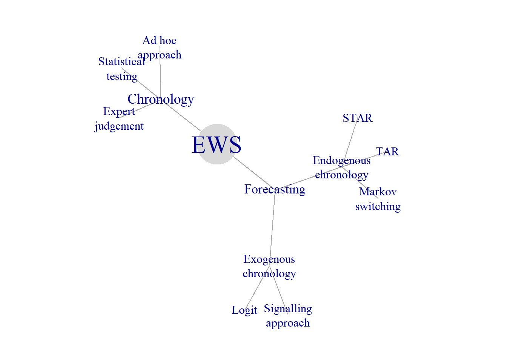

(\#fig:EWSScheme)Early warning system

It distinguishes between the early warning systems with exogenous and endogenous chronologies. In the EWS with exogenous chronology, the determination of the bubble chronology step is done separately and independently on the forecasting step, while in the EWS with endogenous endogenous both these steps are carried out simultaneously. Figure \@ref(fig:EWSScheme) displays three families of methods used in order to establish the bubble chronology (*ad hoc* approach, expert judgment, and statistical testing), two families of forecasting techniques requiring exogenous chronologies (signalling approach and discrete-choice models), and three forecasting methods with endogenous chronology (TAR, STAR, and Markov switching). Below we will discuss each of these methods in more detail.
	
## Dating the speculative bubbles {#sec:Dating}
Nobody knows when exactly do the speculative bubbles (or expansions and recessions in case of business cycles) start and end. In fact, what we observe are periodic declines and increases of asset prices or economic performance. However, without special techniques it is impossible to tell apart small short-lived fluctuations from the cyclical movements. Therefore, some algorithm is needed in order to establish the chronology of bubbles or business cycles. As shown in Figure \ref{fig:EWS_scheme}, there are three families of methods establishing bubble chronologies: 1) expert judgment; 2) *ad hoc* dating; and 3) formal statistical tests.

### Expert judgment

A group of experts decides on the dates of beginning and ending of booms and busts. The most known such a group is the **NBER's Business Cycle Dating Committee**.^[The dates of the peaks and troughs of the US business cycle can be found here: http://www.nber.org/cycles/recessions.html.]
It  maintains a chronology of the U.S. business cycle. The chronology comprises alternating dates of peaks and troughs in economic activity. The way the experts make their dating decisions is perfectly described by the NBER itself:

*The Committee applies its judgment... and has no fixed rule to determine whether a contraction is only a short interruption of an expansion, or an expansion is only a short interruption of a contraction.*

The NBER does not have a fixed definition of economic activity. It examines and compares the behavior of various measures of broad activity: *real GDP*, economy-wide *employment*, and *real income*. The NBER also can consider indicators that do not cover the entire economy, such as *real sales* and the Fed's index of *industrial production*. A well-defined peak or trough in real sales or industrial production helps to determine overall peak or trough dates, particularly if the economy-wide indicators are in conflict or do not have well-defined peaks or troughs. 

Figure \@ref(fig:NBERChronology) plots the US real GDP together with the NBER business cycle chronology depicted as shaded areas.

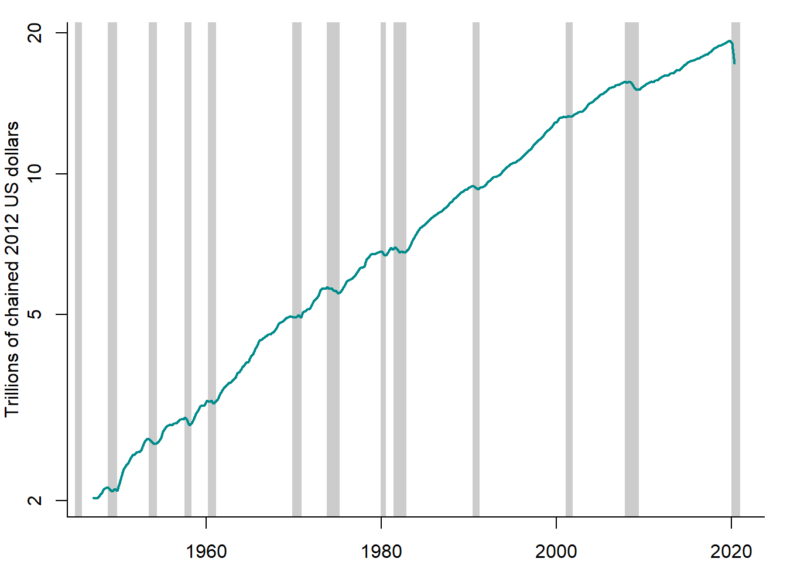

(\#fig:NBERChronology)US real GDP vs. NBER chronology, 1947--2020

Sources: FRED, NBER, and own representation.

It can be seen that the NBER chronology accurately picks up the declines in the real GDP. An especially deep and protracted decline is observed in 2008--2009, the episode known as the Great Recession.
	
The NBER is an established authority and its chronology is a widely recognized one. Other countries have no such expert committee at the national level. Fortunately, there is an international organization --- **Economic Cycle Research Institute (ECRI)**, which produces business cycle chronologies for various countries.^[This is the website of the ECRI: https://www.businesscycle.com/.]
  
Each technique has its advantages and disadvantages. What are the strengths and weaknesses of the expert judgment approach? It has the following advantages: Experts make use of different sources of information. The wise judgment can be superior to a thoughtless use of sophisticated techniques.	The disadvantages of the expert judgment approach to dating the bubbles are as follows: The expert's procedure is not transparent. It is impossible to replicate. It is a very time consuming process: it takes many months or even years to identify the cyclical phases.

### Ad hoc dating methods

The simplest method of dating business cycles and speculative asset price bubble is the rule of thumb using the *two-quarter definition*. According to this rule, recession is defined as two consecutive quarters of decline in real GDP. 

A more sophisticated technique is the procedure developed by @Bry_Boschan_1971. It tries to emulate the decision making process of the NBER using the monthly series of industrial production. The Bry-Boschan technique does not use any formal statistical framework to do the dating. Instead it translates the NBER method into a set of simple decision rules. It basically comprises two stages: 1) selecting the candidates for turning points and 2) applying a censoring rule to eliminate the turning points, which do not satisfy some criteria (e.g., minimum duration).

A quarterly version of Bry-Boschan technique was developed by @Harding_Pagan_2001. Each point in the sample is checked for being a local maximum or minimum:
	
\begin{equation}
	y_t=\left\{
	\begin{array}{l}
\mbox{peak, if } y_t=\max\big(y_{t-K}, \ldots, y_{t+L}\big)\\
\mbox{trough, if } y_t=\min\big(y_{t-K}, \ldots, y_{t+L}\big)\\
\mbox{neither peak nor trough, otherwise}
	\end{array}
	\right.
\end{equation}
Normally, one takes $K=L=2$ for quarterly data (6 for monthly data). Eliminate candidate peaks and troughs, which do not satisfy two restrictions: 
1) minimum phase duration should be 6 months (2 quarters) and 2) complete cycle must last at least 15 months (5 quarters).

The most important appeal of the Bry-Boschan technique is its simplicity and transparency. It is also very robust in the sense that changing the sample will not affect the dates. Although it is sensitive to the choice of criteria and censoring rules. Arbitrariness is the major problem related to the *ad hoc* techniques.
  
Crises occurring at the currency markets have their specific features and, therefore, require somewhat different tools in order to identify them. *A currency crisis* is defined as speculative pressures in foreign exchange markets. In order to identify the periods of a currency crisis, constructed crisis indices need to reflect both successful and unsuccessful speculative attacks on domestic currency. Following @Eichengreen_et_al_1994 recent studies use as crisis indicator the speculative *exchange market pressure (EMP)*, which is a weighed average of depreciation rate of nominal exchange rates, percentage change in international reserves, and change in interest rate. Different weighting schemes are possible. For example, it is reasonable to use for this purpose the inverse of the standard deviations of the component variables ($\frac{1}{\sigma_i}$, where $i=\{\text{exchange rate}, \text{reserves}, \text{interest rate}\}$) in order to equalize their volatilities.

Currency crisis is identified when the EMP index exceeds a particular threshold, such as 2 or 3 standard deviations ($\sigma$) above its mean ($\mu$). Figure \@ref(fig:EMP) illustrates this approach using the monthly Russian financial data over the period 1997--2018.

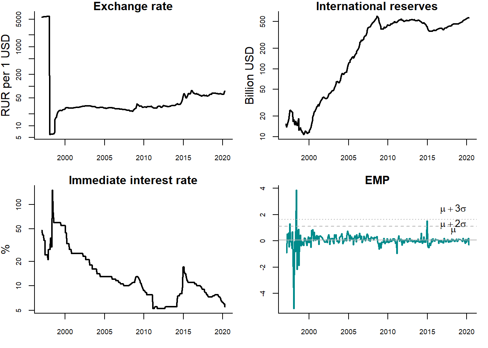

(\#fig:EMP)Detecting currency crises in Russia

Sources: Central Bank of Russia, Federal Reserve Bank of St. Louis (FRED), and own calculations.

Three panels show the dynamics of the exchange rate of ruble, international official reserves of Russia, and short-term interest rate (immediate Rates: less than 24 hours). The lower right panel displays the EMP index calculated using these three series. The dashed (dotted) line reflects the mean plus two (three) standard deviations. The periods, when the EMP index intersects these lines, are treated as currency crises. In this case, it happens twice: in 1998, when a large economic crisis occured in Russia, and 2014, when oil prices went down, Crimean crisis started, and anti-Russian sanctions were introduced by the Western countries. However, in the second case, the EMP crossed only the $\mu + 2\sigma$ line, but not the $\mu + 3\sigma$ line. Thus, no currency crisis would be detected, if we used the stricter criterion.

### Formal statistical tests
Formal statistical tests are free from arbitrariness of both the expert judgment and *ad hoc* methods. Recently, they have been increasingly used to detect the **asset price speculative bubbles** for stock prices, house prices, and commodity prices.

Here, we will discuss the so-called **explosive root** test developed by @Phillips_et_al_2015 in order to identify multiple speculative bubbles. The test is based on the idea that house prices are fundamentally determined by future rents in the period of ownership and, moreover, by future asset price increases. Under the assumption of perfectly informed and rational agents, price increases are again solely determined by dividends earned in the period after the next sale.

In the real estate context, this implies that house prices are ---in the long run--- tied to the development of rents. Under the standard no arbitrage condition, the house price can thus be expressed as

\begin{equation}
P_t = \frac{E_t [P_{t+1} + R_{t+1}]}{1 + i}
(\#eq:HousePrice)
\end{equation}
where $P_t$ is the real estate price, $R_t$ denotes the rental income, $t$ is the current time period, $i$ is the risk-free interest rate, and $E[\cdot]$ is the rational expectation, conditional on the information available [@Homm_Breitung_2012]. The fundamental price, $P^F$, can be determined by forward iteration of equation \@ref(eq:HousePrice):

\begin{equation}
P^F_t = \sum_{n=1}^{\infty} \frac{1}{(1+i)^n}E_t[R_{t+n}]
(\#eq:FundamentalPrice)
\end{equation}

However, there is a unique solution for equation \@ref(eq:FundamentalPrice) under the transversality condition, according to which the present value of a payment occurring infinitely far in the future must be zero,

\begin{equation}
\lim_{k\rightarrow\infty} E_t \Big[\frac{1}{(1 + i)^k} P_{t+k}\Big]= 0
(\#eq:Transversality)
\end{equation}

If the actual price process contains additional elements, like a bubble component $B$, the pricing equation becomes
\begin{equation}
P_t = \lim_{k\rightarrow\infty} E_t \Big[\frac{1}{(1 + i)^k}\Big(\hat{P}_{t+k} + (1 + i)^k B_t)\Big)\Big]+ P^F_t
(\#eq:PriceSolution)
\end{equation}

In this case, there are infinitely many solutions. Today's house price can be decomposed in two elements ---one covering the fundamental value, determined by future rental income and another that is related to potentially speculative motivations. In case of a speculative bubble, any rational investors should expect the house price to increase at rate $i$. Because all rational investors expect other investors to pay a price $P^F_{t+1}+ B_{t+1}$, they are willing to pay $P^F_t+ B_t$ in period $t$.

The fundamental component in equation \@ref(eq:PriceSolution) cannot be observed. Hence, assumptions have to be made in order to characterize the time series properties of the fundamental price, $P^F_t$. One can impose a plausible assumption that housing rent, $R_t$, follows a random walk with drift:
\begin{equation}
R_t = \mu + R_{t-1} + u_t
\end{equation}
where $\mu$ is the drift and $u_t$ is a white noise process. Under this assumption the fundamental price can be expressed as

\begin{equation}
P^F_t = \frac{1 + i}{i^2}\mu + \frac{1}{i} R_t
\end{equation}
where $i$ is the risk-free rate [@Homm_Breitung_2012]. As a result, if $R_t$ follows a random walk with drift, so does the fundamental component of the housing price, $P^F_t$. This permits distinguishing the fundamental price from the speculative bubble that can be described as an explosive autoregressive process. Thus, a test procedure boils down to testing the null hypothesis of a random walk against the alternative of an explosive process.

The basic idea of the test is to analyze the roots of an autoregressive process. The explosive root is tested against the alternative of a unit root (*random walk*). The latter reflects the *rational expectations* hypothesis.

Figure \@ref(fig:RandomWalkExplosiveProcess) compares two artificially generated time series: a random walk and an explosive process.

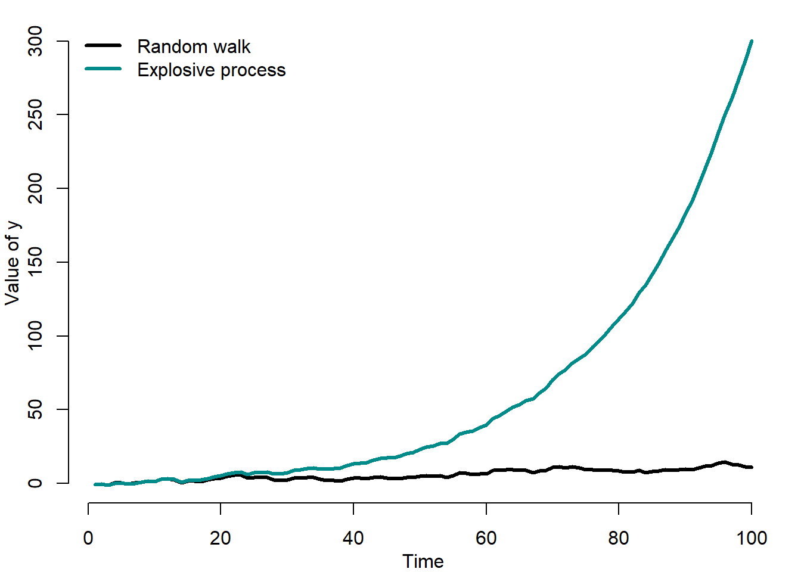

(\#fig:RandomWalkExplosiveProcess)Random walk vs. explosive process

It can be seen that at some point the explosive process rapidly at an ever increasing rate diverges into infinity.

The test is based on the rolling regression model of the following form:
	
\begin{equation}
		\Delta y_t = \alpha_{r_1,r_2} + \beta_{r_1,r_2} y_{t-1} + \sum_{k=1}^K\phi_{r_1,r_2} + \varepsilon_t
\end{equation}
where $y_t$ is the variable to be tested for explosive roots; $k$ is the lag order; $\alpha,\beta,\phi$ are parameters to be estimated; and $\varepsilon_t$ is the disturbance term. Under the null hypothesis (random walk), $\beta_{r_1,r_2}=0$, while under the alternative hypothesis (explosive process), $\beta_{r_1,r_2}>0$.

The sample of this rolling-window regression starts from the $r_1$-th fraction and ends at the $r_2$-th fraction of the total sample ($T$): $r_2 = r_1 + r_w$ and $r_w > 0$ is the (fractional) window size of the regression.

Based on this regression, an augmented Dickey-Fuller (ADF) test is conducted on a forward expanding sample sequence. @Phillips_et_al_2015 test is the supremum value of the ADF statistic sequence:
	
\begin{equation}
		SADF(r_0) = \sup_{r_2 \in[r_0,1]}ADF_0^{r_2}
\end{equation}
where $ADF_0^{r_2}$ is the ADF statistic for a sample running from 0 to $r_2$.

Figure \@ref(fig:BubbleChronologiesP2RPSY) shows the house price-to-rent ratios in various countries and the corresponding speculative bubbles detected using this time series and the explosive root test of @Phillips_et_al_2015.

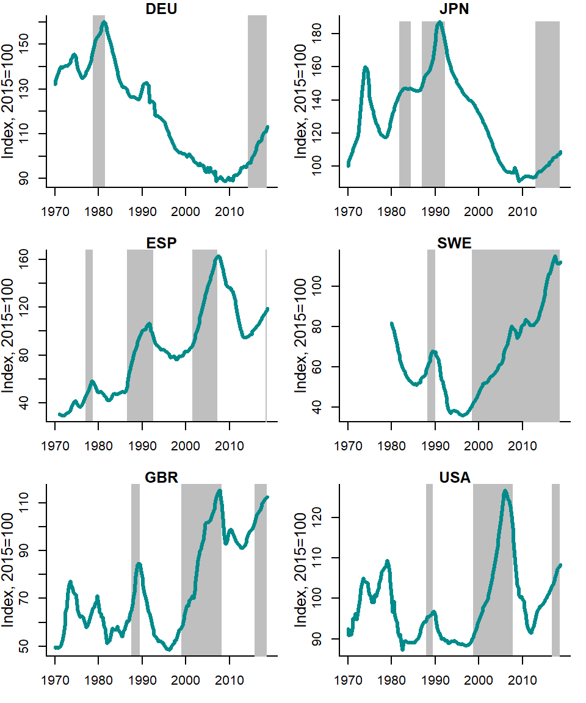

(\#fig:BubbleChronologiesP2RPSY)House price-to-rent ratios vs. Phillips et al. (2015) chronology

Source: OECD and own calculations.

The bubble episodes are quite rare events. However, they can last for 10 years or more, as the example of many countries in the early 2000s and of Scandinavian countries in the 2010s shows. 

## Early warning systems with exogenous chronology {#sec:EWSExogenous}
As pointed out in section \@ref(sec:EWS), the two main elements of an early warning system are: a cycle or bubble chronology and a forecasting model. The chronology can be *exogenous*, when it is not a part of the forecasting model; or *endogenous*, when it is obtained when estimating the forecasting model.
Here, we will consider the early warning systems with exogenous chronology. While the procedure used in order to detect speculative bubbles or business cycle turning points were discussed in the previous section, in this section we will concentrate on the prediction of bubbles and turning points. The EWS with exogenous chronology can use the following forecasting approaches: *signalling approach* and *discrete-choice* models --- see Figure \@ref(fig:EWSScheme).

### Signalling approach {#sec:Signalling}
The signalling approach was suggested by @Kaminsky_et_al_1998 and @Reinhart_Kaminsky_1999. The idea behind this approach is to find indicators that allow the best prediction of crises. The main criterion used to choose the indicators is their behavior: a good indicator tends to deviate from its "normal'' path prior to a crisis. Every time an indicator exceeds certain *threshold value* (e.g., mean plus several standard deviations), it is interpreted as a *warning signal* that a crisis can take place within several periods. 

The threshold values are calculated in such a way as to strike the balance between the risk of producing too many false alarms and the risk of missing the crisis altogether. A reasonable lead between the signal and the crisis must be defined: any signal given within some period (*window*) before the beginning of the crisis is labeled a good signal, while any other signal sent outside that window is labeled a false alarm or noise. Thus, a designer of a bubble prediction model based on the signalling approach needs leading indicators that are highly correlated with the speculative bubble chronology. The examples of economic indicators: business confidence indicators, stock exchange indices, interest spreads (difference between the long-term and short-term interest rates), etc.

The forecasting performance of each indicator can be measured and compared in order to identify the best indicators, that is, indicators, which allow the most precise predictions of speculative price bubbles or business cycle turning points.  

Table \@ref(tab:ABCD) describes the four possible forecasting situations.

<caption> (\#tab:ABCD) Crisis detection: signals vs. crises </caption>

| | Crisis  | No crisis |
|----------------|:-----------:|:---------|
| Signal sent | correct signal, $A$ | false alarm, $B$ |
| Signal not sent | missing signal, $C$ | correct signal, $D$ |

The correct signal takes place, if the signal is sent and the crisis occurs or if the signal is not sent and there is no crisis. Otherwise, when the signal is sent, but no crisis occurs, we talk about a false alarm; whereas when no signal is sent and the crisis occurs, we call it missing signal. The forecast accuracy tests are based on this classification of cases.

For example, Kuipers score uses this classification in the following way:

\begin{equation}
KS = \frac{N_A}{N_A+N_C} - \frac{N_B}{N_B+N_D}
\end{equation}
where $N_A$ and $N_D$ are the number of correct identifications; $N_B$ is the number of false alarms; and $N_C$ is the number of missing signals. The Kuipers score, $KS$, varies between -1 (all false) and 1 (all correct).

The individual indicators can be combined to a *composite indicator* using their $KS$ measures as weights. The signalling approach is typically used to predict the currency crises. However, there are also studies that use it in order to forecast stock and house price bubbles [@Gerdesmeier_et_al_2010;@Dreger_Kholodilin_2013].

### Discrete-choice models
An alternative to signals approach uses the crisis chronology as dependent variable. The chronology is defined as binary, or discrete-choice, variable:
\begin{equation}
C_t=\left\{
\begin{array}{ll}
1 & \mbox{if crisis in period $t$} \\
0 & \mbox{otherwise}
\end{array}
\right.
\end{equation}
In such cases, the discrete-choice models are used such as linear probability model as well as logit and probit models.

### Linear probability model

The probability of being in the period of recession or of speculative bubble is defined as:

\begin{align}
    \Pr(C_t=1|x_t) & = F(x_t,\beta) \nonumber \\
    \Pr(C_t=0|x_t)& = 1-F(x_t,\beta)
    (\#eq:Prob)
\end{align}
where $x_t$ is a vector of indicators at time $t$ ($t=1,\ldots,T$); and $\beta$ is $k\times 1$ parameter vector.

The problem at this point is to devise a suitable model for the r.h.s. of equation. One possibility is to retain the familiar linear regression:

\begin{equation}
    F(x_t,\beta) = x_t'\beta
\end{equation}

In that case, we have a **linear probability model*, which is the multiple linear regression model when the dependent variable, $y$, is binary rather than continuous:
\begin{equation}
	C_t = \beta_0 + \beta_1 x_{1t} + \ldots + \beta_K x_{Kt} + \varepsilon_t
\end{equation}
where $C_t$ is a binary crisis variable.

Because dependent variable is binary, 
\begin{equation}
	E(C_t|x_{1t},\ldots,x_{Kt})=\Pr(C|x_{1t},\ldots,x_{Kt})
\end{equation}
So, for the linear probability model:
\begin{equation}
	\Pr(C_t|x_{1t},\ldots,x_{Kt}) = \beta_0 + \beta_1 x_{1t} + \ldots + \beta_K x_{Kt}
\end{equation}
Regression coefficient $\beta_k$ on a regressor $x_{kt}$ is the change in the probability that $C_t=1$ associated with a *unit change* in $x_{kt}$.

Regression coefficients of linear probability model can be estimated by OLS. The usual (heteroskedasticity-robust) OLS standard errors can be used for confidence intervals and hypothesis tests. The usual goodness-of-fit measure, $R^2$, used for the linear models makes no sense for a linear probability model. When dependent variable is continuous, it is possible to imagine a situation, in which $R^2=1$: All the data lie exactly on the regression line. However, this is impossible, when the dependent variable is binary, unless the regressors are also binary.

Figure \@ref(fig:LPMStylizedExample) shows an example of a LPM estimated for the artificially generated data.

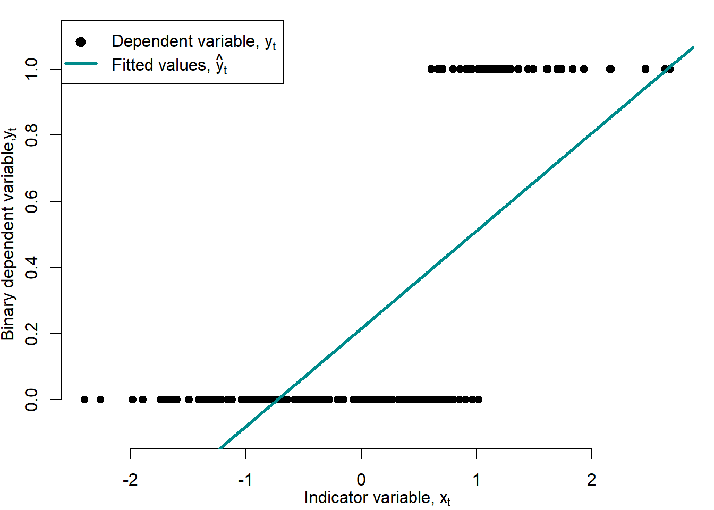

(\#fig:LPMStylizedExample)Linear probability model

The LPM is a simple and yet powerful model. Nevertheless, it also has shortcomings. First, the linearity that makes the linear probability model easy to use is also its major flaw. Because probabilities cannot be less than 0 or exceed 1, the effect on the probability that $C_t=1$ of a given change in $x_t$ must be nonlinear.

Second, in the linear probability model, the effect of a given change in income is constant, which leads to predicted probabilities that drop below 0 or exceed 1. But this is a nonsense!

### Logit and probit models

The logit and probit regressions are nonlinear regression models specifically designed for binary dependent variables. Because a regression with a binary dependent variable $C_t$ models the probability that $C_t=1$, it makes sense to adopt a nonlinear formulation that forces the predicted values to lie between 0 and 1. Because cumulative probability distribution (c.d.f.) functions produce probabilities between 0 and 1, they are used in logit and probit regressions. The probit regression uses the standard normal c.d.f., while the logit regression uses the logistic c.d.f.

The probit model uses the *standard normal c.d.f.*:
\begin{equation}
	\Pr(C_t=1|x_t) = \frac{1}{\sqrt{2\pi}}\int^{x_t'\beta}_{-\infty} \exp^{-\frac{z^2}{2}}dz = \Phi(x_t'\beta)
	(\#eq:Probit)
\end{equation}
where $\Phi$ is the standard normal distribution function.

The logit regression uses the *logistic c.d.f.*:

\begin{equation}
	\Pr(C_t=1|x_t) = \frac{\exp(x_t'\beta)}{1+\exp(x_t'\beta)} = \Lambda(x_t'\beta)
	(\#eq:Logit)
\end{equation}
where $\Lambda$ is the logistic distribution function.

Figure \@ref(fig:LogitProbit) compares transition functions of logit and probit models.

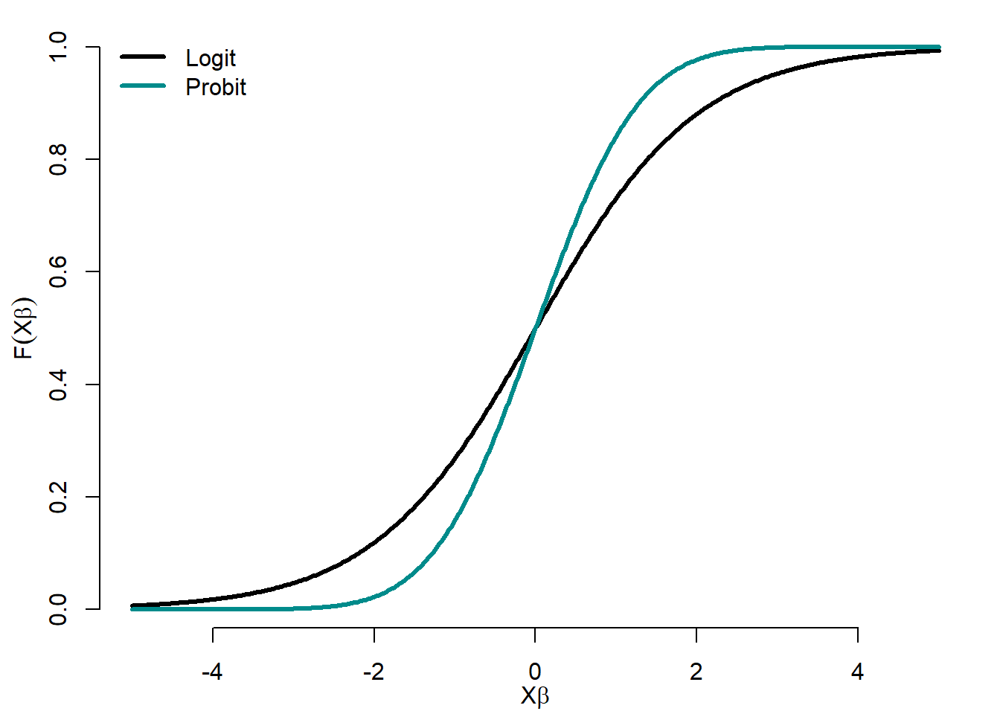

(\#fig:LogitProbit)Logit and probit functions

The logit transition function has heavier tails than the probit one.

The question, which distribution (logistic or exponential) to use, is a natural one. The logistic distribution is similar to the normal, except in tails, which are considerably heavier. It closely resembles a Student distribution with 7 degrees of freedom. Therefore, for intermediate values of $x_t'\beta$ (say, between -1.2 and +1.2), the two distributions tend to give similar probabilities. The logistic distribution tends to give larger probabilities to $C_t=1$ when $x_t'\beta$ is extremely small (and smaller probabilities to $C_t=1$ when $x_t'\beta$ is very large) than the normal distribution.

We should expect different predictions from the two models, if the sample contains 1) very few responses ($C_t$'s equal to 1) or very few nonresponses ($C_t$'s equal to 0); or 2) very wide variation in an important independent variable, particularly if (1) is also true.

It is virtually impossible to justify the choice of one distribution or another on theoretical grounds.

All three models --- linear probability, logit, and probit --- are just approximations to the unknown population regression function $F(C_t|x_t)=\Pr(C_t=1|x_t)$. The linear probability model is the easiest to use and to interpret, but it cannot capture the nonlinear nature of the true population regression function. Logit and probit regressions model this nonlinearity in probabilities, but their regression coefficients are more difficult to interpret. So which should be used in practice? There is no one right answer, and different researchers use different methods.

These models are estimated for the US data, using the NBER business cycle chronology as the dependent variable.

Figure \@ref(fig:PredictionUSRecessions) compares conditional probabilities of recession obtained using logit and probit models to the NBER business cycle chronology.

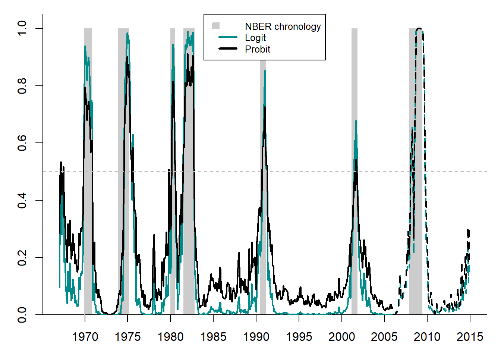

(\#fig:PredictionUSRecessions)Prediction of the US recessions using logit and probit

Both models produce quite accurate forecasts of the NBER recession dates. The logit model appears to be slightly more accurate than the probit model: it has higher recession probabilities during the recession phases of the NBER and lower probabilities during the NBER expansion phases.

## Early warning systems with endogenous chronology {#sec:EWSEndogenous}
This class of models allows moving away from *a priori* dating of crises. Here, three forecasting model classes will be considered: TAR, STAR, and Markov switching; see Figure \@ref(fig:EWSScheme). These are non-linear models, which permit identifying crises in an endogenous way, as switches between the alternating regimes of crises and non-crises are conditioned upon some variable. While in TAR and STAR models, the transition variable is observable and must be somewhat arbitrarily chosen by the forecaster, in the Markov-switching models, it is unobservable. 

The models considered in this section have their advantages and disadvantages. Their advantage is that they reduce arbitrariness in defining crisis periods. They do not need any separately established bubble chronology, since it is estimated simultaneously with other parameters of these models. The models with endogenous chronology have two disadvantages: 1) they are more computation-intensive and unstable compared to the EWS with exogenous chronology and 2) their data requirements are higher (for example, more observations are needed).

### Threshold autoregression
We start from the simplest non-linear model, which allows simultaneously detecting and predicting speculative bubbles. It is known as **threshold autoregressive model (TAR)** and was suggested by @Tong1978 and @Tong1990. In this model, the regime shifts (from expansion to recession or from bubble to no-bubble) in the dependent variable, $y_t$, are triggered by an observable *transition variable*, $x_t$, crossing a threshold $c$:

\begin{equation}
y_t=\bigg(\alpha_0+\sum_{p=1}^P \alpha_{p}y_{t-p}\bigg)I(x_t;c)
 + \bigg(\beta_0+\sum_{p=1}^P\beta_{p}y_{t-p}\bigg) \bigg(1-I(x_t;c)\bigg)+\varepsilon_t
\end{equation}

where $y_t$ is the dependent variable of interest (e.g., real GDP growth rates or price-to-rent ratio); $\alpha$'s and $\beta$'s are the regime-dependent parameters; $\varepsilon_t$ is the error term, $\varepsilon_t \sim IID(0,\sigma^2)$; and $I(\cdot)$ is the indicator function. 

The indicator function, $I(x_t;c)$, is defined as:
\begin{equation}
I(x;c)=\left\{
\begin{array}{rcl}
1,  & \mbox{if} & g(x_t)>c \\
0, & \mbox{if} & g(x_t)\leq c
\end{array}
\right.
(\#eq:IndicatorFunction)
\end{equation}
If the indicator function of transition variable exceeds certain threshold, then economy is in one regime (e.g., crisis), otherwise economy is in another regime (e.g., no crisis).

Figure \@ref(fig:TARTransitionFunction) illustrates the indicator (or transition) function of the TAR model:

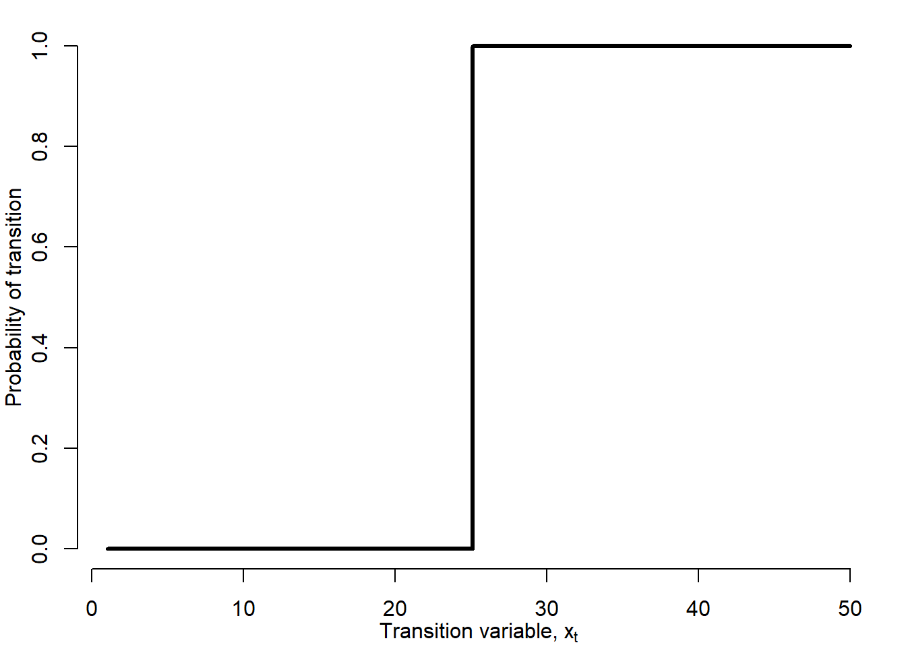

(\#fig:TARTransitionFunction)TAR indicator function

The switch between two regimes is discontinuous: an infinitely small change in the transition variable is enough to jump into
another regime. One may argue that the economy is seldom confronted with such a situation. There can be many different types of transition variable, $x_t$. For $x_t=t$ a model with a **structural break** at time $t=c$ occurs. For the purposes of analysis of currency and financial crises other transition variables may be more useful.

In fact, the TAR model separately estimates two linear models for two different subsamples, depending on the threshold value of the transition variable. The recession subsample is two times shorter than the expansion subsample. In both regimes, the intercept is negative. However, in the recession regime, is almost three times larger in absolute value than that in the expansion regime. The parameter estimates of different explanatory variables are different across regimes.

Figure \@ref(fig:TARPredictionUSRecessions) shows the conditional probabilities of recession resulting from the TAR model presented above.

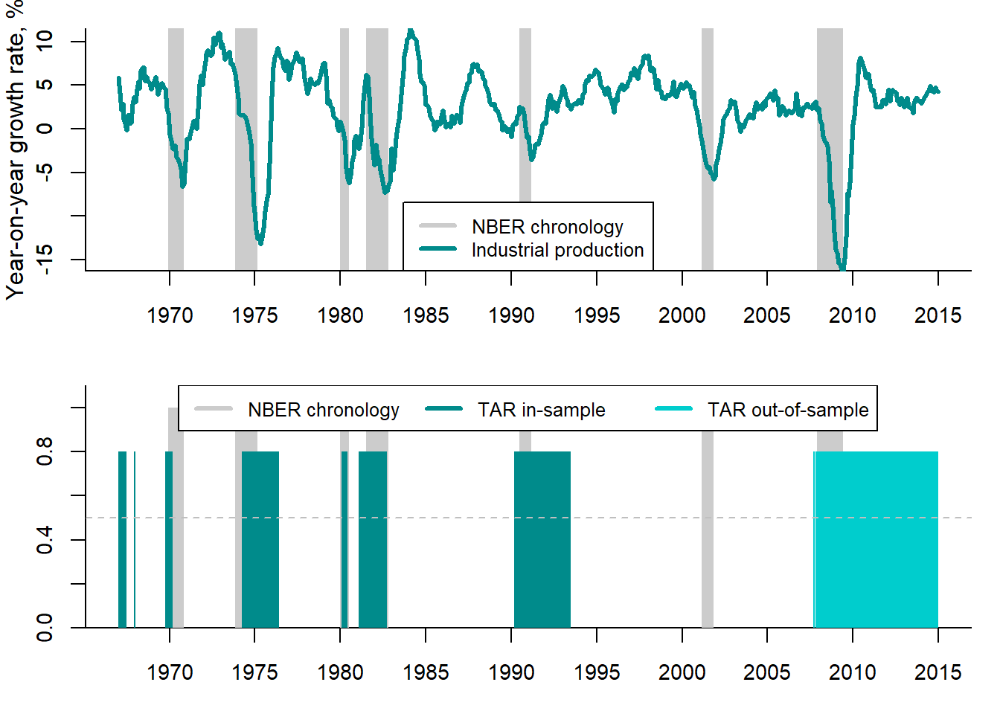

(\#fig:TARPredictionUSRecessions)TAR recession probabilities vs. NBER chronology

The upper panel depicts the growth rates of the real industrial production and the NBER business cycle chronology, where recessions are denoted by the shaded areas. The lower panel compares the conditional recession probabilities to the NBER chronology. The TAR recession probabilities in most cases coincide with the NBER dates, but predict much longer recessions than really observed. This means that the TAR model in this particular case produces many false alarms.

If the transition variable is a lagged endogenous variable, $y_{t-d}$, with delay\index{delay} $d>0$, **self-exciting threshold autoregressive (SETAR)** model results:
\begin{equation}
y_t=\bigg(\alpha_0+\sum_{i=1}^p \alpha_p y_{t-i}\bigg)I(y_{t-d};c)
 + \bigg(\beta_0+\sum_{i=1}^p \beta_p
y_{t-i}\bigg)\bigg(1-I(y_{t-d};c)\bigg) +\varepsilon_t
\end{equation}
where $\varepsilon_t \sim IID(0,\sigma^2)$. 

In SETAR model, regime-generating process is not assumed to be exogenous but directly linked to the lagged endogenous variable
$y_{t-d}$.

### Smooth transition autoregression  {#sec:STAR}

Smooth transition autoregressive model (STAR), was first suggested in @Teraesvirta_Anderson1992 and @vanDijk_et_al_2002. It has the following form:
\begin{equation}
y_t=\bigg(\alpha_0+\sum_{i=1}^p \alpha_p y_{t-i}\bigg)F(x_t;\gamma,c)
 + \bigg(\beta_0+\sum_{i=1}^p \beta_p
y_{t-i}\bigg)\bigg(1-F(x_t;\gamma,c)\bigg) +\varepsilon_t 
(\#eq:STAR)
\end{equation}
where $y_t$ is a dependent variable (e.g., real GDP growth rates or price-to-rent ratio); $x_t$ is the transition variable; and $F(x_t;\gamma,c)$ is a **transition function**, which, unlike the abrupt step-wise indicator function in TAR, is smooth. It is a continuous function bounded between 0 and 1.

As transition variable one can use either a lagged dependent variable $y_{t-d}$ taken with some delay $d>0$, or an exogenous observed variable, $x_t$; or (possibly nonlinear) function of lagged exogenous variable $g(x_t)$;

There are two main types of STAR transition function: logistic and exponential functions.

Logistic function is defined as:
\begin{equation}
				\begin{array}{ll}
		F(x_t;\gamma,c)=\frac{1}{1+\exp[-\gamma(x_t-c)]}, & \gamma>0
		\end{array}
		(\#eq:Logistic)
\end{equation}

Exponential function is defined as:
\begin{equation}
		\begin{array}{ll}
		F(x_t;\gamma,c)=1-\exp[-\gamma(x_t-c)^2], & \gamma>0
		\end{array}
		(\#eq:Exponential)
\end{equation}
where $c$ is the threshold between the regimes; and $\gamma$ is the smoothness parameter: the smaller $\gamma$ the smoother transition between regimes.

Note that when $\gamma\longrightarrow \infty$, STAR transition function $F(x_t;\gamma,c)$ becomes indicator function of TAR, $I(x_t;c)$. When $\gamma\longrightarrow 0$, STAR model converges to  a linear AR(p).

STAR model with logistic transition function is called **logistic STAR (LSTAR)**. The model with exponential transition function is known as **exponential STAR (ESTAR)**. There is no economic theory allowing to distinguish between LSTAR and ESTAR. The choice of transition function as well as of delay parameter $d$ and lag structure of the model should be based on the data.

The STAR model can be interpreted as a regime-switching model that allows for two regimes associated with the extreme values of the	transition function, $F(x_t;\gamma,c)=0$ and $F(x_t;\gamma,c)=1$, where the transition from one regime to the other is smooth. The regime that occurs at $t$ can be determined by observed variable $x_t$ and corresponding value of $F(x_t;\gamma,c)$. Figure \@ref(fig:LSTARvsESTARtransitionFunction) displays the LSTAR and ESTAR transition functions.

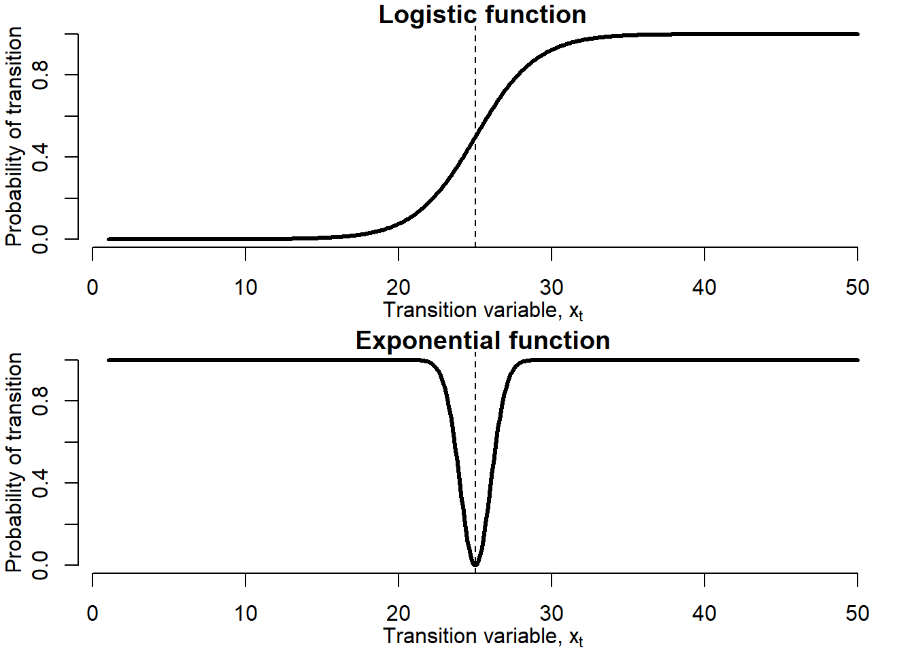

(\#fig:LSTARvsESTARtransitionFunction)Logistic and exponential transition functions

These transition functions are very different. While LSTAR transition function is low at low values of the transition variable, $x_t$, relative to the threshold value $c$, it gets higher at the higher values of the transition variable. Such a trajectory corresponds very well to the business cycles and asset price bubbles: during expansions (bubbles), the transition variable is higher, while during recessions (no-bubbles), it is lower. In the ESTAR model, regimes are associated with small and large absolute deviations of transition variable from threshold $c$: when $x_t$ is either too small or too high ($|x_t-c|$ is large), regime 1 occurs, while when $x_t$ is close to the threshold ($|x_t-c|$ is small), regime 2 takes place. Thus, the ESTAR transition variable is high at the extreme values of the transition variable and low at its middle values.	Such a trajectory is more appropriate for the currency crises: when the exchange rate is extremely under- or overvalued, that is, it violates upper/lower limit of a specified band of fluctuations, the economy is in the crisis regime, while the exchange rate takes intermediate values, the economy is in no-crisis regime.

Figure \@ref(fig:LSTARvsESTARtransitionFunctionGammas) shows the effect the smoothness parameter, $\gamma$, exerts on the smoothness of the transition function.

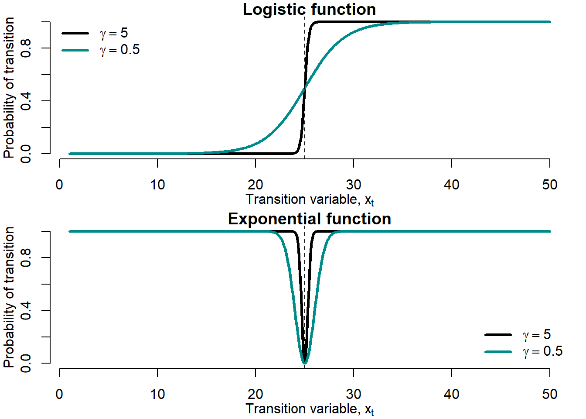

(\#fig:LSTARvsESTARtransitionFunctionGammas)Smoothness parameter $\gamma$

Smaller values of $\gamma$ produce smoother transition. Recall that at very high values of $\gamma$ the transition function converges to the TAR stepwise transition function.

Figure \@ref(fig:LSTARvsESTARtransitionFunctionThreshold) shows the effects exerted by the change in the threshold parameter, $c$, on the LSTAR and ESTAR transition functions.

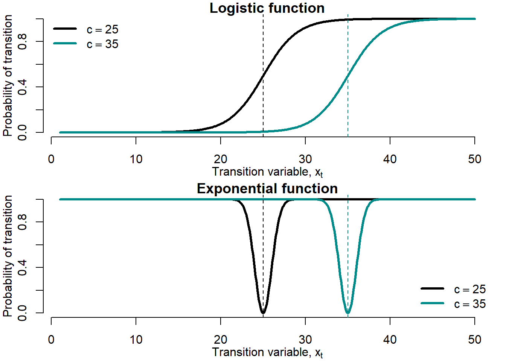

(\#fig:LSTARvsESTARtransitionFunctionThreshold)Threshold parameter $c$

Larger $c$ values shift the transition function rightward without changing the form of the function.

One useful output of the STAR models are the conditional probabilities of recessions or bubbles, depending on how we define the regime of interest. These are computed using equations \@ref(eq:Logistic) and \@ref(eq:Exponential).

Conditional probabilities for the LSTAR model:
\begin{equation}
		\hat{F}(x_t)=\frac{1}{1+\exp[-\hat{\gamma}(x_t-\hat{c})]}
\end{equation}
where $\hat{\gamma}$ and $\hat{c}$ denote the estimated parameter values.

Conditional probabilities for the ESTAR model:
\begin{equation}
		\hat{F}(x_t)=1-\exp[-\hat{\gamma}(x_t-\hat{c})^2]
\end{equation}

Figure \@ref(fig:LSTARPredictionUSRecessions) compares the conditional probabilities of recessions obtained using the LSTAR model to the NBER business cycle chronology.

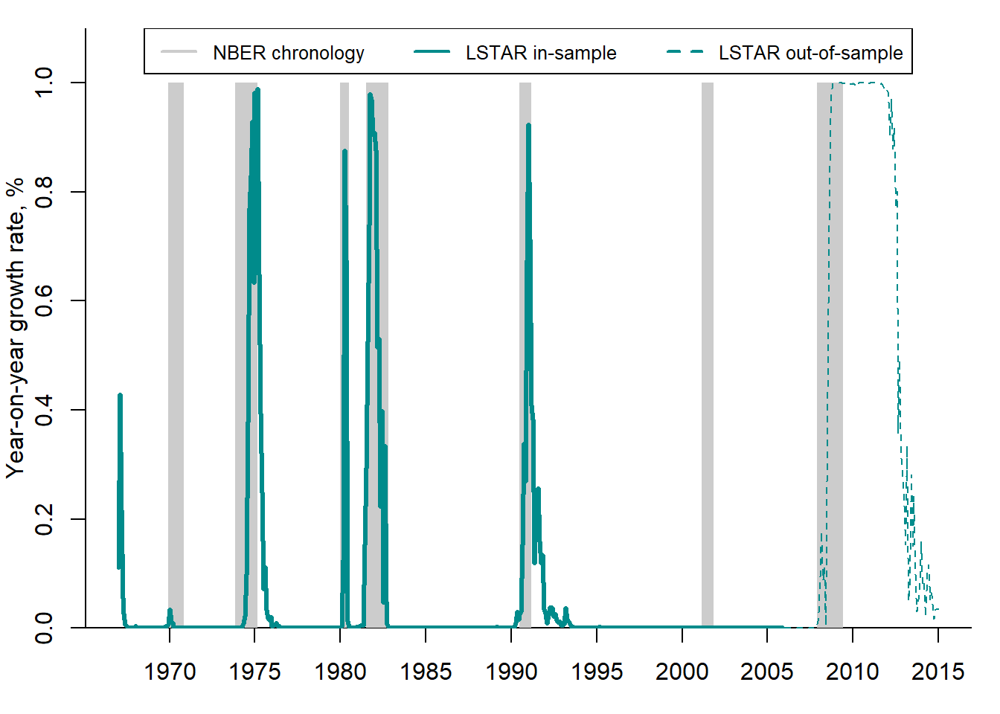

(\#fig:LSTARPredictionUSRecessions)STAR recession probabilities vs. NBER chronology

The LSTAR-based recession probabilities quite accurately depict the NBER recession phases (shaded areas): the probabilities approaching 1 almost always precede or coincide with the NBER recession periods.

The STAR approach is very flexible. It allows for some useful and interesting extensions. For example, in the previous examples we considered the models with only two regimes: expansions vs. recessions or bubbles vs. no-bubbles. However, other STAR models can be constructed, which have more than two regimes. For instance, the model can contain three regimes: expansions, mild recessions, and deep recessions (depressions). This is especially useful, when some recessions are very deep (like the Great Recession or COVID-19 crisis) compared to other economic downturns. The STAR models with multiple regimes were elaborated by @vanDijk_Franses_1999.

Another extension is the STAR model with an asymmetric transition function. In such a model, the switch between regimes can be different depending on the starting point. For example, during recession the economy declines swiftly, while during expansion the recovery can be slow. The STAR model with asymmetric transition was introduced by @Siliverstovs_2005. 

### Markov switching  {#sec:MS}
Markov-switching models (MS), like TAR and STAR, allow to diminish the degree of arbitrariness by estimating the crisis chronology and not relying 		on the *ad hoc* definitions. Unlike in TAR and STAR, however, the Markov switching implies the existence of an **unobserved state variable**, which governs switches between regimes. The regimes can be expansions vs. recessions or bubbles vs. no-bubbles.

One of the first MS models was suggested by @Hamilton1989. It fostered a great interest in Markov switching models as a tool to characterize macroeconomic fluctuations. There is a large number of extensions and refinements of the original model [@Krolzig1997]. The basic Markov-switching model can be formulated as follows:
\begin{equation}
		y_t=\mu(s_t)+\sum^P_{p=1} \alpha_p y_{t-p}+\varepsilon_t 
		(\#eq:MS)
\end{equation}
where $y_t$ is some dependent variable (e.g., real GDP growth or price-to-rent ratio); $\varepsilon_t \sim NID(0,\sigma^2)$; and	$\mu(s_t)$ is the regime-specific intercept that switches between two states:
		
\begin{equation} \mu(s_t)=\left\{
		\begin{array}{rcll}
		\mu_1<0,  &  \mbox{if} & s_t=1 & \mbox{expansion} \\
		\mu_2>0,  & \mbox{if} & s_t=2 & \mbox{recession}
		\end{array}
		\right.
\end{equation}

In this simple model, the variance of the disturbance term, $\sigma^2_{\varepsilon}$, is assumed to be identical in both regimes. In more sophisticated models, all parameters can be regime-dependent: intercept (or mean), $\mu(s_t)$; autoregressive coefficients, $\alpha_p(s_t)$; and residual variance, $\sigma^2_{\varepsilon}(s_t)$.
Thus, during the bubble periods, the growth rate of the price-to-rent ratio, $\frac{\mu(s_t=1)}{1-\sum^P_{p=1} \alpha_p(s_t=1)}$, can be higher than during the no-bubble periods, $\frac{\mu(s_t=0)}{1-\sum^P_{p=1} \alpha_p(s_t=0)}$. In addition, bubble regimes can have higher volatility than the no-bubble ones: $\sigma^2_{\varepsilon}(s_t=1)>\sigma^2_{\varepsilon}(s_t=0)$.

When the financial and currency crises are considered, the two states may be defined differently. Stock market: for a stock exchange index the low values of the intercept $\mu(s_t)$ can represent "crashes", while high values --- the "booms''. In the foreign exchange market, the "high volatiliy" regime is associated with crises, while the "low volatility" regime is associated with normal times. Consecutively, when modelling currency crises, a Markov-switching model with state-dependent residual variance $\sigma^2_{\varepsilon}(s_t)$ is needed.

## Forecast performance measures  {#sec:ForecastPerformance}
In this chapter, we presented a wide range of alternative indicators and models that can be used in order to detect and forecast the episodes like crises or speculative bubbles. How to determine which of the models has the best forecast accuracy? There are several alternative measures of forecast accuracy. They measure how well an indicator or model allow forecasting speculative bubbles or turning points of business cycles.

The **fraction correctly predicted**, or Ben-Akiva and Lerman' measure of fit, is computed as the average proportion of correct predictions made by the forecasting model:

\begin{equation}
    FCP = \frac{\sum_{t=1}^T \left(C_t \hat{F}_t + (1-C_t)(1-\hat{F}_t)\right)}{T}
    (\#eq:FCP)
\end{equation}
where $C_t$ is the binary dependent variable (e.g., recessions or bubbles); $\hat{F}_t$ is the predicted probability of crisis. The difficulty in this computation is that in unbalanced samples, the less frequent outcome will usually be predicted very badly by the standard procedure, and this measure does not pick up that point.

@Cramer_1999 proposed an alternative measure that directly measures this failure:

\begin{align}
    \lambda = E(\hat{F}_t|C_t=1) - E(\hat{F}_t| C_t=0) \nonumber \\
    = \frac{\sum_{t=1}^T C_t\hat{F}_t }{T_1} - \frac{\sum_{t=1}^T (1- C_t)\hat{F}_t }{T_0}
    (\#eq:Cramer)
\end{align}
where $T_1$ is number of periods, for which $C_t=1$, $T_0$ is number of observations, for which $C_t=0$. Thus, the first r.h.s. term is the average $\hat{F}_t$ for $C_t=1$, while the second r.h.s. term is the average $\hat{F}_t$ for $C_t=0$. The Cramer's measure heavily penalizes the incorrect predictions and, since each proportion is taken within the subsample, it is not unduly influenced by large size of the group of more frequent outcomes.

The next two measures of forecast accuracy are widely used by the practitioners.

Log probability score is defined as:
\begin{align}
		LPS = -\frac{1}{T}\sum_{t=1}^T \Big[(1-\hat{F}_t)\ln(1-C_t) + \hat{F}_t\ln(C_t)\Big]
		(\#eq:LPS)
\end{align}

Quadratic probability score is computed as:
\begin{align}
		QPS = \frac{1}{T}\sum_{t=1}^T (\hat{F}_t-C_t)^2
		(\#eq:QPS)
\end{align}
	
The QPS varies between 0 (perfect performance) and 1 (bad performance).

Finally, for the sake of completeness, we should mention the **Kuipers score**, which was already introduced in section \@ref(sec:Signalling):
	\begin{equation}
KS = \frac{N_A}{N_A+N_C} - \frac{N_B}{N_B+N_D}
(\#eq:KS)
\end{equation}
The Kuipers score can take values between -1 (all false) and 1 (all correct).

## Exercises {.unnumbered #sec:ExBubbles}

1. Which of the approaches to determining the turning points of housing cycles is the best one: *ad hoc*, expert judgement, or statistical tests? Explain your reasoning.
2. Assume that the actual housing price is 50,000 rubles per m$^2$ and that, according to your estimations, the fundamental price is 40,000 rubles per m$^2$. What can you conclude?

## Key terms {.unnumbered #sec:KTBubbles}

--------------------------------  -------------------------  ---------------------------------
speculative asset price bubbles   volatility                 logit model                      
booms and busts                   formal statistical tests   probit model                     
early warning system              multiple bubbles test      threshold autoregression         
expert judgment                   random walk                smooth transition autoregression 
NBER                              explosive root             Markov switching                 
ECRI                              fundamental price          structural break                 
ad hoc dating                     exogenous chronology       forecast accuracy measures       
recession chronology              endogenous chronology      fraction correctly predicted     
peaks and troughs                 signalling approach        Kuipers score                    
currency crisis                   discrete-choice model      log probability score            
exchange market pressure          linear probability model   quadratic probability score      
--------------------------------  -------------------------  ---------------------------------
