# Housing tenure {#ch:Tenure}

## Introduction {#sec:IntroductionTenure}

In this chapter, we will introduce the notion of housing tenure and will present several tenure types and forms. Then, in section \@ref(sec:ImportanceHOR), we will concentrate on the homeownership and discuss its importance, advantages and disadvantages. In section \@ref(sec:Choice), a formal model will be formulated, which tries to explain why and how many people choose to become homeowners and other --- tenants. Finally, in section \@ref(sec:Variation), we will show the spatio-temporal variation of the homeownership rate across the world.

## Types of tenure {#sec:Tenure}

The housing tenure is defined as institutional forms by which possession of housing is accommodated with ownership of housing. Possession is the entitlement to hold a resource, for a term or indefinitely, as well as to control it and benefit from its use. The ownership includes possession and a right to transfer all or some of the rights over resource (holding, controlling, and benefiting from its use). 

The national systems of housing tenure are very different. For example, a study conducted in nine European countries distinguished 42 kinds of tenures [@Sisksio_1990].

In modern societies, there are two major institutions through which possession of housing is accommodated with rights of ownership: 1) the ownership implies that consumer has ownership rights over his dwelling and, thus, the right of possession and of disposal; and the renting, or leasing means that consumer acquires the right of possession by renting the dwelling from the owner. A subform of letting is the subletting, when the tenant rents out a part of the dwelling he himself occupies. The crucial difference between the ownership and letting lies in the right of disposal.

Sometimes, apart from these two major types, a third tenure type is identified. It is known as *excluded tenures*, when the households have no ownership or legal tenancy over housing. These include homelessness; temporary accommodation; squatting; as well as illegally built housing and unauthorized encampments.

Some authors further subdivide the tenure types into subtypes. For example, @Ruonavaara_1993 suggests the following classification of tenure subtypes.
*Ownership* has three subtypes: 1) individual owner-occupation --- individual households hold exclusive rights of ownership on the housing unit; 2) shared-equity owner-occupation --- equity is split in to two distinct parts: one owned individually and the other owned collectively (e.g. condominium or cooperative); and 3) collective owner-occupation --- several households form a community holding collectively the rights of ownership so that no single household holds individual ownership rights over the dwellings (e.g., cooperative). *Renting* can be subdivided into two subtypes: 1) private renting --- dwellings are owned by private firms and individuals; and 2) public or social renting --- dwellings are owned by public organizations (local authorities) or non-profit landlord organizations (e.g., trade unions).

The **condominium property**, that is, the right to own an individual apartment in an multi-family apartment house is a relatively recent phenomenon. In most countries, it was introduced in the 1950--1960s, while in the former Socialist countries, it emerged in the early 1990s; Figure \@ref(fig:Condominium). The height of each bar shows the number of countries that issued their condominium acts in the respective decade. A two-digit ISO-alpha 2 code denotes country and the number after it is the year of publication of the act. The introduction of the condominium property paved the way for the expansion of the homeownership rates in the urban areas, where apartment buildings account for a large part of the housing stock.

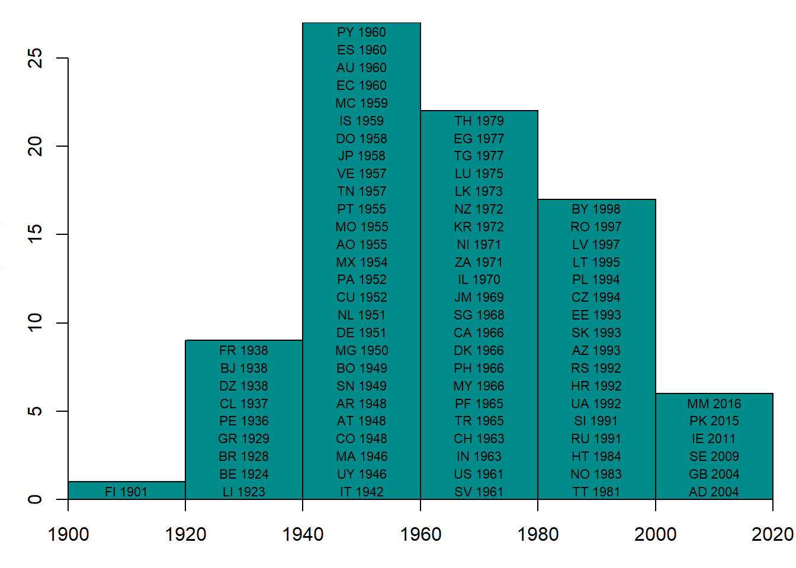

(\#fig:Condominium)Expansion of condominium ownership

Source: own representation.

Figure \@ref(fig:HousingOwnershipStructureDE) depicts the housing ownership structure in Germany in 2011. About 60\% of housing units belong to the private persons, these are single-family and semi-terraced houses, which are mostly located in the country side and in the periphery of the cities. The dwellings in the condominium property make up somewhat over 20\% of the housing stock. The remaining 30\% are more or less evenly distributed between the dwellings in the ownership of local authorities, private firms managing large stocks of housing, and cooperatives.

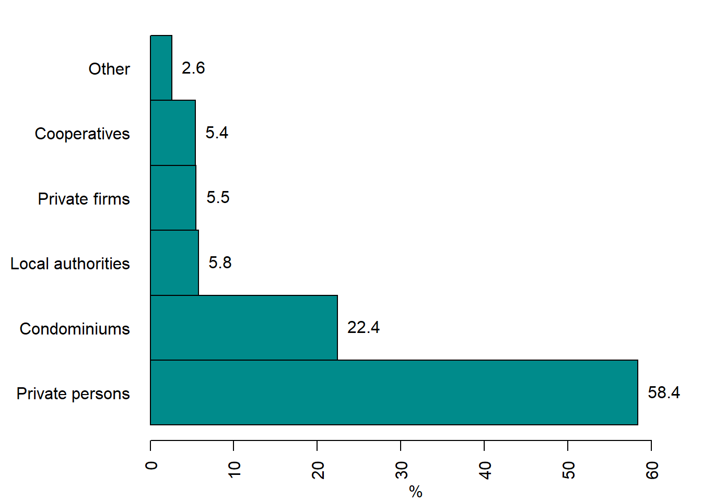

(\#fig:HousingOwnershipStructureDE)Housing stock structure by ownership, Germany 2011

Source: @Destatis_2014, p. 14.

## The importance of homeownership {#sec:ImportanceHOR}

The homeownership plays an important role in the wealth accumulation --- more than half of the private households' wealth is the real estate. Worldwide, over 60\% of all private households are the owners of the dwellings where they live. 

Many governments strive to maximize the homeownership. They encourage mortgage finance and offer financial incentives for people to buy private housing. For example, in the UK, the government helps tenants to buy dwellings they rent by offering 50\% subsidy on market price. In the USA, where being a homeowner is a part of the American Dream, the authorities spend each year about \$195 billion (this corresponds to approximately 1\% of GDP) in tax deductions for mortgage interest for wealthy and middle class homeowners and only \$46 billion a year on affordable housing, which supports affordable housing investments for low-income Americans [@Collinson_et_al_2015]. Thus, the lion's share of government support is directed toward wealthier layers of society.

Why do the governments decide to spend so much money on stimulating the homeownership? The motivation of governments evolved over time and can be different across countries. Here, we summarize the main motives making the government stimulate the expansion of the class of the homeowners.
		
*Support of families*. Families with children are more likely to become homeowners, especially of the single-family houses. Their motivation is often to raise their children in green, where they will have more opportunities to play outside in a nice and healthier environment. Inversely, it has been long thought that owning such a dwelling will stimulate people to have larger families.

*The opposition to left-wing political trends*. After World War II, many countries chose the socialist way of development. In Europe, the capitalist and socialist countries co-existed next to each other. Initially, the idea of socialism seemed to be very attractive. Therefore, the governments of the countries with market economy tried to gain more loyalty from their citizens. They thought that the owners, in particular, those possessing the real estate, would be more resistant against the charms of socialism and left-wing movements disseminating the socialist ideas.

*The old-age care*. Owning the housing is regarded as a good hedge against inflation. Therefore, it is thought to be a supplement to the pension or even substitute, when no pension is provided. After retirement, older people can, for example, sell their dwelling, buy another smaller one, which is worth less, and consume the difference between the value of their previous and new dwellings. Alternatively, they can also borrow money against the value of their dwelling. Some retired persons opt also for the life-time pension paid by a bank or some other organization against the promise that it will inherit the dwelling after these persons' death. Yet another expectation is to save money in the old age, because there will be no need to pay the rent. This motivation becomes especially important at the background of the aging population, a phenomenon observed in many European countries, including Russia. However, such expectations can be disappointed. First, the relative price of an existing owner-occupied dwelling may fall, if the demand for it decreases due to improvements in the design of the new dwellings. Second, flats located in large apartment buildings ---where the ratio of total surface to the area of the land plot occupied by the building is very big--- can depreciate even more. The reason is that the supply of land is inelastic, while that of building materials and labor is not. Therefore, the properties endowed with land, which is a non-depreciable input, may on average appreciate in real value over time [@Ching_Tyabji_1991].

The homeownership is a complex phenomenon, having its advantages and disadvantages, which are discussed below.

*Homeownership and speculative bubbles*. The homeownership is associated with speculative bubbles.^[More on speculative asset price bubbles see in Chapter \@ref(ch:Bubbles).] For example, after World War II, the expansion of mortgage credit related to the growth of the homeownership became a driver of financial instability in advanced economies [@Jorda_et_al_2016]. High-homeownership countries are more prone to volatile house prices and credit cycles [@Ruenstler_2016]. Moreover, the policies promoting homeownership also stimulate speculative bubbles [@Catte_et_al_2004].
		
*Homeownership and mobility*. Homeownership can reduce the residential mobility, since it is associated to higher transaction costs than the renting [@Stein_1995;@Cameron_Muellbauer_1998;@Glaeser_Shapiro_2003;@Blanchflower_Oswald_2013]. According to the hypothesis, known as the **Oswald conjecture**, the homeownership is positively correlated with the unemployment [@Oswald_1996_conjecture]. If the unemployment rate in certain region increases, people could move to other regions with lower unemployment. However, the homeowners are less likely to move due to the transaction costs. Therefore, they stay in their region. This has a negative impact on the efficiency of the labor market. This hypothesis has been tested in many studies. The findings of @Lerbs_2011 for German regions and those of @Blanchflower_Oswald_2013 for the US states support the Oswald hypothesis. Several studies found mixed evidence [@Oliver_Oberst_2014]. By contrast, @Huber_et_al_2017, who investigate the relation between the homeownership and unemployment as well as mobility in 10 CEE countries (including three former USSR republics), find no evidence that homeownership has detrimental impact on individuals' unemployment risks and only weak evidence that homeownership limits mobility.

*Homeownership and individual effects*. The homeownership is found to produce beneficial individual effects [@Megbolugbe_Linneman_1993]. According to this research, the homeowners tend to have higher life satisfaction; neighborhood stability; better children's performance at school; and less divorces. The children of homeowners are more likely to complete their secondary education (less dropouts) and are less likely to become pregnant as teenagers than the children of tenants [@Green_White_1997]. Homeowners tend to save more than tenants, even when their investment in purchasing their home are controlled for [@Krumm_Kelly_1989].

*Homeownership and civil society*. The homeowners are found to participate more actively in the social activities related to their neighborhoods [@Glaeser_Shapiro_2003]. For example, homeowners are more likely to be involved in joining non-professional organizations, gardening, and in investing in social capital in comparison to renters [@DiPasqule_Glaeser_1999]. In the USA, renter communities have significantly worse civic environments than homeowner ones [@Hoff_Sen_2005]. By contrast, @Kortelainen_Saarimaa_2015 using a hedonic house price model where neighborhood homeownership rate is included as an explanatory variable find no evidence of positive externalities from neighborhood homeownership rate. Homeowners are found to invest more in the maintenance of their houses [@Galster_1983;@Rohe_Stewart_1996].
 
The literature also points out other possibly detrimental effects of the high homeownership. @Lo_2012 using Taiwan data finds out that higher homeownership leads to lower fertility rates. The homeownership can exert adverse effects on the propensity to the enterpreneurship. As shown in @Bracke_et_al_2012, purchasing house reduces the probability of starting business by 20--25\%. This result is driven by households with mortgages and persists for several years after entering in the homeownership. 

Summing up, the homeownership has many merits, although the corresponding findings of the empirical research are not always unambiguous. It also has serious drawbacks. Nevertheless, it is not clear whether the net effects of the homeownership are positive or negative.

## Tenure choice {#sec:Choice}

### User cost

The tenure choice refers to the decision the household makes whether to become a homeowner or tenant (or renter). This choice depends on the **user costs of housing**. The user costs of housing vary depending on the type of tenure. The tenant's (renter's) costs is the rental price he pays to the landlord. Typically, the homeowner has the following costs and benefits: 1) mortgage payment; 2) property taxes; 3) depreciation on the dwelling; and 4) housing capital gains.

Let us consider a simple model of tenant choice. This model is based on a set of simplifying assumptions which refer to each of the costs and benefits. 

*The mortgage payment*. Assume that the consumer buys the house using a 100\% mortgage without no down payment. Assume also that this is an interest-only mortgage, i.e., the buyer does not pay the principal amount, only interest accrued on the mortgage debt. Let us denote the mortgage interest cost $iV$, where $i$ is the mortgage interest rate and $V$ is the value of the house.

*Property taxes*. The owner of a house must pay property taxes. The two most widespread taxes are the *stamp duty*, which is paid only once, at the moment of purchasing the house, and the *land tax*, which is paid every year. Here, when talking about property tax we will always refer to the land tax, unless the opposite is not indicated. The property tax is defined as $hV$, where $h$ is the property tax rate. 

*Depreciation on the dwelling*. The depreciation denotes the annual decline in the value of the house as it wears out. It is denoted as $dV$, where $d$ is the depreciation rate. The depreciation rate is typically 1--2\% per year.

*Housing capital gains*. The only financial benefit related to the housing is its capital gains, which reflect the general appreciation of housing values. It can be either positive, if the price of the dwelling increases, or negative, when it decreases. The housing capital gains are denoted as $gV$, where $g$ is the rate of capital gains (annual percentage change in house value).

Now, we can formally express the annual costs incurred by homeowner:
\begin{equation}
			(i+h+d-g)V = (i+h+d-g)vq
\end{equation}
where $q$ is the amount of housing consumption (e.g., total area in $m^2$). Note that the costs of maintenance and insurance are omitted.

Then, the annual homeowner's costs per unit of housing consumption are:
\begin{equation}
			(i+h+d-g)v
\end{equation}

In many countries, the tax treatment of housing depends on whether the owner himself occupies it or let its out as a landlord. Tables \@ref(tab:TaxTreatmentOfHousingCosts) and \@ref(tab:TaxTreatmentBenefits) present the tax treatment of housing-related costs and benefits, correspondingly. 

<caption> (\#tab:TaxTreatmentOfHousingCosts) Tax treatment of housing costs </caption>

| Cost item | Deductible for owner-occupier? | Deductible for landlord? |
|----------------|:-----------:|:---------|
| Mortgage interest | yes | yes |
| Property taxes | yes | yes |
| Depreciation | no | yes |

The treatment is just a stylized example. It corresponds more to the case of the USA and can be different in other countries. In Germany, for example, the mortgage interest is not deductible for the owner-occupiers.

<caption> (\#tab:TaxTreatmentBenefits) Tax treatment of housing benefits </caption>

| Cost item | Deductible for owner-occupier? | Deductible for landlord? |
|----------------|:-----------:|:---------|
| Rental income or imputed rent | no | yes |
| Capital gains | no | yes |

### User cost of owner-occupied housing
The user cost of owner-occupied housing is different from that of the tenant. It can be expressed as follows:
\begin{equation}
			\Big((1-\tau)(i+h)+d-g\Big)v
\end{equation}
where $\tau$ is the owner-occupier's income-tax rate.

The inflation can substantially affect the user cost. In particular, it can reduce it. Assume that all nominal values increase to equal extent. This means that all prices, including those of the housing, and nominal interest rate grow at the same rate. Let the interest rate grow at $\Delta i$, so that in the next period the interest rate will be $i + \Delta i$. Similarly, the market value of dwelling grows at $\Delta g$, increasing the capital gains up to $g + \Delta g$. Assume that both the interest rate and the value of housing grow at the same rate of 1\% per year: $\Delta i = \Delta g = 0.01$. Then, as equation \@ref(eq:UserCostInflation) shows, the user cost will decrease:

\begin{equation}
			\Big((1-\tau)\Delta i-\Delta g\Big)v = \Big((1-\tau)0.01-0.01\Big)v= -0.01\tau v <0
			(\#eq:UserCostInflation)
\end{equation}
Thus, inflation makes the owner-occupied housing more attractive. The effect is even stronger in case of a building-up speculative housing price bubble. In that case, the interest rate remains unchanged, $\Delta i = 0$, while the market value of housing increases $\Delta g>0$. As a result, the user cost decreases by $-0.01v$. Given that the tax rate $\tau<1$, the user cost reduction under speculative price bubble will be larger than in case of inflation. Thus, speculative price increases generate strong incentives to become homeowners.

### User cost of tenant-occupied housing

In order to find the user cost of the rental housing we need to compute the landlord's profit. The landlord's after-tax cost of unit of housing is:
\begin{equation}
			(1-\lambda)(i+h+d)v
\end{equation}
where $\lambda$ is the landlord's income-tax rate. We assume that all costs are tax deductible.
Then, the landlord's after-tax capital gain: $(1-\lambda)gv$.
The landlord's profit can be calculated as:
\begin{align}
			(1-\lambda)p - \Big((1-\lambda)(i+h+d)v - (1-\lambda)gv\Big) \\
			= (1-\lambda)\Big(p-(i+h+d-g)v \Big)
\end{align}
where $p$ is the rental price.

As a rule, despite its heterogeneity, the housing market is characterized by a very high degree of competition. This implies that the competition drives landlord's (and developer's) profit to 0:
\begin{align}
			(1-\lambda)\Big(p-(i+h+d-g)v \Big)=0
\end{align}
Of course, it does not mean that the landlord earns no profit at all. As usual in the microeconomic analysis, some *fair profit* is included in the cost. Therefore, the user cost of rental housing is:
\begin{equation}
			p=(i+h+d-g)v
\end{equation}	
This represents the cost borne by the tenant. As can be seen, it does not contain income tax term. Indeed, the user cost of the housing for the tenant does not depend on his income. Here, we consider the housing provided at the market conditions. In chapter \@ref(ch:Policy), we will briefly discuss the social housing provided to the poor households at special conditions.

### Tenure choice in the simple model
In deciding whether to rent or to own, the household will choose the cheaper tenure mode. In the basic model,
\begin{equation}
			\Big((1-\tau)(i+h)+d-g\Big)v < (i+h+d-g)v
\end{equation}
	 since
\begin{equation}
			(1-\tau)(i+h) < i+h
\end{equation}
		 given that $\tau\in[0,1)$.
Hence, household will always choose to be owner-occupier. However, we know that, on average, worldwide 30--40\% of households are renters. It means that the simple model that we consider here cannot adequately explain the real-life phenomena, since it misses some important points.

One way to model the tenure choice in accordance with facts is to use a more realistic assumption on the depreciation deduction. Depreciation rate, $d$, represents **economic depreciation**, that is, the actual wearing out of buildings. In many countries, however, tax codes allow landlords to deduct **accelerated depreciation**. In this case, the buildings are treated as wearing out faster than they really do. Such accelerated depreciation allowed for tax purposes can be expressed as $d+e$, where $e$ is the rate of **excess depreciation** over the rate of economic depreciation. Under this assumption, the profit of landlord will look like:
\begin{align}
			(1-\lambda)p - \Big((1-\lambda)(i+h+d)v - \lambda ev -(1-\lambda)gv\Big) \\
			= (1-\lambda)\Big(p-(i+h+d-g)v \Big) +\lambda ev
\end{align}

Again, in a free competitive market, the landlord's profit must equal 0. Hence, new renter's user cost (rental price) is:
\begin{equation}
			p=(i+h+d-g)v -\frac{\lambda ev}{1-\lambda}
\end{equation}

Thus, the new renter's user cost is smaller than the previous one by $\frac{\lambda ev}{1-\lambda}$. The presence of subtracted term reduces the renter's user cost. It makes unclear which user-cost expression is smaller. Recall that owner-occupier's user cost depends on income tax rate $\tau$. This tax rate will differ across households, provided that the country uses a progressive income tax, when tax rate increases as a function of the income.^[In Russia, the income tax has a constant rate. Is this probably a reason for a very high homeownership rate in Russia, see Figure \@ref(fig:HORRussia).] Under progressive schedule, $\tau$ will be low (high) for low-income (high-income) households. Hence, user cost will be lower for higher-income households. By contrast, renter's user cost does not depend on the household's income-tax rate. 

Figure \@ref(fig:HousingTenureChoice) displays predictions of the model. The horizontal thick line corresponds to the user cost of homeowner, while the thick line with negative slope reflects the user cost of tenant. They intersect at the tax rate $\hat{\tau}$. The households with income tax rate lower than $\hat{\tau}$ will opt for being renters, whereas those with higher income will be homeowners. Thus, the society is divided into tenants and homeowners by the income criterion.

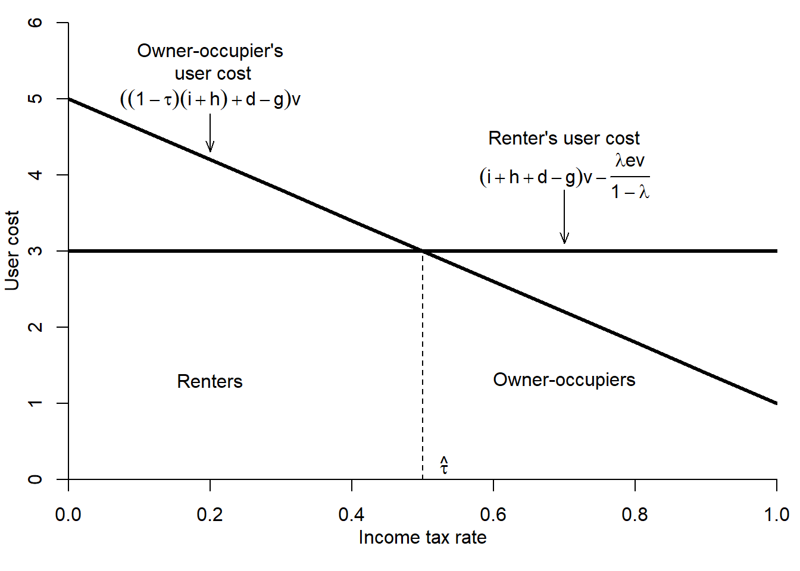

(\#fig:HousingTenureChoice)Housing tenure choice

Not all countries have progressive income tax rate. Still, there exist renter households. How to explain their existence? There are several other factors that can create incentives for being tenants. 

*The expected mobility* of homeowner is lower than that of the renters. The reason for this are the substantial transaction costs of buying/selling dwellings. Typically, these costs comprise various fees (for the services of notary, real estate agent, and registration) and taxes (e.g., stamp duty). Figure \@ref(fig:TransactionCostsOECD) shows that transaction costs can account for more than 14\% of the purchasing price of a dwelling. Assume that the dwelling is sold for 200,000 euros. In addition to that, the buyer must expend 28,000 euros as transaction costs, the value of a good car. Thus, each time you buy a new house, you give up buying a car. By contrast, the tenant must only pay the costs of moving to a new house plus guarantee, which will be returned to him, and sometimes the real estate agent fee for finding the new dwelling. However, these expenses are negligible in comparison to the transaction costs incurred by the homeowner.

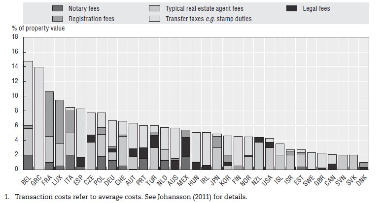

(\#fig:TransactionCostsOECD)Transaction costs on buyer in OECD countries, 2009

Source: @sanchez2011residential, p. 192.

*The pride of ownership*. Consumers often take pride in being able to own rather than rent. In many countries, being a homeowner, especially when it is a single-family house, is a matter of prestige. In the USA, it is a part of the American Dream. In Russia, after generations of Soviet citizens had lived in the shared apartments (*kommunalki*) in the very squeezed conditions, many people strive of having their own dwelling, even if it is a tiny cell in a 30-storeys building, where a couple of thousand other people live.

*The risk*. Despite the common belief that the real estate is a very safe investment, the real life shows that is not the case. First, the value of the housing can decline as a result of some external event. For example, if a highway or starkly polluting factory is build next to the house. Second, the risk of investing in homeownership is magnified when consumer's wage is positively correlated with housing prices in his city (e.g., monocity). Assume that you own a dwelling in a town like Pikalyovo, where the major and almost the only employer is a cement factory. Assume also that you work at this factory. What will happen, if the owner decides to shut it down? You will lose your job. But, more than that, your dwelling will become worthless. If you will decide to start a new life elsewhere, you will have to start from zero, since you lost your major asset.

*Dislike of home-maintenance tasks*. Living in your own house means that you have to do a lot of home maintenance: make little repairing, paint the walls, mow the lawn, if you have one, etc. Therefore, the people who dislike home-maintenance tasks will rather choose to rent.

*The down payment*. Typically, a home buyer is required to make a substantial down payment. This is the own capital invested by the home buyer. The banks often, although not always, are not eager to finance the full value of the dwelling, because they do not want to bear additional risks. If the home buyer cannot pay his mortgage loan and the value of the house goes down, the bank will be unable to recover its money lent to the home buyer. The household lacking the funds for down payment will not be able to become homeowner. In the previous simpler model, it was assumed that no down payment was needed. Now, we will modify the tenure choice model in the following way: the consumers with income-tax rates below $\hat{\tau}$ will still be renters, while the consumers with income-tax rates above $\hat{\tau}$ would like to be owners, but only patient ones will be able to accumulate the required down payment. Thus, down payment requirement reduces the number of homeowners.

In order to illustrate the impact of the down payment on the tenure choice, we introduce the notion of the **loan-to-value ratio**, which is the ratio of mortgage loan to the value of the dwelling. Formally, the loan-to-value (LTV) ratio is:
\begin{equation}
			LTV = \frac{M}{V} = \frac{1-D}{V}
\end{equation}
where $M$ is the amount of mortgage loan; $V$ is the value of the dwelling; $D$ is the down payment, or home buyer's own capital.

Table \@ref(tab:LTV) reports the LTVs and other housing finance features in some advanced economies.

<table>
<caption>(#tab:LTV)Housing finance features in advanced economies, 2008</caption>
</table>
<!--html_preserve-->

<!--/html_preserve-->
Source: @IMF_2011, p. 117.

It shows that the LTV varies from 70 to 125\%. This implies that in some countries (e.g., Japan), the home buyer must invest at least 30\% of his own capital, in other countries (e.g., Ireland and The Netherlands), the home buyer does not need any own capital and even receives from the bank additional money in excess of the dwelling's value. With this money the home buyer can make a world tour of buy furniture or even a car.

## Spatio-temporal variation of the homeownership rates  {#sec:Variation}

**The homeownership rate** characterizes how widespread is the homeownership. In the international statistical practice, there are three definitions of the homeownership rate. The homeownership rate is defined as the

1. share of dwellings occupied by their owners;
2. share of households living in their own dwellings (e.g., Germany and USA);
3. share of persons living in their own dwellings (e.g., Eurostat).

In Russia, the official statistics does not provide a measure of the homeownership. It only reports the square meters of the housing, which are in the personal private property. Based on these figures, one can compute the share of housing surface in the personal property with respect to the total housing surface. This is not entirely compatible with the homeownership rates computed by other countries. First, the surface does not perfectly correlate with the number of dwellings or households. Larger dwellings are more likely to be owner occupied. Therefore, the surface-based measure tends to overestimate the homeownership. Second, the property status of a dwelling convey no information on its tenure: it can be own-occupied, rented out, or stay vacant. Hence, the surface-based measure tends to underestimate the homeownership rate. In part, these opposite effects cancel out. This is probably why the surface-based indicator produces the values similar to the homeownership rates computed using the international methodology and the survey data collected for Russia, for example, within the Life in Transition Survey (LITS) conducted by the European Bank for Reconstruction and Development and The Russia Longitudinal Monitoring Survey --- Higher School of Economics (RLMS-HSE). Similar estimates are obtained also by other institutions: according to a survey conducted by a Russian analytical center NAFI, in 2017, only 9\% of Russians rented their dwellings [@NAFI_2017].

Figure \@ref(fig:HORinternational2015) shows the homeownership rates in 18, mostly developed, countries in 2015. It varies from about 50\% in Switzerland to approximately 90\% in Singapore. The average homeownership rate for these countries is about 70\%, which corresponds roughly to the world average value.

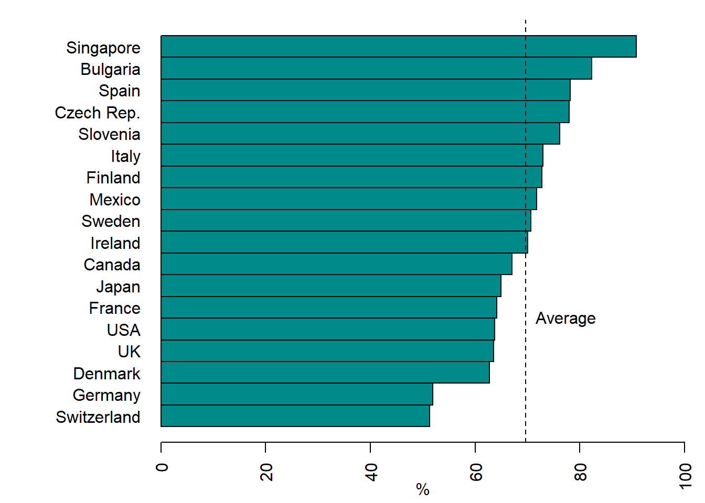

(\#fig:HORinternational2015)International homeownership rates, 2015

Source: @Goodman_Mayer_2018.

Figure \@ref(fig:HousingTenureDistribution2014) provides more insights into the housing tenure structure in 37 OECD member states in 2014. It does not simply divide the whole housing stock into owner- and tenant-occupied housing. Instead, it subdivides the owner-occupied tenure between the own outright and owner with mortgage (owners, who did not pay yet their mortgage debt) and distinguishes between the private and subsidized (social) rental housing.

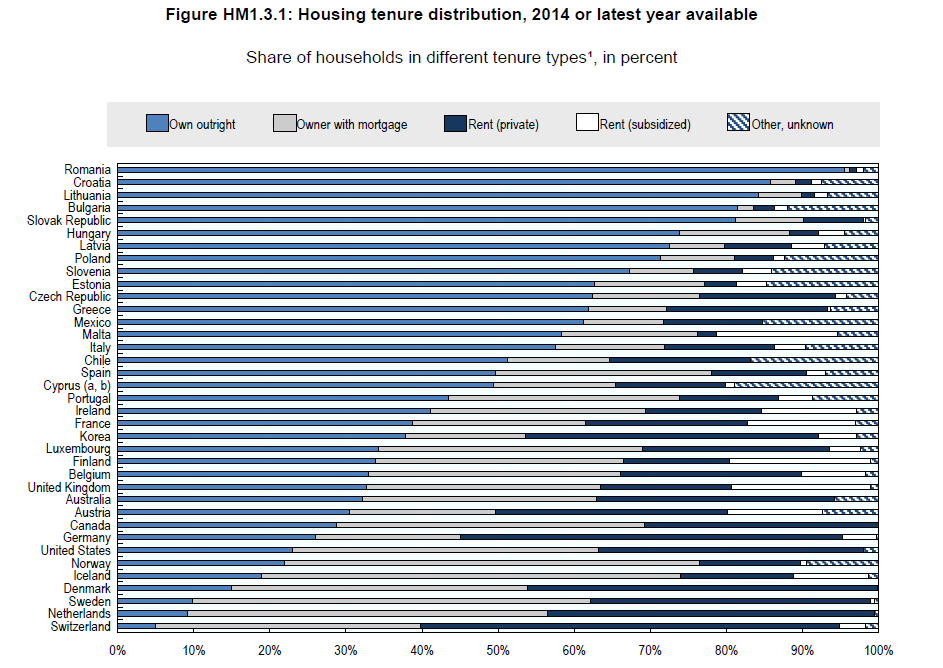

(\#fig:HousingTenureDistribution2014)Housing tenure distribution, 2014

Source: OECD Affordable Housing Database, http://www.oecd.org/social/affordable-housing-database.htm.

The country with the lowest homeownership rate is again Switzerland, while that with the highest rate is Romania. Note that three German speaking countries have the lowest homeownership rates. In most countries, the share of the own outright occupancy is much higher than that with mortgage. The notable exceptions are the Scandinavian countries and in The Netherlands. For example, in Sweden many households take interest-only loans, where they do not repay the principal of the debt. Also in most cases, the proportion of the private rental housing stock is significantly larger than that of the subsidized rental. By contrast, in Malta the subsidized rental is several times larger than the private one. Large shares of subsidized rental housing are also in Finland, Ireland, France, and the UK. Surprisingly, according to the diagram, The Netherlands has no subsidized rental housing, which contradicts other evidence and, in particular, Figure \@ref(fig:MapSocialHousingStockEU).

Figure \@ref(fig:MapHOREUregions) shows the geographical distribution of the homeownership rates in the European Union at the NUTS2 regions level,^[The abbreviation NUTS stands for the Nomenclature of Territorial Units for Statistics (from French: *Nomenclature des unites territoriales statistiques*) and is a geocode standard for referencing the subdivisions of the EU countries for statistical purposes.] which corresponds, for example to the *Regierungsbezirke* in Germany and *Comunidades aut\'onomas* in Spain.

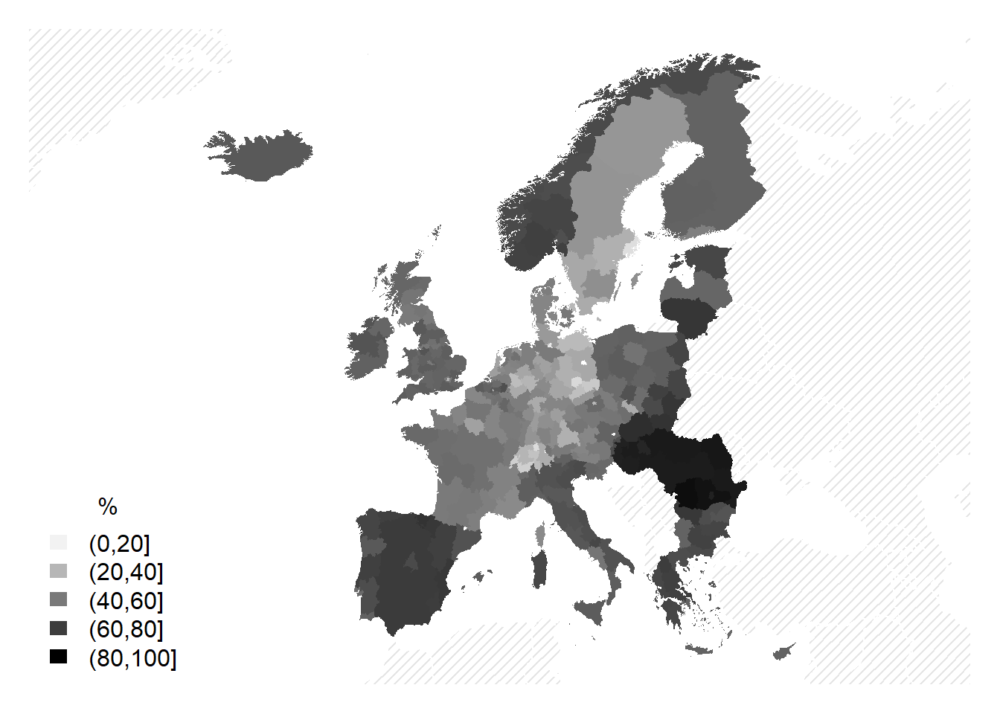

(\#fig:MapHOREUregions)Homeownership rates in the EU NUTS2 regions, 2011

As seen in the map, the highest homeownership rates are observed in the periphery of the EU, while the lowest ones in its central regions.

However, the actual homeownership rates are just a snapshot, they have little to do with the rates observed several decades ago. The homeownership rates have changed dramatically. Figure \@ref(fig:HORGermanyEngland) illustrates the evolution of homeownership rates in West Germany and England between 1950 and 2019.

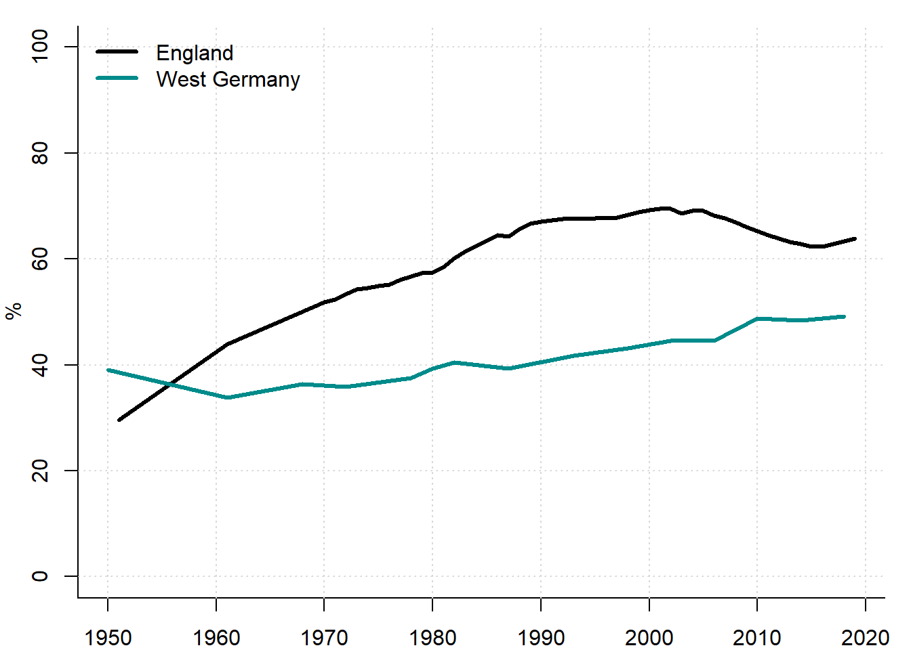

(\#fig:HORGermanyEngland)Homeownership rates in West Germany vs. England, 1950--2019

Sources: Gov.uk, Destatis, and own representation.

In 1950, the homeownership rates in both countries were below 40\%. Interestingly, in the UK, the HOR was substantially lower than in West Germany. Over the next 60 years, the homeownership rate in the UK more than doubled, whereas in West Germany it increased by slightly more than 10 percentage points. Thus, HORs in different countries have evolved differently: in some cases the changes were large, while in other countries only mild changes took place.

The differences are even more prominent when observed at the city level, as seen in Figure \@ref(fig:HORBerlinMadridZuerich), which shows the evolution of the HORs in Berlin, Madrid, and Zurich between 1900 and 2019.

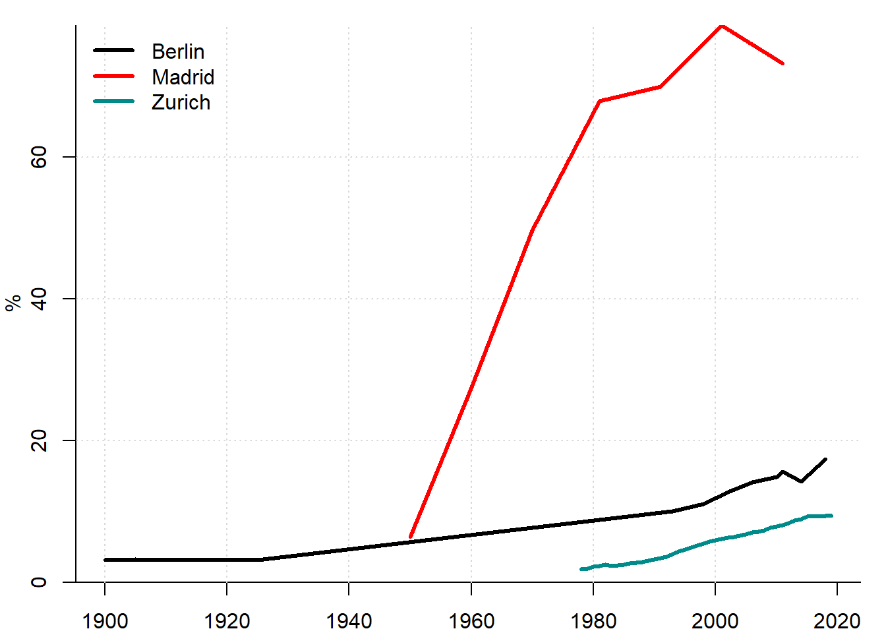

(\#fig:HORBerlinMadridZuerich)Homeownership rate in Berlin, Madrid and Zurich, 1900--2019

Sources: 1) Berlin: @SASB_1902; @SASB_1910; @SASB_1925; @SBA_2000; @SBA_2013; Destatis; @BlancoArtola_2012; 2) Madrid: Instituto Nacional de Estadistica de Espana; 3) Zurich: Statistik Stadt Zuerich, GWZ; 4) own representation.

In Berlin, since the beginning of the 20th century, the homeownership rate increased from about 5 to 17\%. In Zurich, the HOR has been the smallest and only slowly increasing. By contrast, in Madrid a huge surge in the HOR took place, which reversed the relationship between the tenant and homeowners: if in 1950 the vast majority of Madrid households were renting their dwellings, by 2000 almost 80\% the dwellings were owner-occupied.

Historically, private tenancy has dominated large parts of the 20th century: homeownership rates crossed the 50\% threshold as early as 1955 in Spain, 1968 in Portugal, 1970 in Great Britain, 1982 in France, and 1998 in the Netherlands. Even if the remainder is partially public or municipal housing, private tenancy is not negligible, as public housing has been declining in most countries since the 1970s [@Kohl_2017_Homeownership]. In general, after World War II and until the Great Recession of 2008--2009, the homeownership rates had been increasing. In the 2010s, they stabilized and even appear to be declining; see Figure \@ref(fig:HORboxplot), which shows the distribution of the HORs worldwide by decades between 1900 and 2010. 

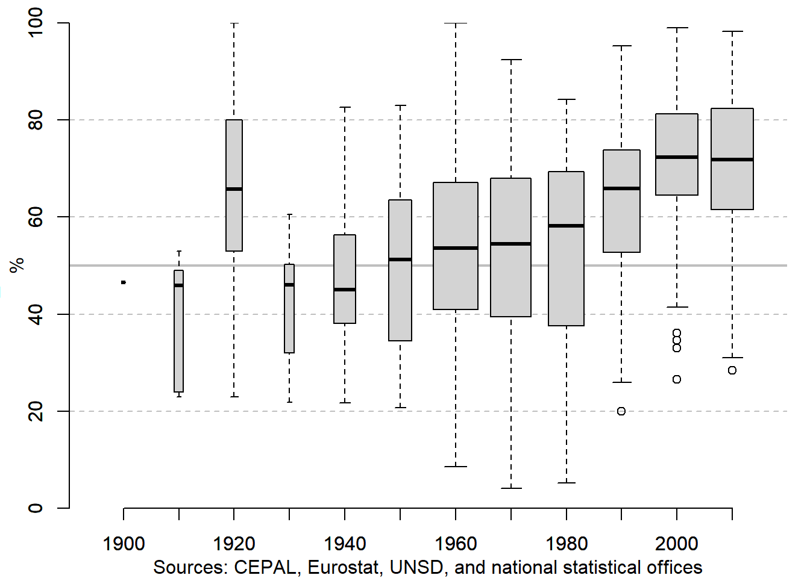

(\#fig:HORboxplot)Evolution of homeownership rate in the world, 1940--2010s

The width of each boxplots represents the number of countries for which HORs in the corresponding decade are available: we have data on very few countries in the first half of the 20th century, and many more for the more recent decades. The thick horizontal line in each box corresponds to the median HOR, while between the lower and upper borders of each box, half of the observations (countries) are contained.

After we saw how the HORs evolved worldwide, it would be interesting to look at several country cases. Let us first examine the homeownership rates of German regions (*Kreise*, an analog of Russian municipal districts, *rayony*) between 1950 and 2011, see Figure \@ref(fig:HORDEKreise). This is a scatter diagram comparing the HORs in two nearest periods, the horizontal axis corresponding to the earliest period, while the vertical axis corresponding to the latest period. Each circle denotes a region: bigger circles are urban regions (*kreisfreie Staedte*), whereas smaller circles are rural regions (*Landkreise*).

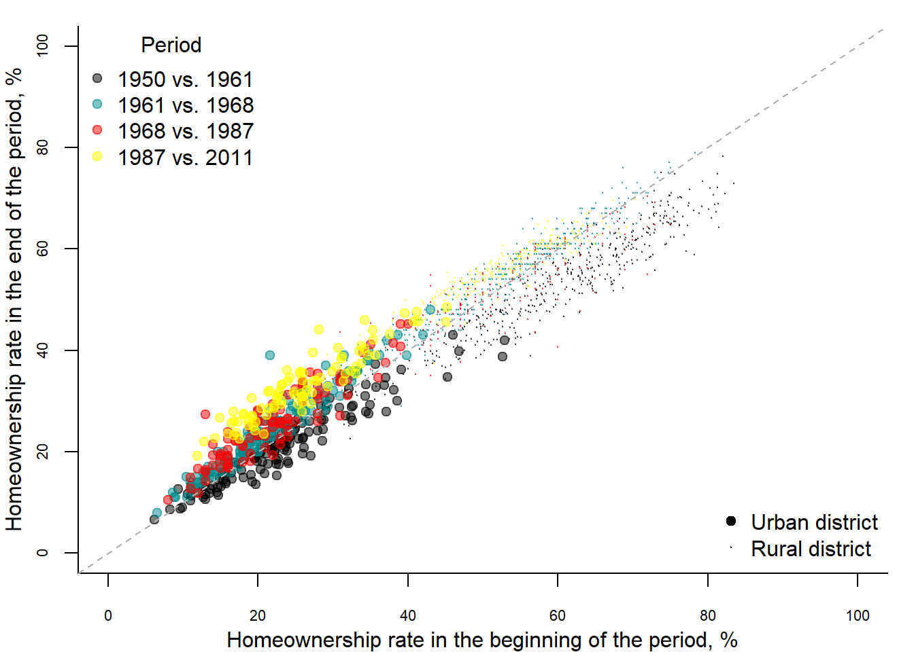

(\#fig:HORDEKreise)Evolution of HOR in German Kreise, 1950--2011

Source: Destatis and own representation.

For example, black circles depict the HORs in 1950 and 1961. The dotted line is drawn at 45$^0$. If a point lies on this line, then the HOR did not change, say, between 1950 and 1961. If it lies below (above) this line, then the HOR decreased (increased) between 1950 and 1961. From this diagram several conclusions can be drawn. First, the HORs in the rural areas are substantially higher than HORs in the urban areas: the borderline is somewher at 40\%. Second, the HORs decreased only during one period --- between 1950 and 1961, which was related to a massive construction of the social rental housing. During all other periods, the HORs increased. A particularly strong increase took place between 1987 and 2011. Third, a tendency toward convergence of the HORs between urban and rural regions can be observed: while urban HORs increased, the rural ones declined.

Now, let us look at the case of Russia. There is only little obstacle that complicates this task. As mentioned above, the Russian official statistics does not compute the homeownership rate. However, we have seen that the surface-based measure can be a satisfactory approximate for the HOR. Figure \@ref(fig:HORRussia) shows the evolution of this measure in Russia between 1940 and 2018. It shows two HORs: in the urban areas and in the whole country.

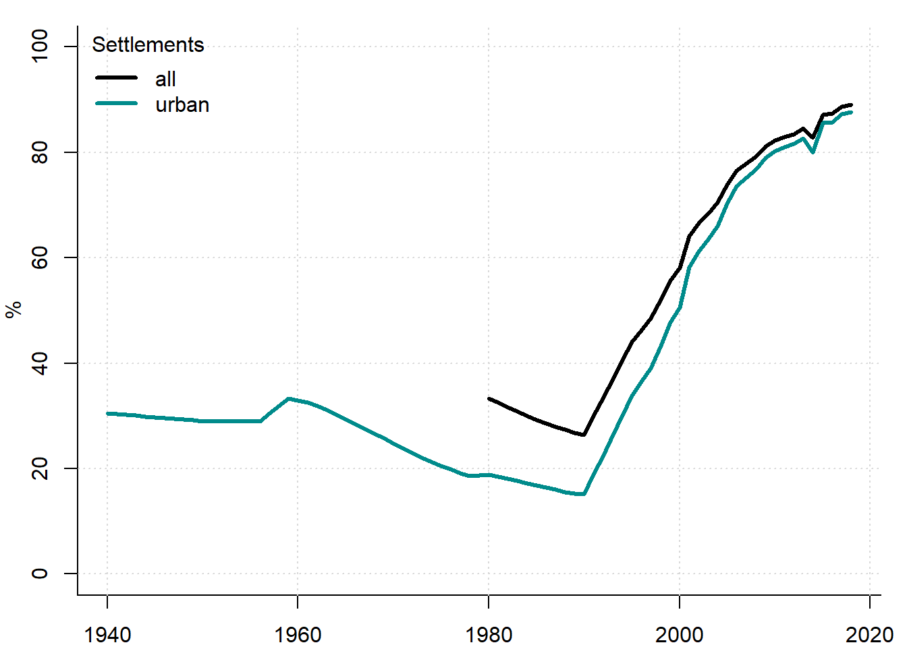

(\#fig:HORRussia)HOR (share of personally owned space) in Russia, 1940--2018

Sources: CSU RSFSR and Rosstat.

In 1940, the surface-based proxy for the homeownership rate was at around 30\%, which is similar to the HOR in the United Kingdom at that time. During the following 50 years, with an exception of a short period in the late 1950s, the HOR in Russia declined. How can it be explained? First, the Soviet system was ideologically opposed to any form of the private property, in particular, for housing. For example, the Civil code of 1964 imposed various restrictions on the transfer of the privately owned housing. Typically, only small houses with total area not exceeding 60 m$^2$ could be privately owned. Secondly, since the end of the 1950s, a large-scale housing construction program had been implemented, when predominantly large apartment buildings were erected. Thirdly, as seen in Figure \@ref(fig:UrbanizationRussia), in 1959 the parity between the urban and rural population was attained. After that, the majority of the Russian population started to be the urban dwellers. This contributed to the further decrease of the HOR, since homeownership in the cities tends to be smaller than in the country side. After the collapse of the Soviet Union, the opposite trend began. In the early 1990s, Russia, together with many other countries from Eastern and Central Europe, chose the "American way of development'' and opted for expansion of its homeowner class. In the 1990s, this objective was attained mainly through a mass privatization of the existing housing stock. People were allowed to privatize for free the housing they occupied at the moment of the reform. Since many people were occupying rooms in the shared apartments, they privatized rooms, not entire dwellings. Thus, a unique roomwise homeownership institution emerged. In the 2000s, when the most part of the housing was already privatized, the further expansion of the homeownership started to be fed by the development of the mortgage financing. As a result, the vast majority of Russian population became homeowners. In 2018, the HOR  was about 88\% in the urban areas and 89\% in the whole country. In the rural areas, where single-family houses dominate, the HOR is slightly higher than in the cities. However, between 1980 and 2018 this gap has almost disappeared: it decreased from approximately 14 to 1 percentage point.

The interregional differences of the HOR in Russia are quite big, as Figure \@ref(fig:MapHORRussia) shows. It displays the surface-based HOR proxy at the subject of federation (oblasts and autonomous republics) level.

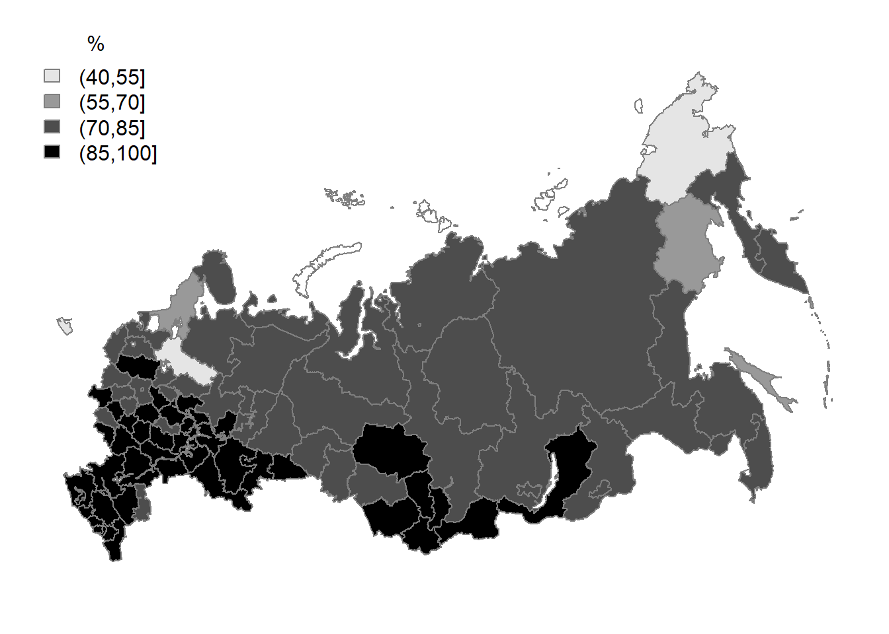

(\#fig:MapHORRussia)HOR (share of personally owned space) in Russian regions, 2013

In some regions (for example, in Vologodskaya and Kaliningradskaya oblasts), the HOR is below 50\%, while in other regions, especially in the South and in Caucasus, it approaches 100\%. The higher homeownership rates in the South can be explained by a larger proportion of the rural population there, becauses these regions are characterized by a larger role played by the agricultural production. And it is known that the rural areas have higher HORs than the urban ones.

## Box: Historical aside {.unnumbered #sec:BoxxTenure}
> **_Historically, urban areas had a very unequal distribution of housing ownership. Since only entire houses could be owned, very few persons could afford being homeowners. Thus, the vast majority of the city dwellers were occupying rental premises. For example, in early 14th-century Norwich --- at that time the second largest city of England --- at most 25\% of households were homeowners [@Baer_2011_landlords, p. 253]. Between 1633 and 1800, in large Italian cities the homeownership varied between 2 and 7\% [@Lyon_Caen_2015_immobilier, p. 58]. In St. Petersburg in 1900, the HOR fluctuated around 3.6\% [@Kholodilin_et_al_2019_housing]._**

## Exercises {.unnumbered #sec:ExTenure}

1. What of the following does not belong to the transaction cost:
	a. the notary fee;
	b. the income tax;
	c. the land stamp duty;
	d. the real estate agent commission;
	e. the land tax.
2. The homeownership rate is one of the following:
	a. The ratio of the housing surface in the private property to the surface of the rental housing;
	b. The ratio of the number of dwellings occupied by their owners to the total surface of all dwellings;
	c. The ratio of the number of households owning the housing to the total surface of all dwellings;
	d. The ratio of the number of households owning the housing to the number of dwellings they occupy;
	e. The ratio of the number of dwellings occupied by their owners to the total number of dwellings.
3. Assume that the down payment is 500,000 rubles and that the dwelling is worth 4 million ruble. What is the loan-to-value ratio in this case? How will the LTV change if
	a. the interest rate will increase from 10 to 12\%?
	b. the dwelling is sold at a discount of 10\%?
	c. the income of the buyer decreases by 5\%?
4. What happens to the homeownership rate, according to the model of housing tenure choice, if
	a. the homeowner's income tax rate increases?
	b. the homeowner's income tax rate decreases?
	c. the landlord's income tax rate decreases?
	d. the landlord's income tax rate increases?
5. How is the homeownership affected by the change in the housing price?

## Key terms {.unnumbered #sec:KTTenure}

-------------------------------  ----------------------------  -------------------------
housing tenure                   collective owner occupation   capital gains            
possession                       private renting               economic depreciation    
ownership                        public or social renting      accelerated depreciation 
homeownership                    condominium property          transaction cost         
owner occupied                   user cost                     tenant or renter         
tenant occupied                  mortgage payment              landlord                 
individual owner occupation      property taxes                down payment             
shared-equity owner occupation   depreciation                  loan-to-value ratio      
-------------------------------  ----------------------------  -------------------------
