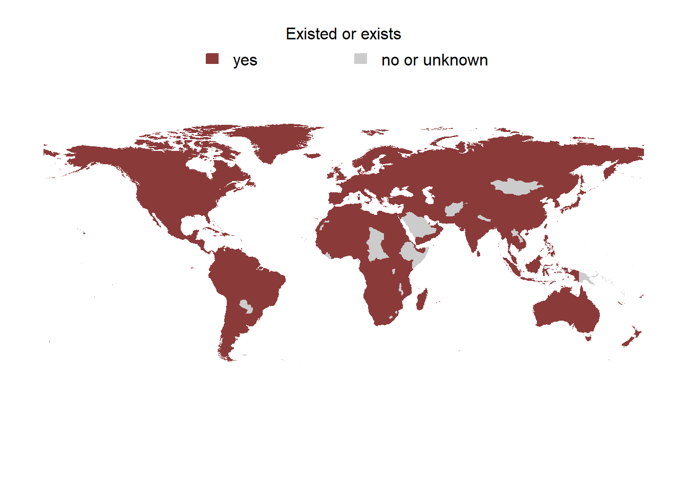
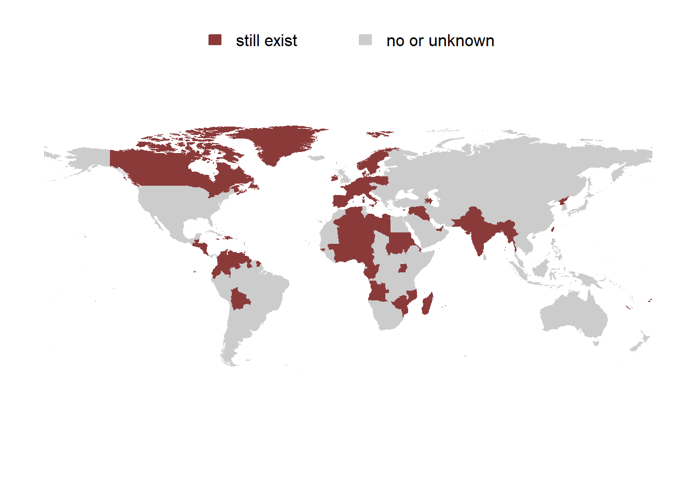
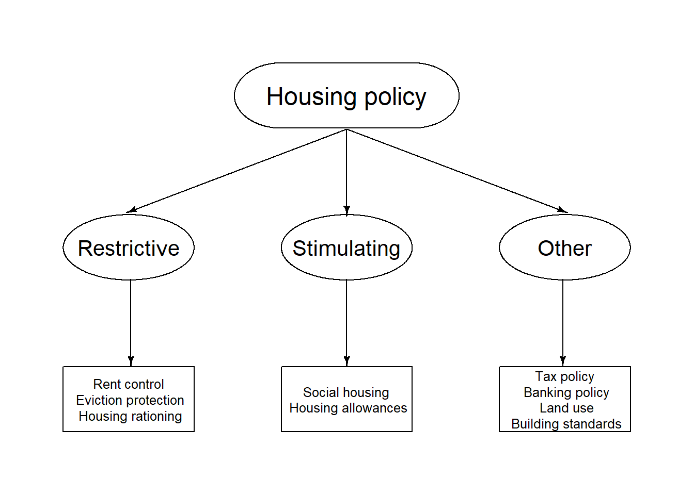
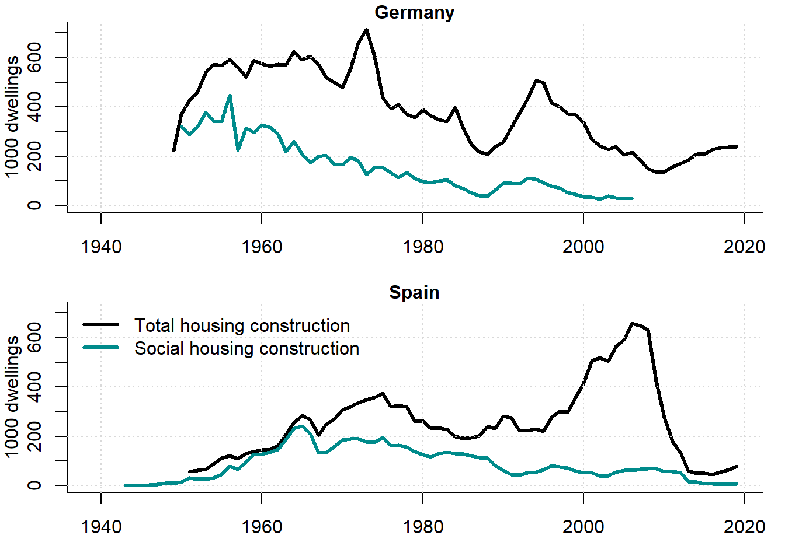
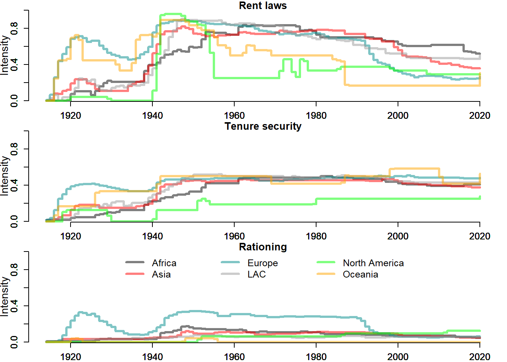
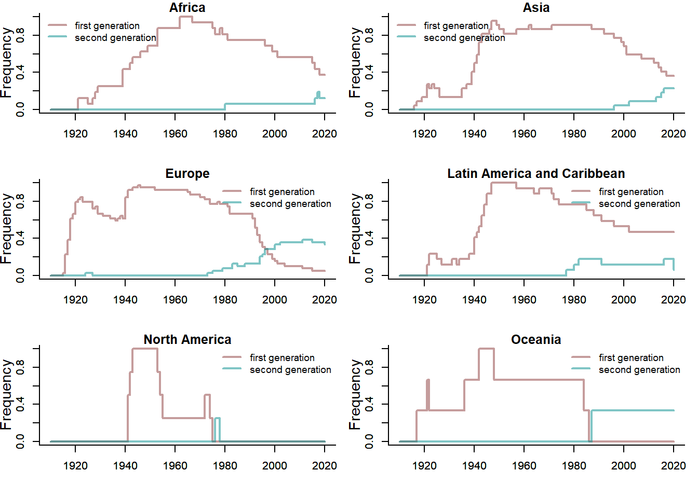

# Housing policy {#ch:Policy}

## Introduction {#sec:IntroductionPolicy}

Housing is one of the most important aspects of the human life.^[A detailed account in Russian language on rental housing policies worldwide and, in particular, in Germany, Russia, and the USA can be found in @Kholodilin_2019_ru.] It is also one of the heavily regulated sectors. Since World War I, in most countries, the government actively intervenes in the housing market trying to correct the really existing or imaginary market failures. For example, as seen in Figure \@ref(fig:MapExistence), virtually all countries of the world had or still have rent controls. 

(\#fig:MapExistence)Countries that used or are still using rent control

By the late 2010s, such regulations were abandoned by most countries \@ref(fig:MapExistence2017). 

(\#fig:MapExistence2017)Countries that are still using rent control

However, a renaissance of rent control is now observable in many countries. For example, limitations on rent setting were imposed in Paris and Lyon (France) in July 2019 and March 2020, respectively; state-wide rent growth restrictions were introduced in California in January 2020 and are to remain in force until January 2031; and in Berlin (Germany) rents were frozen for 5 years starting in February 2020, to name just a few examples. The outbreak of the COVID-19 pandemic has increased the importance of such measures. After the majority of countries imposed sanitary restrictions, such as lockdowns, in March 2020, the resulting loss of income led to a worldwide wave of eviction bans and rent freezes [@Kholodilin_2020_Covid]. Thus, not only historically housing market regulations played an important role, they are far from being dead nowadays.

<iframe src="https://www.youtube.com/embed/hYM8ZzTsSoQ" width="99%" height="400px" style="border: none;"></iframe>

(\#fig:COVID19PolicyRU)Lecture on housing policies during COVID-19 crisis in Leontieff Centre on October 21, 2020 (Russian)

The purpose of the chapter is to make the readers acquainted with a toolkit of policies that has been applied to the housing market in many countries across the world. We carry out a critical analysis of these housing policies. In addition, we discuss the evolution of the restrictive policies (such as rent control, protection of tenants from eviction, and housing rationing) by continents and worldwide between 1910 and 2020.

## Housing policy: definitions  {#sec:PolicyDefinitions}
Housing policy, in a wide sense, can be defined as the set of all measures applied by a government in order to affect housing market performance. The main purpose of such interventions is to provide people with affordable housing that simultaneously must satisfy certain quality standards. Apart from this, the government can pursue additional purposes: political stability, competitiveness of the domestic economy, and even stimulation of the industrialization. For instance, during the interwar period, housing rents in Germany were restricted in order to moderate the workers' wage increase requests and to make, as a result, domestic products less expensive. In the 1920s, the Brazilian authorities sought to increase investments in manufacturing by discouraging real estate investments, which were highly profitable at that time. Eventually, through rent control, authorities managed to reduce this profitability, thus making investments in the manufacturing sector relatively more profitable [@Bonduki_1994, p. 717].

Governments can take advantage of a large variety of tools in order to regulate housing markets; see Figure \@ref(fig:HousingPolicyTools) for a schematic representation of housing policies. The instruments of housing policy, in a narrow sense, can be classified as either stimulating or restrictive. Stimulating housing policies come in two forms: object help, which helps with residential (social) construction, and object help, which assists the tenants through housing allowances. The restrictive measures encompass rent control, protection of tenants from eviction, and housing rationing. Each of these tools is examined in more detail below.

(\#fig:HousingPolicyTools)Housing policy tools: wide and narrow sense

## Stimulating tools of housing policy {#sec:Stimulate}

### Stimulation of residential construction

The main purpose of the stimulation of residential construction policy is to expand the supply of housing, in particular cheap homes. The rising supply should make housing more affordable. Other purposes are also pursued. It is, for example, a creation of a strong class of owners who are resistant against the communist propaganda. Especially in aging societies, the purpose of simulating policies is often the accumulation of wealth to provide for old age. Support of families, improvement of housing conditions, and fostering the economy through construction industry, among others, are also the goals of stimulating housing policy [@Haas_2018]. The policy of stimulating residential construction includes the following instruments: 1) provision of state aid in form of construction subsidies and low or zero interest loans; 2) provision of the state credit guarantees; 3) reduction of the taxes and fees (particularly, land stamp duty); and 4) provision of building land at lower prices or in form of a long-term leasing.

Using such instruments, the state intends to foster residential building and provide in the first place the low-income households with an affordable housing. This housing ---sometimes called social housing--- can be both rental and owner-occupied. Sometimes (for example, in Spain in the 1940--1970s) the state builds the rental housing that is later to be purchased by the tenants afterward. In Iceland in the 1930--1970s, social workers' houses were predominantly built as owner-occupied ones [@Sveinsson_2004]. The rent in social housing is subject to restrictions and is typically set at the level of the construction and operation costs plus a moderate markup representing a "fair profit'' for the landlord. Admittance as a tenant in social housing requires proving that you have a low enough income. However, once moved in, tenant income is practically never tested. As a result, households with increased income keep occupying social housing, even though they are formally no longer eligible for it, because their income exceeded the admittance threshold. For this reason, many low-income persons cannot gain access to social housing. The problem is that both verifying the income levels of households living in social housing and carrying out evictions are too costly. By decreasing its efficiency, this is one of the main disadvantages of social rental housing.

Here are just a few figures illustrating this inefficiency. For example, in Germany, in some regions, 25\% of social dwellings are unlawfully occupied [@Bundestag_2016]. In the UK, a union boss occupied social housing, despite earning \pounds145,000.^[https://www.dailymail.co.uk/news/article-2513521/Bob-Crow-says-moral-duty-leave-council-house-despite-generous-salary.html.]
In Amsterdam in 2007, the waiting time for starters on the social housing market was 5--10 years [@vanHeelsum_2007].
The reasons for such inefficiencies is that both verifying the income levels of households living in social housing and carrying out evictions are too costly.

Figure \@ref(fig:MapSocialHousingStockEU) depicts the share of the social rental housing in the member states of the European Union. 

(\#fig:MapSocialHousingStockEU)Social rental housing as percentage of total housing stock in the EU, 2017

Source: @Housing_Europe_2017.

As seen, the highest proportions of social housing are observed in The Netherlands (30\% of the total housing stock) and Austria (24\%), while the lowest are in Cyprus and Greece (0\%). Germany, for example, is in the lower tail of the distribution with its 4.8\%.

Figure \@ref(fig:SocialHousingConstruction) displays the scale of total and social housing construction in Germany and Spain between 1940 and 2020. The total residential construction is measured as completed dwellings, while for social housing construction the number of approved dwellings is used.

(\#fig:SocialHousingConstruction)Overall vs. social housing construction in Germany and Spain, 1940--2020

Sources: 1) Germany: Destatis and Fachkommission Wohnungsbaufoerderung; 2) Spain: Ministerio de Fomento and @Belsky_Retsinas_2004_history, p. 18; and own representation.

During certain periods, for instance, in the late 1920s and early 1950s, the social housing construction made up more than a half of total residential building. These were the times of the intensive restrictive regulations that often hindered the private initiative. Therefore, the state had to intervene in order to guarantee the necessary level of housing construction.

### Housing allowances
Housing allowances are state subsidies paid to low-income households or, sometimes, directly to their landlords (for example, in the USA, where this aid is known as housing vouchers). The idea is to cover a part of the housing costs of such households in order to permit them to live in appropriate conditions. This policy can be considered to be an alternative or a complement to social housing policy. In this case, the means testing can be conducted on a continuous basis, with housing allowances adjusted in accordance with the changing income of the household. It is also a more flexible form of aid, since it allows the households to choose the dwelling where they would like to live more freely. A big disadvantage of such a policy is its inflationary effect: especially in the housing market, with its rigid short-run supply, an increase in demand will immediately lead to rising rents and prices.

For instance, in Germany in 1965, the social housing made up 18\% of total housing stock, while in 2014 it was 3.5\%. In the USA, in 1970, social housing was 1.8\% of total housing stock, while in 2016 it made up merely 0.8\%. In 2015, 11\% of German households received housing allowances. In 2015 in the USA, 2.2 million households, or about 1.9\% of all households got allowances. In Russia in 2015-2016, 6\% of families were housing allowance receivers.

## Restrictive tools of housing policy {#sec:Restriction}

<iframe src="https://www.youtube.com/embed/S-_KSr2oQsg" width="99%" height="400px" style="border: none;"></iframe>

(\#fig:RestrictivePolicyRU)Lecture on restrictive housing policies in Leontieff Centre on April 26, 2018 (Russian)

### Protection of tenants from eviction 
The purpose of the protection of tenants from eviction policy is to reduce eviction risks for the tenants. Prior to World War I, in most countries the corresponding legislation was very liberal. The relations between landlord and tenants were regulated mainly by their rental contract. The contracts could have a definite or indefinite duration. If the contract duration was definite, then after it was over, the landlord could evict the tenant without any formalities. During the contract term, the eviction could normally happen only if the tenant violated certain conditions indicated in the contract or in the civil code. One such eviction reason could be a delayed payment of rent.

At that time, contracts, as a rule, were short term, typically up to one year. Under normal conditions, this did not cause too many problems for the tenants. However, in the extraordinary situations, such as wars, revolutions, natural catastrophes, etc., which led to an acute housing shortage, a loss of housing due to eviction could result in homelessness. Therefore, when faced with such situations, almost everywhere policy makers started introducing the following limitations to make the eviction of tenants more difficult: 1) automatic prolongation of the existing contracts upon their expiration, sometimes indefinitely, sometimes for a short period, which was, however, steadily extended in each new legal act; 2) prohibition for the landlords to break rental contracts, except for a more or less clearly identified set of reasons: e.g., non-payment of rent; urgent need of the landlord or his relatives to move into the dwelling occupied by the tenant; negligent treatment of the housing by the tenant; his unacceptable behavior with respect to other tenants or the owner; 3) setting the minimum duration of finite contracts; and 4) prohibition of short-term (less than 1 year) letting.

Among all housing policy instruments, the protection of tenants from eviction turned out to be the most durable. During the first decades after its introduction, it was considered an emergency measure called into existence by extreme circumstances. However, it later became strongly rooted in legislation and in people's mind. In part, it is related to the fact that it does not require any direct manipulation of market prices, unlike rent control policy. An important advantage of this policy is that it makes the rental relation more stable. Its pitfall is that it makes it more difficult to evict bad-faith tenants, thereby decreasing the attractiveness of investments in the housing sector. Therefore, for example, in Germany with its strong eviction protection, a tenant-occupied dwelling offered for sale is worth substantially less than an identical vacant dwelling [@Kholodilin_et_al_2017].

### Rent control
The main purpose of the rent control policy is the protection of tenants from rental increases. When housing becomes scarce, rents start growing because, in the short run, which can last several years, it is impossible to extend housing supply quickly. As rent is one of the most important components of household expenditures (in different countries, the share of the housing expenses varies around 15--30\%), its increases strongly affect the purchasing power of the population.
Like many other instruments of the modern housing policy, rent control originated during World War I.  By the beginning of the war, the vast majority of urban populations in Europe and North America were tenants. Mass mobilization converted them into a powerful force, meaning that the authorities had to respect their interests. Therefore, in order to avoid social turmoil, governments froze prices for basic consumption goods and services, including housing rents. Initially, this policy was thought to serve as an interim emergency measure, which could be removed as soon as the housing market returned to normality.  Nevertheless, once put in place, rent control was prolonged many times, thus remaining in effect for many decades.

Rent control includes: 1) rules regulating the setting of rent in newly concluded rental contracts (either for the very first time after the dwelling was completed or after the previous contract was over); 2) rules regulating updating rent within the existing rental contracts; 3) exceptions, which specify either housing not subject to the regulations or the segments of the housing market subject to stricter controls.

Researchers distinguish between first- and second-generation rent controls; see, for example, @Arnott_1995 and @Arnott_2003. First-generation rent control implies a rent freeze, when the rent is fixed at some basic level. There are different ways of determining basic rent: 1) rent for this or similar dwellings at some date; typically, prior to some crucial event (e.g., a war) or at the date of enactment of the corresponding legal act (e.g., in Germany, Poland, and Spain after WWI as well as on the territory of the former Russian Empire during WWI and Russian Civil War ); 2) certain percentage of the taxable (book) value of the dwelling (for instance, in Chile and Portugal); 3) absolute value (for example, in Italy and the USSR); or 4) value calculated by the local authorities depending on the structural and locational characteristics of the dwelling (e.g., in the USSR).  Only governments could change the basic rent from time to time. It could not only be raised in order to cover at least a part of the growing expenses of the landlords, but also decreased in reaction to political or economic crises. The basic rent was reduced, for instance, in Chile in 1925 in reaction to a tenants strike,  in Italy in 1927 and 1934, in Germany in 1931 as a result of the Great Depression, as well as in Poland in 1935. First-generation rent controls emerged during World War I and remained in force as late as the 1970s, when they started being replaced with second-generation rent controls; however, rent freezes are still used in some countries, especially developing ones. Second-generation rent control implies a more or less free setting of rent when new contracts are concluded, but imposition of upper bounds on its growth rate within the existing contracts. The upper bound of rent growth can be the rate of increase of the consumer prices during the preceding year (e.g., in Colombia, Czech Republic, France, Italy, Poland, and Spain), mortgage interest rate (in Switzerland), or an index of government bonds (in Brazil). Sometimes, even under second-generation rent controls, the rent in the newly concluded contracts can be subject to limitations. For example, since 2015, in areas with an acute housing shortage in Germany, new rent cannot exceed the average market rent for similar dwellings in the same neighborhood by more than 10%.

Rent control has both pros and cons. On the positive side, it makes dwellings more affordable for sitting tenants and exerts some anti-inflationary impact. The list of its pitfalls is longer. First, in case of a positive demand shock on the housing market, rent control slows the transition to the new equilibrium, as shown in @Brueckner_2011, p. 141-143. Second, rent control causes the inefficient allocation of housing when sitting tenants stay put, even if their housing needs no longer match the quality and quantity of their present dwelling. Therefore, frequently there are large dwellings in inner cities that are occupied by older individuals who rent them cheaply, while big families occupy small, crowded dwellings and pay astronomical rents. Third, since it is impossible to legally raise rents, landlords look for workarounds. One widespread practice is, for instance, to force tenants to buy furniture left by the landlord or previous tenant for exorbitant prices. In some countries (for example, in Portugal prior to World War II), rent can be charged in a foreign currency and, being frozen nominally, can grow at the pace of devaluation of the domestic currency. Fourth, for the same reason, landlords can make repairs less frequently in an attempt to restore their rate of return by cutting their expenses. Fifth, keeping the rents artificially low also diminishes the incentives to invest in housing construction, as its rate of return decreases, given the constant rents against the background of other (consumer) prices rising almost without a limit. As a result, investors stop investing either into the housing sector in general, thus, accentuating the housing shortage, or, specifically, in the rental housing segment, which is replaced with owner-occupied housing. A conversion of dwellings into nonresidential premises (e.g., medical practices or lawyer offices) can also happen. Sixth, the wrongly shaped incentives can lead to paradoxical reactions. For example, in Chile in 1925, the owners of unhealthy dwellings were ordered to reduce the rent by 50\% and freeze it at that level. As a result, some tenants started consciously degrading their dwellings in order to achieve an unhealthy state in order to obtain rent reductions! Finally, the prohibitions to freely increase rent not only reduce the revenue of the landlords, they also reduce tax revenues for the government.

### Housing rationing
When there is an acute housing shortage, the government can impose measures like compulsory disposal of the housing in order to use fully the available housing stock. These measures include: 1) registration of both dwellings and tenants in order to create a register of the available and becoming vacant dwellings as well as the creation of a waiting list for potential tenants; 2) preservation of housing by banning the demolishment of it or conversion of its use to non-residential purposes (for example, as office space or holiday dwellings for tourists); 3) redistribution of housing by putting new tenants into unused or underutilized housing; 4) setting the maximum housing consumption norms (for instance, the maximum floor area or number of rooms per person); 5) mobility restrictions meaning the creation of obstacles to move into areas with an especially acute housing shortage, while facilitating migration to other areas; 5) nationalization of private housing by transferring it into state property.

As shown, the rationing of housing implies that the government intends to manipulate both its supply and demand. The supply is protected or, to some extent, increased through a mobilization of the available premises (including non-residential ones that are appropriate for lodging) for their use as housing. At the same time, demand is reduced by limiting the freedom of mobility freedom and by setting low norms of housing consumption.

In its most extensive form, housing rationing was extensively employed in centrally planned economies, such as Czechoslovakia, Poland, and the USSR. However, it was also used in market economies, for example, in Germany, Italy, Luxemburg, Spain, Switzerland, and even the USA. Most frequently, such measures are used in extraordinary circumstances, when the housing stock is destroyed (e.g., due to the bombardments, earthquakes, or hurricanes) and cannot be quickly restored. After the market has stabilized, these measures are typically abrogated. Nevertheless, even during peaceful times, housing rationing can still be applied. One example is the interdiction against using dwellings for non-residential purposes or holiday dwellings (e.g., recent restrictions on the letting apartments through Airbnb. See, for example, @Lee_2016. In North America, prohibitions to demolish or convert rental residential properties into condominiums are also quite widespread. Such policies diminish the attractiveness of the housing sector for investors by increasing their risks. Hence, it can be expected that it will negatively affect housing supply.

The housing policy instruments described here are not usually applied individually, but rather in various combinations. Combined their effects are sometimes offset and sometimes mutually strengthen. For example, a simultaneous application of eviction and rent controls can substantially reduce incentives to increase the housing supply. Therefore, in order to compensate for this, the government can use housing rationing, which counteracts the reductions in housing supply to some extent. It can also apply measures that stimulate residential building, thus extending the housing stock through new construction.

### Housing policy in a wide sense {#sec:HousingWide}
The above list is far from exhaustive. It represents only the housing policy in narrow sense. The decisions of economic agents concerning construction, as well as the choice between own and rented housing, are also affected by many other governmental regulations, including, for example, property taxation, city planning, environmental, and banking regulations.

### Tax treatment of homeownership
Through tax policy, the state sets various property taxes and exemptions therefrom. In this way, it changes the relative cost of both own and rented housing, thus affecting the choice of a particular tenure form by making it more or less attractive from a financial point of view. In many countries, tax policy is biased toward homeownership. For example, in the Netherlands and the USA, interest payments are subtracted from taxable income; thus, making the purchase of own housing using borrowed money very attractive. This can lead to the emergence of speculative price bubbles in real estate markets [@Figari_et_al_2017]. As an offsetting measure, taxation of imputed rent can be used. However, this instrument is rarely used: for example, it is primarily found in The Netherlands, where it applies to all dwellings, and Greece, where it only applies to large dwellings.

What are the main taxes imposed on the property? The most important types of property taxes or tax exemptions include the land stamp duty, the tax on imputed rent, the interest deductibility, the capital gains tax, and the value added tax (VAT) on new homes as on other durables. 

**The tax on imputed rent** is a tax that is imposed on the financial user value of an owner-occupied dwelling. The basic idea is that the homeowner obtains an additional income inflow, since he, unlike a tenant, does not pay housing rent. Therefore, this additional income must be taxed in order to restore the equal treatment relative to other incomes. Moreover, in case the mortgage interest is deductible, the imposition of the tax on imputed rent means that the tax neutrality with respect to tenure security is guaranteed. The tax on imputed rent tends to have a negative impact on the incentives to buy a home. Thus, it removal can have an incentivizing influence on the homeownership formation.

**The mortgage interest deductibility** is often accompanied by the tax on imputed rent. The logic is that the  the income-related costs, which are incurred when earning the corresponding income, should be deductible. For example, in case of car production, the state taxes not the total revenue, but the profit, which is a difference between the total revenue and total cost. Mortgage interests are treated as a part of costs. In some cases, the mortgage interests can be deductible in absence of the tax on imputed rent. The interest deductibility makes the purchase of an own home more attractive. This can, however, foster a build-up of speculative price bubbles; see Chapter \@ref(ch:Bubbles).

**The capital gains tax** is a tax, which is imposed on the capital gains, that is, the difference between the purchase and the sale price. Therefore, it is sometimes also called a speculation tax, for it should reduce the incentives to buy real estate with a single purpose of reselling it at higher prices, which can lead to speculative bubbles. However, likewise, the capital gains tax makes the purchase of homes to live in less attractive. Therefore, this tax is often designed in such a way as to hinder speculations without negatively affecting the purchases made with the own-occupation motive. For example, in Germany, the capital tax must be paid, if the dwelling is resold within 10 years after the purchase date, but only within 2 years, if the owner really resided there for this period.

**The VAT on new homes** is a tax imposed on the purchase price of a new dwelling. This tax makes the dwelling more expensive and, hence, its purchase less attractive. On the other hand, it has a similar logic as the tax on imputed rent: if the real estate is to be treated equally with other goods, it must be subject to the VAT. The absence of the VAT on new homes can be considered as a kind of subsidy targeted to the buyers of new homes. 

### Land use regulations
**The city planning** policy imposes constraints on the spatial distribution and density of housing construction. Land use regulation establishes zoning of cities, which determines the use of each zone (residential, industrial, recreational, etc.). Moreover, within specific zones additional restrictions can be imposed, for example, those concerning the height of buildings and housing density (total surface of housing per surface of the land plot). This regulation can reduce the price elasticity of housing supply [@Hilber_Vermeulen_2016]. The reason is that As a result, there will be lower supply at higher prices.

### Banking regulations
The banking regulation generally restricts the supply of mortgage loans, in some cases to specific individuals based on their income and debt. After the Great Recession of 2008--2009, many countries introduced *macroprudential regulations* ---defined as a prudential tool that is designed to tackle systemic risk--- in order to avoid the buildup of speculative house price bubbles by limiting the mortgage loans provision. The opponents of this policy argue that it leads to a widening of the gap between the rich and poor, since the latter have a lower purchasing capacity and, hence, are subject to the restraints imposed on the mortgage crediting to a larger extent.

### Environmental policies
Environmental policies pursue the purpose of reducing the harmful emissions and combatting the global warming. Therefore, they impose stricter requirements on the newly built housing (for example, an obligatory use of solar batteries, heat insulation, and so on), which can cause construction cost increases. This can lead, in turn, to higher house prices or smaller number of dwelling completions. 

## Enforceability of governmental regulations
It should be noted that legal acts often do not work, remaining a dead letter. Firstly, laws that are very inconvenient for market participants tend to be avoided through various loopholes. The imagination of many people, who are motivated to find loopholes, is much richer than that of the handful of the lawmakers, attempting to close these loopholes. Secondly, in order to make the laws effective, mechanisms to uncover violations of the laws are needed. The state is unable to provide each dwelling or building with a policeman who enforces compliance with the law. Most frequently, it is an interested party, i.e., tenants, who report violations of the law. However, they are not always willing to do so, because, even if they win the process, they still remain tenants of the landlord with whom the relationship is then strained. Thirdly, law enforcement is inhibited by ignorance of the laws by the people. For instance, @Franco_Ubeda_2016, based on a survey of lawyers, landlords, and tenants in Ecuador's capital Quito, showed that only 1\% of landlords and tenants are aware of the legislation regulating rental housing market. Similarly, in Bogot\'a (Colombia) only 10.4\% of low-income tenants are informed about the tenant protection [@CENAC_2007] and in several Zambian cities about 30\% of the respondents "had some idea about the existence of some rent controls'' [@Nzonzo_2005, p. 28].

## Evolution of restrictive housing policies worldwide

In this section, we discuss the worldwide evolution of restrictive housing market regulations between 1910 and 2020. These are measured using indices developed and thoroughly described in @Kholodilin_2020_database and @Kholodilin_Weber_2018. Detailed documentation and data can be found here: https://rpubs.com/Konstantin_Xo/RHMR.

Regulation intensity measures are based on the textual summaries of legal acts, which are then mapped into numeric values. Using a set of questions concerning the restrictions imposed on the rental housing, binary variables are constructed that equal one, if regulation is more stringent, and zero, otherwise: 
\[
I^k_{jt}= 
\begin{cases}
1,& \text{if restriction $j$ of type $k$ is present in period $t$}\\
0,   & \text{otherwise}
\end{cases}
\]
For each regulation type, $k$, a composite index is computed as a simple average of binary variables:
\[I^k_{t}= \frac{1}{N_k}\sum_{j=1}^{N_k} I^k_{jt}
\]
where $k=\{\mbox{Rent laws},\mbox{Tenure security}, \mbox{Housing rationing}\}$.

*Rent control*. The first regulation type to be considered here are rent laws, or rent control. The intensity of rent control by continents (as measured by an average of rent law binary indices) is shown in the upper panel of Figure \@ref(fig:RegulationIndicesContinent). 

(\#fig:RegulationIndicesContinent)Rental regulation indices by continents

In all the cases, the intensity increases up to a peak and then stabilizes or decreases. The peaks take place in different times: in Europe, North America, and Oceania the highest rent control intensity is attained in the 1940s, in Latin America and Caribbean (LAC) it is achieved in the 1950s, while in Africa and Asia is observed in the 1970s. Moreover, Europe and Oceania experienced higher than the world average intensity in the first half of the 20th century, LAC between 1950 and 1980 and then again from the late 1990s, Africa between 1960s and now, whereas Asia between 1980 and 2000s. Thus, Europe was the first to introduce rent control and to relax it, while Africa and LAC lag behind other continents. This is especially true for Africa, where rent control still has a very high intensity. This is related to the transition from the first-generation rent control to either the second-generation rent control or complete removal of it. The evolution of two generations of rent control is shown Figure \@ref(fig:RentControlGenerationsContinent), where the shares of countries having either first- or second-generation controls are displayed by continent. 

(\#fig:RentControlGenerationsContinent)Rent control generations by continent

The sum of the shares of first- and second-generation rent controls is not always equal to 1, for some countries lift all restrictions on rent setting. Europe was the first to introduce the more flexible second generation of rent control in the early 1970s. In the early 1990s, the number of European countries with second-generation rent control exceeded that of the countries with first-generation rent control. To some extent, this was helped by the transition of the former socialist countries to the market economy. In the late 1970s, the second-generation rent control was introduced in LAC, in the late 1990s in Asia, and only in the 2010s in Africa. Oceania did not have second-generation rent control and went directly to a free market, while in Africa and LAC there are still more countries with first-generation rent control than those with second generation.

Figure \@ref(fig:MapRentControlGenerations2017) shows that currently the majority of countries have no rent control. The developed countries maintain mostly a soft ---second-generation--- form of rent restrictions. The first-generation rent control is mainly to be found in Africa and India.

(\#fig:MapRentControlGenerations2017)Rent control worldwide, 2017

*Tenure security*. Another group of laws is tenure security laws. The composite tenure security index averaged by continents is displayed in the middle panel of Figure \@ref(fig:RegulationIndicesContinent). Unlike rent control that tends to decrease since the second half of the 20th century, tenure security worldwide displays an almost monotonic upward trend and starting from the turn of the 21st century stabilizes at a high level. Only in North America and Oceania its intensity diminishes after World War II. At the end of our sample period, tenure security is the highest in Europe and the lowest in Oceania. In Asia, it is substantially lower than the worldwide average, while in Africa and LAC it almost coincides with this average.

*Housing rationing*. The third group includes laws regarding housing rationing. Although this policy attired little attention in the literature, it appears to be quite widely used: more than three-fourths out of 81 countries/provinces in our sample used or still use it. The intensity of housing rationing by continent over 100 years is shown in the lower panel Figure \@ref(fig:RegulationIndicesContinent). The measures of forceful redistribution of housing and tenants are almost omnipresent across the world. Only North America appears to have escaped such a policy at large scale. It is known, though, that some US cities, e.g., Santa Monica (California) employed such forms of housing rationing as obligatory registration of vacant housing and prohibition to use dwellings to non-residential purposes [@Keating_1983]. The continent that most actively took advantage of housing rationing is Europe. The two periods of the most extensive use of such policies coincide with both world wars and their aftermath. Nevertheless, with the passage of time, European countries, although markedly reduced the application of housing rationing, did not dismantle them completely. Even new forms of housing rationing were introduced, such as protection of social composition areas in Germany [@Kholodilin_2017]. Latin America and Caribbean had similar, but somewhat lower intensity of housing rationing than Europe. Africa and Asia had some episodes in their history (1950s and 2010s), when their intensity of housing rationing exceeded the worldwide average. Oceania used such policies only in the 1950s.

## Box: Historical aside {.unnumbered #sec:BoxPolicy}
> **_The tenant protection originated already during the Middle Ages. However, the measures adopted at that time were local *ad hoc* regulations. Here, we mention some most prominent examples. Thus, on March 6, 1425, the king of France Charles VII ordered the seneschal of Poitou to supervise that the rents in Poitiers are not abusively raised [@Guerin_1896_Recueil, p. 419]. In June 1604 by a breve of Clement VIII, a so-called *jus gazzaga* was introduced in order to protect Jews confined to the Rome's ghetto, where they could not own housing and were forced to rent dwellings from the Christian landlords [@Brechenmacher_2005_vatikan, p. 41]. This regulation prohibited the landlords both from evicting their tenants and from raising rents. As a result, the rents remained frozen until 1870, when the ghetto was dissolved. In the late 16th --- early 17th century, during the siege of Paris by the king Henri IV, the Parliament of Paris reduced the rents by 25--50\% in an attempt to alleviate the situation of the popular classes and students. In Lisbon, following a big earthquake, a decree of December 3, 1755 (Decreto --- Proibe o aumento do aluguer de casas que escaparam ao Terramoto, CLDA Tomo I) prohibited new construction and froze rents: rental prices for houses that survived could not exceed the value they would have had without the earthquake, i.e., prices paid before the earthquake [@Araujo_et_al_2007_terramoto, p. 220]. Finally, in 1870--1871, during the Franco-Prussian war, rent control was introduced in Paris by the Government of National Defense and then reintroduced in 1871 by the Paris Commune [@Croize_2009]._**

## Exercises {.unnumbered #sec:ExPolicy}

1. What are the pros and cons of stimulating tools of the governmental housing policy?
2. What is the main purpose of governmental housing policy?
	Variants of answers:
	a. improvement of the competitiveness of the domestic economy;
	b. provision of the population by an affordable housing;
	c. creation of a powerful class of owners;
	d. elimination of slums;
	e. support of the performance of the domestic economy.
3. Which of the following statements is correct? 
Answer: The second-generation rent control implies
	a. a free setting of the initial rent and its unlimited upward adjustment during the contract term;
	b. a free setting of the initial rent and pegging its increases to the dynamics of the cost of living;
	c. reduction of the initial rent and unlimited upward adjustment during the contract term;
	d. limitation of the initial rent and prohibition to increase it during the contract term;
	e. a free setting of the initial rent and prohibition to increase it during the contract term.
3. What is enforceability of a regulation? What factors can affect the enforceability?
5. What are the advantages and disadvantages of a macroprudential policy?

## Key terms {.unnumbered #sec:KTPolicy}	

----------------------------------------  -------------------------------  ----------------------------
housing policy                            rent control                     capital gains tax           
housing affordability                     first-generation rent control    VAT on new homes            
stimulation of residential construction   second-generation rent control   environmental policy        
credit guarantees                         housing rationing                city planning               
land stamp duty                           tax policy                       banking policy              
housing allowances                        tax on imputed rent              macroprudential regulations 
protection from eviction                  interest deductibility           law enforceability          
----------------------------------------  -------------------------------  ----------------------------
