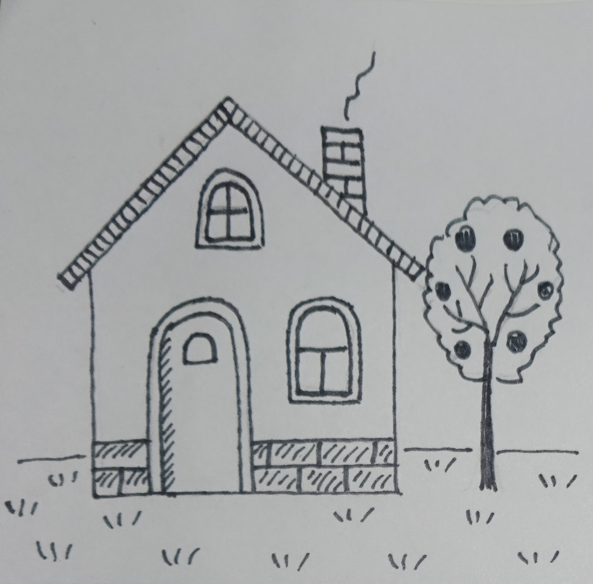

--- 
title: 'Lectures on housing economics: A European text'
author: "Konstantin A. Kholodilin"
date: "2020-08-18"
output:
  word_document: default
  pdf_document: default
description: Everything you need (and nothing more) to start a bookdown book.
documentclass: book
link-citations: yes
bibliography: Uchebnik.bib
site: bookdown::bookdown_site
biblio-style: apalike
---

# Preface {-}

This is the very first part of the book.

